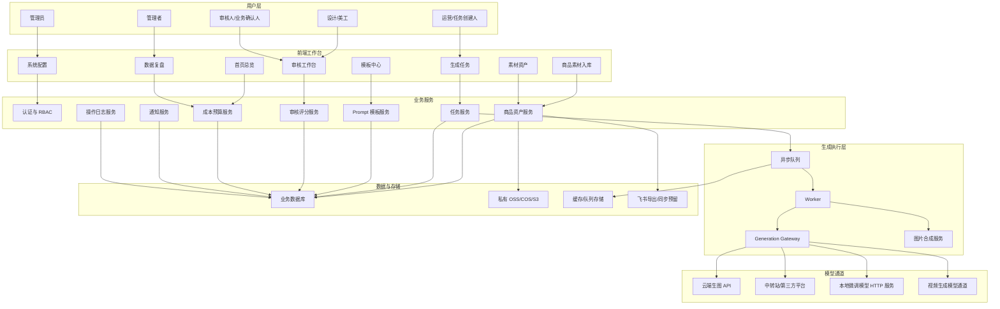
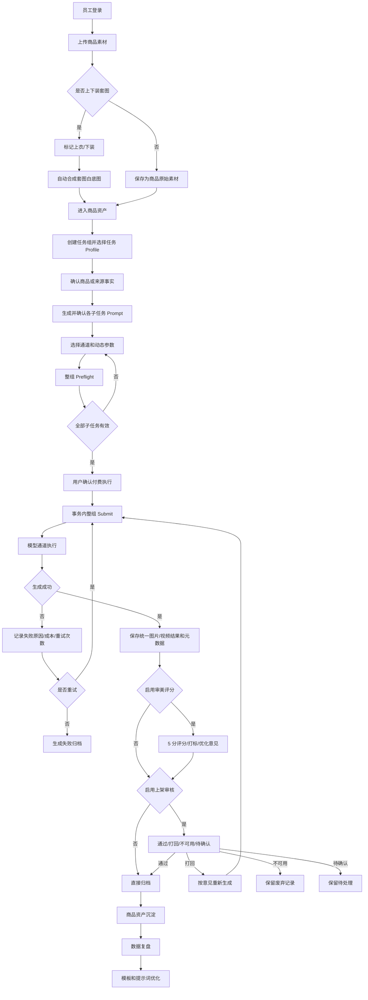
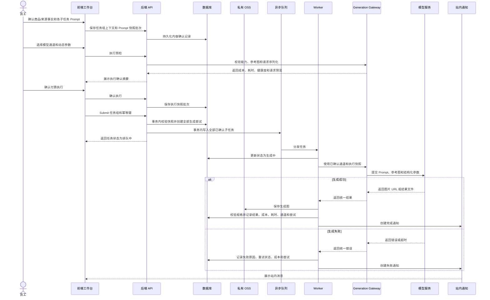
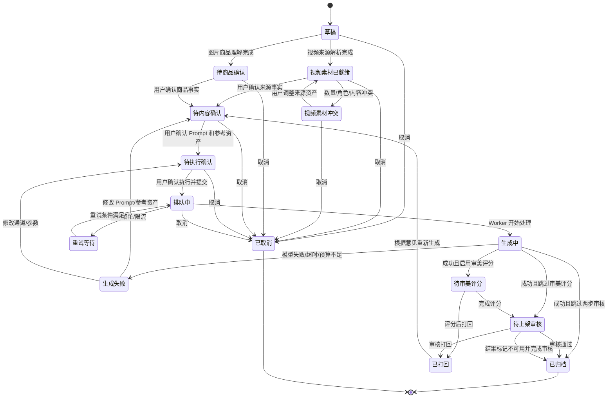
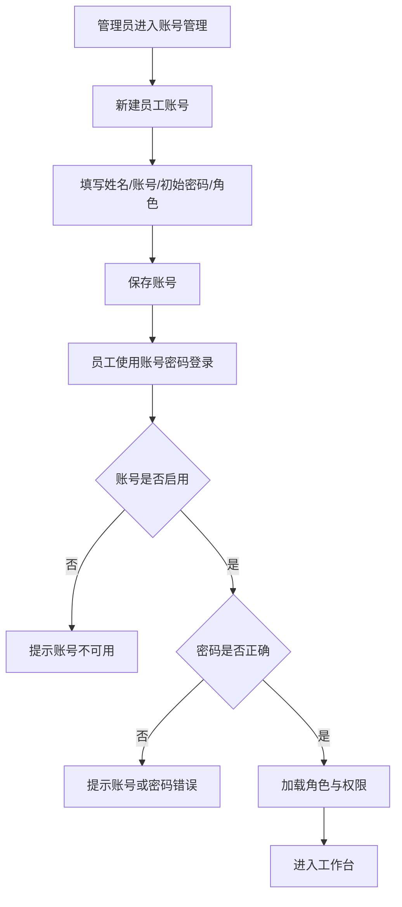
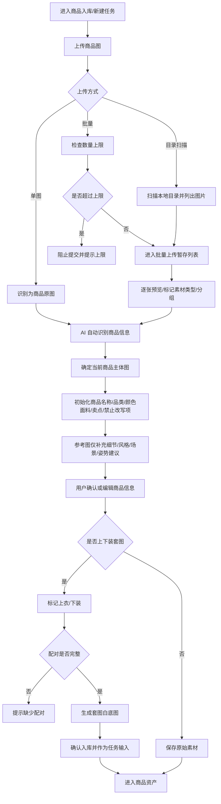
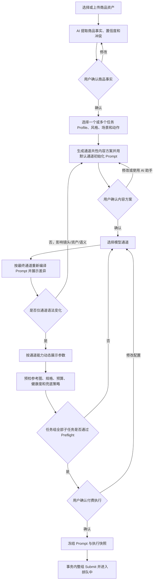
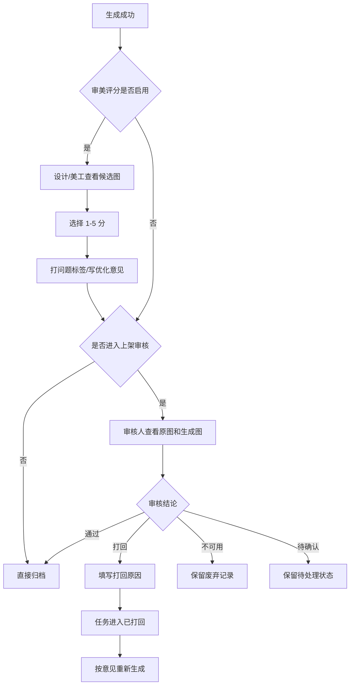
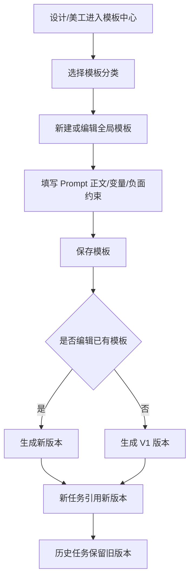
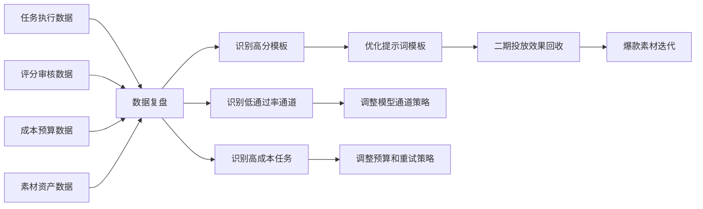

# 产品需求文档：达芬奇密码 AI 素材工作台 - 内部产品化一阶段完整 PRD V2.3

版本：V2.3  
日期：2026-07-17
状态：正式开发依据  
产品基线：V2.3  
文档职责：产品范围、业务流程、页面行为、状态语义、AI Skills 边界与验收标准的唯一 SSOT  
适用范围：公司内部 20+ 员工试运行版本

V2.3 重点调整：在 V2.2 业务规则基础上合并工作流与 Skills 蓝图，正式收口任务组与子任务模型、结果血缘、五阶段创建门禁、组级 Preflight/Submit、五个 AI Skills 和七个平台能力，并增加多模型通道 Prompt 分层。阶段 3 使用默认通道 Prompt Profile 初始化 Prompt；阶段 4 选择或切换通道时加载对应 Prompt Profile 和动态参数。五阶段是业务状态和接口顺序，不强制映射为五个独立页面或重复向导。任何付费生成必须经过“确认内容与 Prompt -> 选择通道并加载对应 Prompt/参数 -> Preflight -> 用户确认执行 -> Submit”。

## 1. 产品概述与架构

### 1.1 核心定位

「达芬奇密码 AI 素材工作台」是一个面向服装电商团队的内部 AI 素材生产工作台，为运营、设计/美工、审核人和管理者提供商品素材上传、AI 生图、审美评分、上架审核、素材归档、成本复盘能力，解决 demo 阶段依赖飞书、素材过程不可沉淀、提示词经验难复用、生成质量难闭环的问题，通过私有资产库、模板版本、模型通道和审核数据沉淀实现可持续的素材生产提效。

### 1.2 产品判断

一期不建议继续把飞书作为核心系统。飞书适合 demo 演示、表格协作和临时同步，不适合作为 20+ 员工长期生产系统的主数据库、权限中心、素材资产库和异步任务中心。

一期推荐采用标准产品化范式：

- 前端工作台：账号密码登录，按角色展示菜单和操作。
- 后端服务：统一业务 API，承载任务、资产、模板、审核、成本、配置。
- 数据库：保存任务、商品资产、模板版本、评分审核、成本和操作日志。
- 私有对象存储：保存原图、合成图、生成图、归档图。
- 异步队列：生成任务排队执行，避免用户长时间等待。
- Generation Gateway：统一管理通道能力、动态参数、Preflight、提交和查询；云端、中转站、第三方模型及未来本地模型通过内部 Provider Adapter 接入。
- 飞书：仅保留导出、汇报、演示或后续同步能力，不作为主数据源。

### 1.3 部署建议

一期推荐「公网域名登录 + 登录鉴权 + 权限控制 + 私有存储」，不推荐只做公司局域网部署。

| 方案 | 结论 | 原因 |
| --- | --- | --- |
| 公司局域网部署 | 可做但不推荐作为主线 | 远程办公、外包协作、后续多平台接入、模型回调和运维都会受限制 |
| 公网域名登录 | 推荐 | 员工访问更稳定，便于模型回调、OSS 访问控制、后续接店铺和投放数据 |
| 混合方案 | 可选 | 服务部署在云服务器，访问通过账号密码、IP 白名单、HTTPS 和 RBAC 控制 |

一期默认采用公网域名登录，配合管理员后台创建账号、强密码、RBAC、操作日志、私有 OSS 访问签名。若公司安全策略要求，也可以在公网域名前增加 IP 白名单或 VPN。

### 1.4 一期目标

- 让公司内部 20+ 员工顺畅使用，不再依赖飞书表格跑主流程。
- 支持 4 类图片生成任务：商品主图、详情页/场景图、细节图、上身/三视图。
- 支持商品图上传、轻量批量上传、目录扫描上传。
- 支持上下装分开上传后自动合成套图白底图。
- 支持风格、场景、动作、图片比例、生成张数由操作者调节。
- 支持普通员工基于模板创建任务，并允许编辑本次任务 Prompt 副本。
- 支持轻量 AI 助手融合在任务工作台内，用对话方式辅助补充需求、优化本次 Prompt、解释审核意见和生成重试建议。
- 支持设计/美工和管理员维护全局模板和提示词库。
- 支持异步生成队列和模型通道配置，预留本地微调模型接入。
- 支持审美 5 分评分、上架审核、问题打标、优化意见。
- 支持任务成本、生成耗时、重试次数、模型通道表现记录。
- 支持素材资产长期沉淀，为二期投放效果回收和提示词进化预留字段。
- 支持基于已生成图片创建受控视频任务，视频任务可从图片任务列表、图片任务详情或新建视频任务页发起。
- 支持 P0 轻量版虚拟/授权模特参考库，用于图片主图和视频任务中的模特风格推荐、人工选择和真人感质量评分。

### 1.5 一期非目标

- 不做自动上架。
- 不做多平台一键分发。
- 不做店铺后台直接发布。
- 不做投放效果自动回收。
- 不做无图片输入的泛 Text-to-Video 创作台。
- 不做复杂分镜剪辑、字幕包装、音乐剪辑和自动成片发布。
- 不做任意联网抓取真人模特图，不做未经授权的真人肖像复用。
- 不做复杂自动模特训练、人脸身份复刻或长期保持具体真人身份一致性。
- 不做 SKU 变体智能批量生成。
- 不做复杂 Excel 全字段导入。
- 不做无人确认的全自动批量生产。
- 不把飞书作为主数据源。
- 不做类似豆包的独立通用 AI 对话工作台。
- 不允许 AI 助手绕过用户确认自动提交生成、修改全局模板或改变审核结论。

### 1.6 整体产品架构图



### 1.7 核心业务闭环



### 1.8 异步生成时序图



### 1.9 任务状态机



技术枚举固定为：`draft`、`assets_ready`、`asset_conflict`、`pending_product_confirmation`、`pending_prompt_confirmation`、`pending_execution_confirmation`、`queued`、`retry_waiting`、`generating`、`generation_failed`、`pending_aesthetic_review`、`pending_listing_review`、`returned`、`archived`、`cancelled`。`unusable` 是结果审核结论，`spec_mismatch` 是结果校验状态。

## 2. 用户角色与权限矩阵

### 2.1 用户角色

| 角色 | 核心职责 | 一期重点 |
| --- | --- | --- |
| 管理员 | 管理账号、角色、权限、模型通道、模板、预算和系统配置 | 保证系统可控可运维 |
| 运营/任务创建人 | 上传商品素材、创建任务、配置参数、查看进度、发起重试 | 承担主要素材生产入口 |
| 设计/美工 | 维护提示词模板、审美评分、问题打标、给优化意见 | 提升结果质量和模板复用 |
| 审核人/业务确认人 | 判断素材是否可用于上架，决定通过、打回、不可用、待确认 | 保证商品图可用性 |
| 项目负责人/管理者 | 查看任务效率、质量、成本、资产沉淀和预算情况 | 判断产品化价值和后续投入 |

### 2.2 权限原则

系统采用 RBAC：

```text
用户 -> 角色 -> 权限点 -> 菜单/按钮/数据范围
```

一个用户可拥有多个角色。普通员工可创建任务和编辑本次任务 Prompt 副本，但不能修改全局模板、模型通道、预算配置和 RBAC 权限。设计/美工可维护模板和进行评分。审核人可进行上架审核。管理员拥有系统配置权限。

### 2.3 权限矩阵

| 功能模块 | 管理员 | 运营/任务创建人 | 设计/美工 | 审核人 | 管理者 |
| --- | --- | --- | --- | --- | --- |
| 登录系统 | 可用 | 可用 | 可用 | 可用 | 可用 |
| 创建账号/停用账号 | 可用 | 不可用 | 不可用 | 不可用 | 只读 |
| 分配角色和权限 | 可用 | 不可用 | 不可用 | 不可用 | 只读 |
| 上传商品素材 | 可用 | 可用 | 可用 | 不可用 | 只读 |
| 上下装合成 | 可用 | 可用 | 可用 | 不可用 | 只读 |
| 选择推荐模特 | 可用 | 可用 | 可用 | 不可用 | 只读 |
| 维护模特资源库 | 可用 | 不可用 | 可用 | 不可用 | 只读 |
| 创建生成任务 | 可用 | 可用 | 可用 | 不可用 | 只读 |
| 编辑任务级 Prompt | 可用 | 可用 | 可用 | 不可用 | 只读 |
| 修改全局模板 | 可用 | 不可用 | 可用 | 不可用 | 只读 |
| 提交生成/重试 | 可用 | 可用 | 可用 | 不可用 | 只读 |
| 审美评分 | 可用 | 不可用 | 可用 | 可选 | 只读 |
| 上架审核 | 可用 | 不可用 | 可选 | 可用 | 只读 |
| 素材归档 | 可用 | 可用 | 可用 | 可用 | 只读 |
| 查看数据复盘 | 可用 | 自己数据 | 可看质量数据 | 可看审核数据 | 可用 |
| 模型通道配置 | 可用 | 不可用 | 不可用 | 不可用 | 只读 |
| 预算配置 | 可用 | 不可用 | 不可用 | 不可用 | 只读 |

## 3. 详细功能列表

| 关键模块 | 核心功能点 | 主要权限角色 | 设计要点与边界 |
| --- | --- | --- | --- |
| 账号权限 | 账号密码登录 | 全部角色 | 管理员后台创建账号；一期不做自助注册和第三方登录 |
| 账号权限 | 账号管理 | 管理员 | 支持创建、编辑、停用、重置密码、分配角色 |
| 账号权限 | RBAC 权限控制 | 管理员 | 控制菜单、按钮和关键数据范围 |
| 商品入库 | 单图上传 | 运营、设计/美工、管理员 | 支持商品原图、细节图、风格参考图、场景参考图、模特/姿势参考图 |
| 商品入库 | 轻量批量上传 | 运营、设计/美工、管理员 | 默认最多 5 张，后台可配置上限 |
| 商品入库 | 目录扫描上传 | 运营、设计/美工、管理员 | 延续 demo 轻量批量体验，不做复杂 Excel 导入 |
| 商品入库 | 上下装合成 | 运营、设计/美工、管理员 | 上传后标记上衣/下装，合成套图白底图 |
| 模特资源库 | 虚拟/授权模特参考库 | 设计/美工、管理员维护；运营可选择 | P0 只做上传/维护、标签化、推荐和人工选择，不做任意联网抓取真人图 |
| 模特资源库 | 模特匹配推荐 | 运营、设计/美工、管理员 | 基于商品品类、风格、场景、目标人群、图片/视频任务类型推荐 2-3 个候选模特 |
| 生成任务 | 任务类型选择 | 运营、设计/美工、管理员 | 一期支持主图、详情/场景、细节、上身/三视图 |
| 生成任务 | 风格/场景/动作选择 | 运营、设计/美工、管理员 | 普通员工优先选预置模板；模板由设计/管理员维护 |
| 生成任务 | 比例和张数配置 | 运营、设计/美工、管理员 | 支持 1:1、3:4、4:5、9:16、16:9；张数可调 |
| 生成任务 | 任务级 Prompt 副本 | 运营、设计/美工、管理员 | 创建任务时从全局模板复制，可编辑本次，不影响全局 |
| 生成任务 | 轻量 AI 助手 | 运营、设计/美工、审核人、管理员 | 仅在任务上下文内辅助补充描述、优化本次 Prompt、解释审核标签、生成重试建议；所有应用动作需用户确认 |
| 异步生成 | 队列处理 | 系统 | 任务提交后异步执行，支持状态追踪和失败重试 |
| 异步生成 | 模型通道适配 | 管理员配置，系统执行 | 统一云 API、中转站、本地模型调用差异 |
| 审美评分 | 5 分评分 | 设计/美工、管理员 | 审美评分可选；支持维度评分、标签和意见 |
| 上架审核 | 通过/打回/不可用/待确认 | 审核人、管理员 | 上架审核可选；打回可重新生成 |
| 素材资产 | 归档素材库 | 全部按权限访问 | 保留原图、生成图、审核、评分、Prompt 版本、通道、成本 |
| 素材资产 | 模特资源库 | 设计/美工、管理员维护；运营可使用 | 管理虚拟/授权模特参考图、风格标签、审美标签、授权状态和使用表现 |
| 模板中心 | 模板分类管理 | 设计/美工、管理员 | 任务类型、风格、场景、平台规格、负面约束 |
| 模板中心 | 模板版本管理 | 设计/美工、管理员 | 全局模板修改生成新版本；历史任务绑定旧版本 |
| 数据复盘 | 效率/质量/成本/资产指标 | 管理者、管理员 | 支持按时间、类型、风格、场景、通道、模板、员工筛选 |
| 系统配置 | 批量上限配置 | 管理员 | 默认 5，调整后对新上传生效 |
| 系统配置 | 预算配置 | 管理员 | 记录调用成本、预算使用率、单张通过成本 |
| 通知中心 | 站内通知 | 全部角色 | 一期仅站内通知，不做短信、微信、飞书推送 |

## 4. 核心数据对象

### 4.1 用户 User

| 字段 | 说明 |
| --- | --- |
| 用户 ID | 系统唯一标识 |
| 姓名 | 员工姓名 |
| 登录账号 | 账号密码登录使用 |
| 密码哈希 | 不保存明文密码 |
| 部门 | 可选，用于筛选和权限扩展 |
| 角色 | 一个或多个角色 |
| 状态 | 启用、停用 |
| 创建人/创建时间 | 管理追溯 |
| 最后登录时间 | 安全和活跃度统计 |

### 4.2 商品资产 ProductAsset

商品资产是长期沉淀对象，不以单次任务为中心。

| 字段 | 说明 |
| --- | --- |
| 商品资产 ID | 系统唯一标识 |
| 商品名称 | 必填 |
| 品类 | 可选，一期用于筛选 |
| 颜色/面料/卖点 | 可选，用于 Prompt 变量 |
| 禁止改写项 | 如颜色、Logo、图案、版型 |
| 原始图 | 商品主输入图，通常为白底图或实拍图，是生成时需要保真的商品主体 |
| 细节图 | 可选 |
| 风格参考图 | 可选，仅用于参考画面风格、色调、氛围，不代表需要保真的商品主体 |
| 场景参考图 | 可选，仅用于参考室内/室外/货架/街拍等环境 |
| 模特/姿势参考图 | 可选，仅用于参考模特体态、动作、构图 |
| 推荐模特 | 可选，来自虚拟/授权模特参考库，用于图片主图和视频任务中的模特气质、脸型、身材比例、姿势方向参考 |
| 上衣图/下装图 | 套图合成输入源图 |
| 套图白底图 | 上下装合成结果；合成成功后成为新的商品输入素材，可作为任务原图使用 |
| 已通过素材 | 审核通过并归档的结果 |
| 废弃素材 | 审核不可用或废弃的结果 |
| 历史任务 | 关联全部生成任务 |
| 平台/用途/尺寸 | 二期分发预留 |

### 4.2A 模特资源 ModelProfile

P0 轻量版只维护虚拟/授权模特参考库，不做任意联网抓取真人图，不做真人身份复刻。模特资源用于图片主图和视频任务中的模特风格推荐、人工选择和质量评估。

| 字段 | 说明 |
| --- | --- |
| 模特 ID | 系统唯一标识 |
| 模特名称 | 用户可读名称，可为内部命名 |
| 模特类型 | 虚拟模特、授权真人参考、内部素材 |
| 授权状态 | 已授权、待确认、不可用 |
| 风格标签 | 甜美、清冷、高级、轻熟、东方、欧美、中老年等 |
| 年龄感 | 少女、轻熟、成熟、中老年等 |
| 脸型/五官特征 | 脸型、五官立体度、亲和力、高级感、三庭五眼评分 |
| 肤色/发型/妆容 | 用于匹配风格和场景 |
| 身材比例 | 高挑、标准、微胖、中老年体型等 |
| 头身比例 | 如 7 头身、8 头身、自然比例；用于审核和推荐 |
| 适用品类 | 针织衫、连衣裙、裤装、套装、鞋包等 |
| 适用任务 | 图片主图、上身/三视图、视频首帧、视频参考 |
| 参考图 | 模特参考图或样例图 |
| 使用次数/平均分/通过率 | 数据复盘指标 |
| 启用状态 | 启用、停用 |

模特推荐逻辑：

```text
商品品类 + 商品风格 + 场景 + 目标人群 + 任务类型 + 输出规格
-> 匹配模特风格标签、年龄感、脸型五官、身材比例、头身比例、适用品类
-> 推荐 2-3 个候选模特
-> 用户确认或手动切换
-> 写入任务级 Prompt 副本和生成上下文
```

### 4.2.1 素材类型定义

为避免原型和开发理解混淆，一期上传区必须区分以下素材类型：

| 素材类型 | 含义 | 是否作为商品主体 |
| --- | --- | --- |
| 商品原图 | 当前任务需要保真的商品图，可以是白底图或实拍图 | 是 |
| 上衣图 | 上下装合成的上衣源图 | 是，合成前源图 |
| 下装图 | 上下装合成的下装源图 | 是，合成前源图 |
| 套图白底图 | 上衣图和下装图合成后的完整套装白底图 | 是，可作为任务原图 |
| 细节图 | 领口、面料、纹理、袖口、图案等细节参考 | 部分保真 |
| 风格参考图 | 参考审美风格、光影、色调、商业感 | 否 |
| 场景参考图 | 参考室内、室外、货架、街道等环境 | 否 |
| 模特/姿势参考图 | 参考上身姿态、动作、构图 | 否 |
| 模特参考图 | 来自虚拟/授权模特参考库，用于模特气质、五官、身材和头身比例参考 | 否 |

原型中不要只写“参考图”一个泛标签，应拆成“风格参考”“场景参考”“模特/姿势参考”。“参考图”不是套图白底图；套图白底图必须单独展示为“合成套图白底图”。

### 4.3 生成任务 GenerationTask

一次新建流程先创建 `GenerationTaskGroup`。多选商品主图、场景图、细节图和上身/三视图时，一个任务组包含多个 `GenerationTask` 子任务；单个图片或视频任务也使用只有一个子任务的任务组。任务组共享商品上下文、主通道、模型、执行参数和兜底策略，但每个子任务拥有独立 Prompt、快照、生成尝试和结果。子任务状态是执行状态 SSOT，任务组状态由 API 聚合返回。

技术对象固定映射为：任务组 `generation_task_groups`、子任务 `generation_tasks`、Preflight `generation_preflights`、执行快照 `generation_execution_snapshots`、生成尝试 `generation_attempts`、统一结果 `generation_results`。同一组 Prompt 和执行确认分别通过 `confirmation_batch_id` 关联。

| 字段 | 说明 |
| --- | --- |
| 任务 ID | 系统唯一标识 |
| 任务组 ID / 组内顺序 | 关联本次五阶段创建状态和组内展示顺序 |
| 任务名称 | 默认由商品名和任务类型生成，可编辑 |
| 商品资产 ID | 关联商品 |
| 媒体类型 | `image` 或 `video` |
| 任务 Profile | `main_image`、`scene_image`、`detail_image`、`tryon_three_view`、`img2video`、`reference2video` |
| 输入素材 | 商品原图、套图白底图、细节图、风格参考图、场景参考图、模特/姿势参考图等，需记录素材类型 |
| 商品信息识别结果 | 上传商品原图或套图白底图后，由图片理解能力自动提取的品类、颜色、面料、卖点、禁止改写项和置信度 |
| 风格 | 甜美网红风、纯欲风、老年风、中式国风、富贵风 |
| 场景 | 室内、室外、动作/姿势等预置 |
| 动作 | 模板预置，可扩展 |
| 推荐模特 | 可选，系统基于商品、风格、场景和任务类型推荐的模特资源 |
| 模特选择方式 | 系统推荐、手动选择、不使用模特 |
| 模特匹配上下文 | 模特 ID、风格标签、年龄感、脸型五官、身材比例、头身比例、推荐理由 |
| 比例/张数等目标偏好 | 内容阶段可保存偏好，最终提交值只读取执行快照 |
| 模型通道 | 用户从当前任务可用通道中选择；系统可以推荐并提供默认通道，但不得在用户确认后静默切换 |
| 通道参数 | 根据所选通道能力动态生成，包括比例、分辨率、张数、参考图数量、时长、运动幅度等结构化参数 |
| 全局模板版本 | 创建任务时引用的模板版本 |
| 视频内容方案快照 | 保存通道共性的主叙事、动态镜头结构、动作幅度、运镜、图片业务/视觉角色和一致性约束；切换通道时作为重新编译 Prompt 的稳定输入 |
| Prompt Profile | 记录 `provider + model + task_profile + version`，例如 `vidu-q3.reference2video@1.0.0`；默认通道和最终执行通道分别记录 |
| 任务级 Prompt | 由通道共性内容方案和对应 Prompt Profile 编译形成，可编辑本次副本；比例、分辨率、张数、时长和模型通道属于执行快照，不得只依赖 Prompt 文本表达 |
| Prompt 组装来源 | 记录模板版本、变量值、用户自由描述、AI 助手应用建议，便于追溯 |
| 自由描述 | 用户补充描述 |
| 状态 | 草稿、视频素材已就绪、视频素材冲突、待商品确认、待 Prompt 确认、待执行确认、排队中、等待重试、生成中、生成失败、待审美评分、待上架审核、已打回、已归档、已取消 |
| 失败原因 | 生成失败时记录 |
| 重试次数 | 任务级统计 |
| 成本 | 调用成本或本地模型估算成本 |
| 耗时 | 生成耗时 |

### 4.3.1 轻量 AI 助手上下文 AssistantContext

轻量 AI 助手不是独立聊天产品，而是任务工作台内的辅助面板。它围绕当前商品、当前任务和当前审核结果工作。

| 字段 | 说明 |
| --- | --- |
| 助手会话 ID | 与任务或商品资产关联 |
| 关联任务 ID | 当前任务上下文 |
| 关联商品资产 ID | 当前商品上下文 |
| 可读上下文 | 商品信息、任务类型、风格、场景、比例、张数、模板版本、任务级 Prompt、审核标签、优化意见、推荐模特、模特风格标签 |
| 用户输入 | 自由描述、修改要求、问题咨询 |
| 助手输出 | 参数建议、Prompt 改写建议、审核意见解释、重试建议、模特匹配解释 |
| 应用动作 | 应用到本次 Prompt、补充自由描述、生成重试建议 |
| 权限边界 | 不修改全局模板、不提交生成、不改变审核结论，除非用户点击确认 |
| 记录范围 | 保留与任务相关的关键建议和应用记录，便于追溯 |

### 4.3.2 生成执行快照 GenerationExecutionSnapshot

付费生成前必须创建不可变执行快照。Prompt 确认与执行确认是两个不同动作；用户修改 Prompt、参考图、通道或任一参数后，旧执行确认自动失效。

| 字段 | 说明 |
| --- | --- |
| 执行快照 ID | 系统唯一标识 |
| 任务 ID / 内容方案快照 ID / Prompt 快照 ID | 关联任务、已确认通道共性内容和最终通道编译 Prompt |
| 模型通道 / Model ID | 本次实际选择的通道和模型 |
| Prompt Profile / 编译版本 | 本次通道实际使用的 Prompt Profile、版本和编译结果指纹 |
| 结构化参数 | 比例、分辨率、张数、时长、运动幅度、seed 等通道支持参数 |
| 参考图清单 | 使用 `{asset_id, role, position}` 保存；`position` 从 1 开始且在同一子任务清单内唯一 |
| 能力版本 | 生成参数表单所依据的通道能力版本 |
| 预检记录 | 关联未过期的 Preflight；包含参数、请求大小、预算、健康度、限流和参考图校验结果，默认有效期 10 分钟 |
| 成本与耗时估算 | 提交前展示给用户的预计成本和时间范围 |
| 重试与兜底策略 | 最大重试次数、间隔、允许切换的兜底通道；默认不复用旧资产 |
| 请求摘要 | 不含密钥的 Provider 请求预览和序列化摘要 |
| 确认信息 | 确认人、确认时间和确认版本 |

### 4.4 生成结果 GenerationResult

| 字段 | 说明 |
| --- | --- |
| 结果 ID | 系统唯一标识 |
| 任务 ID | 关联任务 |
| 媒体类型 | `image` 或 `video` |
| 来源类型 `source_type` | `generated` 或 `reused`；复用结果不得伪装成模型生成 |
| 素材文件 | 私有 OSS/COS/S3 中的图片或视频文件 |
| 缩略图 URL | 列表和卡片展示 |
| 图片/视频规格 | 宽高、比例、格式；视频额外包含时长、封面、编码和媒体元数据 |
| 模型通道 | 实际通道 |
| Prompt 版本 | 使用的任务级 Prompt |
| 生成尝试 | `generated` 必填；`reused` 为空并记录来源资产或来源结果 |
| 成本 | 本次结果成本；`reused` 不产生生成成本 |
| 校验状态 | `pending`、`valid`、`spec_mismatch`、`validation_failed` |
| 审核状态 | 待审核、通过、打回、不可用、已归档 |
| 规格校验 | 实际数量、尺寸、比例、格式、Checksum 和差异明细 |
| 审美评分 | 1-5 分，可为空 |
| 审核结论 | 通过、打回、不可用、待确认 |
| 标签 | 问题标签或优点标签 |
| 优化意见 | 人工填写 |
| 模特真人感评分 | 可选，评估模特是否自然真实 |
| 五官自然度评分 | 可选，评估三庭五眼、五官比例和表情自然度 |
| 高级感评分 | 可选，评估模特气质是否符合品牌审美 |
| 头身比例评分 | 可选，评估头身比例和身材比例是否自然 |
| 姿势自然度评分 | 可选，评估动作、手部、站姿/坐姿是否自然 |
| 商品上身保真评分 | 可选，评估上身后颜色、图案、版型、面料是否保真 |
| 视频质量信息 | 可选，包含抽帧质量结果、人物/服装漂移时间点和封面素材 |

`spec_mismatch` 是结果校验状态，不是任务状态。规格不符结果进入人工审核并禁止自动归档。`unusable` 是结果审核结论，不是任务状态；全部结果审核完成且未选择打回重试时，任务进入已归档并保留结果汇总。

### 4.5 PromptTemplate

| 字段 | 说明 |
| --- | --- |
| 模板 ID | 系统唯一标识 |
| 模板名称 | 如「甜美网红风主图模板」 |
| 模板类型 | 任务类型、风格、场景、平台规格、负面约束 |
| 适用任务类型 | 主图、场景图、细节图、三视图 |
| Prompt 正文 | 支持变量占位 |
| 负面约束 | 可单独维护 |
| 版本号 | 修改全局模板时递增 |
| 启用状态 | 启用、停用 |
| 创建人/更新人 | 追溯 |
| 使用次数/通过率/平均成本 | 数据复盘使用 |

### 4.6 ModelChannel

“模型通道”是实际执行生成能力的统一入口，替代原型中的“供应商”概念。供应商只是模型通道的一种来源，不应成为业务主概念。

| 字段 | 说明 |
| --- | --- |
| 通道 ID | 系统唯一标识 |
| 通道名称 | 如云端 API、内部模型、备用节点 |
| 通道类型 | 云端 API、本地模型、第三方平台、中转站 |
| 能力范围 | 主图、场景图、细节图、三视图，视频预留 |
| 能力 Schema | 支持的参考图数量、比例、分辨率、张数、时长、参数类型、默认值、范围和依赖条件 |
| 调用方式 | 同步、异步、轮询、回调 |
| Base URL | 管理员配置，不向普通用户展示 |
| API Key 状态 | 只显示已配置/未配置，不展示明文 |
| 默认模型 | Model ID |
| 成本规则 | 按次、按图、按时间或手动配置 |
| 超时规则 | 任务最大等待时间 |
| 重试规则 | 最大重试次数、重试间隔 |
| 兜底规则 | 可选兜底通道和是否需要再次人工确认；禁止把旧资产作为生成成功兜底 |
| 启用状态 | 启用、停用、维护中 |
| 今日消耗/错误率/队列健康度 | 运维监控，供提交前预检使用 |

### 4.7 本地微调模型接入预留

一期不要求实现本地微调模型，但必须预留通道形态。推荐未来本地模型以 HTTP Provider Adapter 接入 Generation Gateway。

```text
POST /generate

输入：
- prompt: string
- image_urls: string[]
- params: object
  - task_profile
  - ratio
  - count
  - seed
  - style
  - scene
- callback_url: string

输出：
- job_id: string
或
- image_urls: string[]
```

适配器需要屏蔽不同模型返回格式差异，对业务层统一返回：成功、失败、生成中、超时、成本、图片 URL、错误原因。

## 5. 全部业务流程

### 5.1 登录与账号创建流程



### 5.2 商品素材入库流程



### 5.3 任务创建流程

新建任务必须依次满足五阶段业务门禁：来源素材与任务 Profile、商品/来源事实确认、Prompt 内容确认、通道参数与 Preflight、用户确认付费执行。前端默认使用单页工作台承载这些阶段，允许用户在原页面就地补充和确认；五阶段不要求展示为独立页面、顶部 Stepper 或 AI 助手向导。Submit 后的排队、生成、审核和归档属于任务生命周期，不属于创建门禁。



### 5.4 评分审核流程



### 5.5 模板维护流程



### 5.6 数据复盘与二期闭环预留



## 6. 用户故事与验收标准

### US-01：管理员创建员工账号并分配角色

作为管理员，我希望在后台创建员工账号并分配角色，以便让不同成员只访问自己需要的功能。

业务规则：

1. 管理员可创建账号，字段包括姓名、账号、初始密码、部门、角色、启用状态。
2. 一个用户可拥有多个角色。
3. 停用账号后，用户不能登录。
4. 未授权用户不能访问模板管理、模型通道、预算和账号管理。

验收标准：

- GIVEN 管理员创建账号并分配运营角色，WHEN 员工登录，THEN 员工可进入任务创建页面。
- GIVEN 员工没有模型通道权限，WHEN 访问模型通道配置，THEN 系统隐藏入口或提示无权限。
- GIVEN 账号被停用，WHEN 用户尝试登录，THEN 系统提示账号不可用。

### US-02：运营上传商品素材并入库

作为运营，我希望上传商品白底图、实拍图、细节图和不同类型参考图，并由系统自动初始化商品信息，以便后续创建生成任务。

业务规则：

1. 支持单图上传。
2. 支持轻量批量上传和目录扫描上传。
3. 批量上传默认上限为 5 张，后台可配置。
4. 批量上传后先进入暂存列表，不直接提交生成；暂存列表展示缩略图、文件名、大小、识别建议、素材类型、商品分组和删除操作。
5. 支持标记图片类型：商品原图、细节图、风格参考图、场景参考图、模特/姿势参考图、上衣、下装、单品。
6. 上传商品原图或套图白底图后，系统调用图片理解能力，参考 demo/飞书多维表格中的商品分析提示词，自动提取并初始化商品名称建议、品类、颜色/面料、核心卖点和禁止改写项。
7. 自动识别结果必须可编辑；低置信度字段需展示“需人工确认”提示。
8. 新建图片任务页中间区域展示“当前选中的商品主体图”，该图是商品保真的事实来源，并与商品信息表单绑定。
9. 参考图为选传辅助素材，只用于补充细节、风格、场景和姿势建议，不得覆盖商品主体图识别出的商品事实。
10. 图片保存到私有 OSS，数据库记录元数据、识别结果、素材类型和确认人。

验收标准：

- GIVEN 批量上限为 5，WHEN 用户上传 6 张，THEN 系统阻止提交并提示上限。
- GIVEN 用户上传支持格式图片，WHEN 系统完成识别，THEN 商品信息表单自动填入品类、颜色/面料、核心卖点和禁止改写项。
- GIVEN 用户修改自动识别结果，WHEN 确认入库，THEN 系统保存人工确认后的商品资产记录。
- GIVEN 用户上传不支持格式，WHEN 提交，THEN 系统提示更换文件。

### US-03：上下装自动合成套图白底图

作为运营，我希望上传上衣和下装后标记并自动合成套图白底图，以便快速获得完整搭配素材。

业务规则：

1. 用户需要显式标记上衣和下装。
2. 缺少上衣或下装时不能合成。
3. 合成结果作为新的商品素材进入商品资产。
4. 合成图可作为后续主图、场景图、上身/三视图任务输入。

验收标准：

- GIVEN 用户上传上衣和下装并完成标记，WHEN 点击合成，THEN 系统生成套图白底图。
- GIVEN 只上传上衣，WHEN 点击合成，THEN 系统提示缺少下装。
- GIVEN 合成成功，WHEN 创建任务，THEN 用户可选择合成图作为输入素材。

### US-04：用户基于模板创建生成任务

作为任务创建人，我希望先确认商品与创意内容，再选择模型通道并确认该通道支持的参数、成本和失败策略，以便生成符合用途且执行过程可控的图片。

业务规则：

1. 一期支持任务类型：商品主图、详情页/场景图、细节图、上身/三视图。
2. 风格预置：甜美网红风、纯欲风、老年风、中式国风、富贵风。
3. 场景预置：室内、室外、动作/姿势。
4. 比例、分辨率和张数不使用全局固定选项，页面只展示当前模型通道实际支持的值；平台规格可以作为推荐值。
5. 张数由用户设置，但受所选通道能力、后台上限和预算控制。
6. 普通员工使用推荐模板，可编辑任务级 Prompt 副本，不能修改全局模板。
7. “任务级 Prompt 预览”只基于用户确认后的商品快照、任务类型、风格、场景、动作、参考图和模板生成，不读取未确认的实时字段。
8. 用户点击“重新套用全局模板”时，系统按当前参数刷新任务级 Prompt；已手工编辑内容需提醒可能被覆盖。
9. 用户确认 Prompt 后进入执行配置，不立即生成。模型通道选择后，页面根据能力 Schema 动态显示参数、默认值、依赖条件和成本影响。
10. 提交前必须展示实际参考图数量、顺序和角色、结构化参数、预计成本、预计耗时、通道健康度、重试和兜底策略。
11. 用户修改 Prompt、参考图、模型通道或参数后，原执行确认失效，必须重新预检和确认。
12. 多选图片 Profile 时只创建一个任务组；任一子任务 Preflight 失败，整组不能确认执行或 Submit。
13. Submit 必须在服务端事务中全量创建并入队子任务，禁止部分成功。

验收标准：

- GIVEN 用户确认完整商品事实和内容方案，WHEN 保存内容，THEN 系统生成任务级 Prompt 副本。
- GIVEN 普通员工编辑 Prompt，WHEN 保存，THEN 只影响本次任务。
- GIVEN 用户调整风格、场景或参考资产，WHEN 查看 Prompt 预览，THEN 系统自动带入最新内容变量并展示任务级 Prompt 副本。
- GIVEN 用户缺少必填参数，WHEN 提交，THEN 系统提示缺失项。
- GIVEN 用户切换 Agnes 与其他生图通道，WHEN 通道能力不同，THEN 参数表单、可选比例、参考图限制和成本估算同步变化。
- GIVEN Prompt 已确认但执行配置未确认，WHEN 用户点击生成，THEN 系统不得提交付费任务。
- GIVEN Prompt 中写有 `4:5` 但所选通道未配置结构化比例，WHEN 预检，THEN 系统提示规格参数缺失，不能仅依赖 Prompt 文本通过校验。
- GIVEN 用户同时选择主图、场景图和细节图，WHEN 创建任务，THEN 系统返回一个任务组及三个独立子任务。
- GIVEN 三个子任务中有一个 Preflight 失败，WHEN 用户尝试确认执行，THEN 整组被阻止且页面定位失败子任务。
- GIVEN 用户确认执行后再次修改任一 Prompt，WHEN 点击 Submit，THEN 服务端拒绝旧执行快照并要求重新 Preflight。

### US-05：系统异步执行生成任务

作为用户，我希望提交任务后系统异步生成，以便我可以离开页面并稍后查看结果。

业务规则：

1. 任务只有在执行快照确认后才能提交，提交后进入排队中。
2. 只有已确认执行快照的任务才能进入排队；Worker 开始处理后进入生成中。
3. 系统可推荐模型通道，但实际提交使用用户确认的通道；仅在已确认兜底策略内允许自动切换。
4. 每次提交、重试和切换通道都创建独立生成尝试，记录 Provider task ID、参数、响应、耗时、成本和失败原因。
5. 队列满、限流或临时不可用时进入等待重试，不得复用历史结果并标记为本次生成成功。
6. 复用历史资产必须由用户明确发起，结果来源标记为 `reused`，不创建虚假的 Provider 成功记录。
7. 生成完成后校验实际数量、尺寸、比例和格式；与执行快照不一致时标记规格不符并进入人工审核。
8. 生成完成或失败后发送站内通知。
9. `reused` 结果不创建 Provider 成功尝试、不产生生成成本，并在列表和详情中持续展示来源标识。

验收标准：

- GIVEN 用户提交有效执行快照，WHEN 任务进入队列，THEN 任务列表展示排队中。
- GIVEN Worker 开始处理，WHEN 用户查看任务，THEN 状态展示生成中。
- GIVEN 生成成功，WHEN 结果返回，THEN 系统保存图片并进入评分、审核或归档状态。
- GIVEN 生成失败，WHEN 达到失败条件，THEN 系统展示可理解失败原因。
- GIVEN Provider 返回队列满，WHEN 重试策略仍有效，THEN 任务展示等待重试、重试次数和下次时间，不展示旧图为新结果。
- GIVEN Provider 返回方图但执行快照要求 4:5，WHEN 结果标准化完成，THEN 结果标记 `spec_mismatch` 并不得自动归档。
- GIVEN 主通道失败且用户已确认兜底通道，WHEN 系统切换，THEN 新建生成尝试并展示切换原因；未确认兜底时必须等待用户处理。
- GIVEN 用户显式复用历史资产，WHEN 结果写入任务，THEN 结果标记 `reused`、attempt 为空且成本不增加。

### US-05A：用户通过轻量 AI 助手优化本次任务

作为任务创建人，我希望在当前任务页面通过轻量 AI 对话补充描述、优化本次 Prompt 和理解审核意见，以便不用离开工作台也能提升生成质量。

业务规则：

1. AI 助手以任务为上下文，不作为独立通用聊天入口。
2. AI 助手可读取当前商品信息、任务类型、风格、场景、比例、张数、模板版本、任务级 Prompt、审核标签和优化意见。
3. AI 助手可输出参数建议、Prompt 改写建议、审核意见解释和重试建议。
4. 用户可点击“应用到本次 Prompt”或“补充到自由描述”。
5. 普通员工使用 AI 助手只影响当前任务，不能修改全局模板。
6. AI 助手不能自动提交生成、不能自动重试、不能改变审核结论，必须由用户确认。
7. AI 助手建议应保留在任务记录中，至少记录应用过的建议和应用人。

验收标准：

- GIVEN 用户在新建任务页打开 AI 助手，WHEN 输入“更偏室内高级感，保留衣服颜色”，THEN 助手给出本次 Prompt 修改建议和可应用按钮。
- GIVEN 普通员工点击应用建议，WHEN 保存任务，THEN 系统只更新任务级 Prompt 副本，不修改全局模板。
- GIVEN 任务被打回，WHEN 用户打开 AI 助手，THEN 助手可基于审核标签和优化意见生成重试建议。
- GIVEN 助手生成建议，WHEN 用户未点击确认，THEN 系统不能自动提交生成或重试。

### US-06：设计/美工进行审美评分和打标

作为设计/美工，我希望对生成结果进行 5 分审美评分、打标签并写优化意见，以便沉淀质量反馈。

业务规则：

1. 审美评分使用 1-5 分。
2. 审美评分可选，由任务或系统配置决定是否启用。
3. 可选维度包括主体准确性、风格一致性、构图美感、细节质感、商业可用性。
4. 支持问题标签和自由文本优化意见。
5. 评分记录保留评分人和评分时间。

验收标准：

- GIVEN 生成结果已完成，WHEN 设计/美工评分 4 分并保存，THEN 系统记录分数、标签和意见。
- GIVEN 未启用审美评分，WHEN 生成成功，THEN 任务可直接进入上架审核或归档。

### US-07：审核人进行上架审核

作为审核人，我希望判断素材是否可上架，以便筛选出可用素材。

业务规则：

1. 上架审核结论包括通过、打回、不可用、待确认。
2. 审核可选，由任务或系统配置决定是否启用。
3. 打回必须填写原因或选择问题标签。
4. 不可用结果保留历史记录，但不进入可用素材库。
5. 通过结果可归档到商品资产。

验收标准：

- GIVEN 审核人点击通过，WHEN 保存审核，THEN 图片进入已归档或待归档状态。
- GIVEN 审核人点击打回并填写原因，WHEN 保存审核，THEN 任务进入已打回并可重新生成。
- GIVEN 审核人标记不可用，WHEN 保存，THEN 图片进入废弃记录。

### US-08：设计/管理员维护模板库

作为设计/美工或管理员，我希望维护提示词模板和版本，以便普通员工稳定复用有效经验。

业务规则：

1. 模板分类包括图片任务模板、风格场景模板、视频 Prompt 模板、平台规格模板、负面约束模板。
2. 全局模板修改后生成新版本。
3. 历史任务绑定创建时使用的模板版本。
4. 普通员工不能修改全局模板。
5. 模板支持启用、停用、复制。

验收标准：

- GIVEN 设计/美工修改全局模板，WHEN 保存，THEN 系统生成新版本。
- GIVEN 历史任务使用旧模板，WHEN 全局模板更新，THEN 历史任务仍显示旧版本。
- GIVEN 普通员工访问模板中心，WHEN 尝试编辑全局模板，THEN 系统拒绝操作。

### US-08A：设计/管理员维护模特资源库

作为设计/美工或管理员，我希望维护虚拟/授权模特参考库，以便运营在图片主图和视频任务中选择更符合商品风格的模特。

业务规则：

1. P0 只支持虚拟模特、授权真人参考和内部素材，不支持任意联网抓取真人图片。
2. 新增模特必须记录模特类型、来源说明和授权状态。
3. 模特资源支持风格标签、年龄感、脸型/五官、三庭五眼评分、身材比例、头身比例、适用品类和适用任务。
4. 运营创建图片主图或视频任务时，系统可推荐 2-3 个候选模特，用户可确认、切换或选择不使用模特。
5. 模特选择只影响当前任务级 Prompt 副本，不修改全局模板。
6. 模特生成结果审核需支持真人感、高级感、五官自然度、三庭五眼、头身比例、姿势自然和商品上身保真。

验收标准：

- GIVEN 设计/美工新增模特资源，WHEN 保存，THEN 系统记录模特标签、授权状态和适用任务。
- GIVEN 运营创建图片主图任务，WHEN 选择风格和品类，THEN 系统推荐 2-3 个候选模特。
- GIVEN 用户切换推荐模特，WHEN 保存任务，THEN 系统只更新本次任务级 Prompt 副本和模特匹配上下文。
- GIVEN 生成结果进入审核，WHEN 审核人评分，THEN 可记录真人感、五官自然度、头身比例和商品上身保真问题。

### US-09：管理者查看数据复盘和成本

作为管理者，我希望查看效率、质量、成本和资产数据，以便判断工作台价值和优化方向。

业务规则：

1. 效率指标：任务总数、已完成任务数、平均生成耗时、平均审核耗时。
2. 质量指标：平均审美分、上架通过率、打回率、生成失败率、平均重试次数。
3. 成本指标：总消耗、预算使用率、单任务平均成本、单张生成成本、单张通过成本。
4. 资产指标：归档素材数、归档商品数、高分素材数、模板使用次数。
5. 筛选维度：时间、任务类型、风格、场景、模型通道、模板、员工/创建人。

验收标准：

- GIVEN 管理者进入数据复盘，WHEN 选择时间范围，THEN 系统展示对应指标。
- GIVEN 用户按模型通道筛选，WHEN 查看成本，THEN 系统展示该通道消耗、成功率和通过成本。
- GIVEN 预算接近上限，WHEN 查看首页，THEN 系统展示预算使用提醒。

## 7. 后台原型页面全集

### 7.1 菜单结构定义

```text
一级菜单：首页总览
└── 二级页面：工作台首页

一级菜单：生成任务
├── 二级页面：新建任务
├── 二级页面：任务列表
└── 二级页面：任务详情/审核工作台

一级菜单：模板中心
├── 二级页面：图片任务模板
├── 二级页面：风格场景模板
├── 二级页面：视频 Prompt 模板
├── 二级页面：平台规格模板
└── 二级页面：负面约束模板

一级菜单：素材资产
├── 二级页面：商品素材库
├── 二级页面：模特资源库
├── 二级页面：素材归档
└── 二级页面：商品素材包

一级菜单：数据复盘
├── 二级页面：效率质量看板
├── 二级页面：成本预算看板
└── 二级页面：模板效果看板

一级菜单：系统配置
├── 二级页面：账号与角色
├── 二级页面：模型通道配置
├── 二级页面：审核规则
├── 二级页面：预置项配置
└── 二级页面：操作日志
```

### 7.2 全局布局

参考 Stitch 原型目录：

```text
docs/prototypes/
```

设计规范：

- B 端工作台风格，浅色主工作区，深色或高对比侧边导航。
- 左侧固定导航，顶部显示当前页面、预算使用率、通知和用户菜单。
- 主内容区适配 1280px-1920px 桌面屏。
- 审核页采用三栏布局：左侧原始商品，中间候选图，右侧评分审核面板。
- 任务状态颜色统一：生成中蓝色、待审核橙色、已归档绿色、失败红色。
- 成本信息不能藏太深，首页、任务列表、任务详情、数据复盘都要可见。
- 原型中的“供应商”统一改名为“模型通道”。

高保真原型入口：

| 页面 | Stitch 截图 | 可交互 HTML |
| --- | --- | --- |
| 首页总览 | [查看截图](stitch_aesthetic_design_interface/ai_prd_v2_1/screen.png) | [打开原型](stitch_aesthetic_design_interface/ai_prd_v2_1/code.html) |
| 新建任务 | [查看截图](stitch_aesthetic_design_interface/ai_prd_v2_4/screen.png) | [打开原型](stitch_aesthetic_design_interface/ai_prd_v2_4/code.html) |
| 任务列表 | [查看截图](stitch_aesthetic_design_interface/ai_1/screen.png) | [打开原型](stitch_aesthetic_design_interface/ai_1/code.html) |
| 任务详情/审核工作台 | [查看截图](stitch_aesthetic_design_interface/screen.png) | [打开原型](stitch_aesthetic_design_interface/code.html) |
| 模板中心 | [查看截图](stitch_aesthetic_design_interface/ai_2/screen.png) | [打开原型](stitch_aesthetic_design_interface/ai_2/code.html) |
| 商品素材库 | [查看截图](stitch_aesthetic_design_interface/ai_3/screen.png) | [打开原型](stitch_aesthetic_design_interface/ai_3/code.html) |
| 数据复盘 | [查看截图](stitch_aesthetic_design_interface/ai_4/screen.png) | [打开原型](stitch_aesthetic_design_interface/ai_4/code.html) |
| 模型通道配置 | [查看截图](stitch_aesthetic_design_interface/ai_prd_v2_5/screen.png) | [打开原型](stitch_aesthetic_design_interface/ai_prd_v2_5/code.html) |
| 账号与角色 | [查看截图](stitch_aesthetic_design_interface/ai_7/screen.png) | [打开原型](stitch_aesthetic_design_interface/ai_7/code.html) |

### 7.3 页面：首页总览

页面名称：首页总览  
所属菜单：首页总览 -> 工作台首页  
页面用途：让管理者和员工快速看到任务进度、待办、成本和最近通过素材。

| 区域 | 元素与交互描述 |
| --- | --- |
| A. 页面导航与全局状态 | 顶部显示「工作台首页」、预算使用率、站内通知、当前用户角色。 |
| B. 筛选与查询区 | 时间范围筛选：今日、本周、本月、自定义；可按任务类型、模型通道筛选。 |
| C. 主要操作栏 | 「新建任务」「查看待审核」「进入模板中心」「查看成本看板」。入口按权限展示。 |
| D. 核心内容展示区 | 顶部 4 个指标卡：本周生成任务数、审核通过率、平均交付时长、模型消耗。中部：任务状态分布、今日待办列表。下方：最近审核通过素材网格。 |
| E. 详情/编辑面板 | 点击任务待办进入任务详情/审核工作台；点击素材进入素材详情。 |
| F. 其他独立视图/子页面 | 无。 |

ASCII 原型：

```text
+---------------------------------------------------------------+
| 首页总览                         预算 62% | 通知 | 用户       |
+------------+------------+------------+-----------------------+
| 本周任务 38 | 通过率 62% | 时长 2.4h  | 模型消耗 ¥1,280      |
+------------+------------+------------+-----------------------+
| 任务状态分布                     | 今日待办                  |
| 待确认/排队中/生成中/待评分/归档 | 待确认、失败、待归档       |
+----------------------------------+---------------------------+
| 最近通过素材                                                   |
| [图] 商品/用途/模板/通道  [图] 商品/用途/模板/通道             |
+---------------------------------------------------------------+
```

高保真原型：


[打开首页总览可交互 HTML](stitch_aesthetic_design_interface/ai_prd_v2_1/code.html)

### 7.4 页面：新建任务

页面名称：新建任务  
所属菜单：生成任务 -> 新建任务  
页面用途：完成商品素材上传、商品事实确认、内容方案确认、能力驱动的执行配置和付费生成确认。

| 区域 | 元素与交互描述 |
| --- | --- |
| A. 页面导航与全局状态 | 保留三栏单页工作台，顶部显示生成准备度和未完成项，不使用强制五步导航。素材、事实、Prompt、通道和参数在原区域就地编辑与确认；修改上游内容后，下游确认自动失效。 |
| B. 筛选与查询区 | 可从已有商品资产搜索商品名，也可直接新建商品资产；新建时以当前上传/选中的商品主体图初始化任务。 |
| C. 主要操作栏 | 素材区提供「目录扫描」「批量上传」「保存草稿」；事实区和 Prompt 区保留就地确认；页面主操作为「检查并生成」。点击后先按五阶段状态反向核验，缺失时定位原页面对应区域并可选择让 AI 助手补全；全部通过后运行 Preflight 并打开最终付费确认弹窗。只有弹窗中的「确认费用并生成」可以触发付费 Submit。上下装合成作为左侧素材上传区内的快速功能。 |
| D. 核心内容展示区 | 三栏布局：左侧为商品主体图、上下装合成套图和带角色及顺序的参考图；中间展示各子任务拍摄方案和独立 Prompt；右侧在内容确认后展示任务组可用模型通道。选择通道后按能力 Schema 动态渲染比例、分辨率、张数、参考图数量、质量档位、Seed 等参数，不展示该通道不支持的选项。 |
| E. 详情/编辑面板 | 内容确认区展示商品事实快照、各子任务 Prompt、变量来源、自由描述、负面约束和推荐模特；最终付费确认弹窗展示逐子任务参考图顺序、结构化参数、请求摘要和校验结果，以及整组预计总成本、耗时区间、队列健康度和兜底策略。任一子任务失败时整组不可提交。用户修改 Prompt、参考图、通道或任一执行参数后，旧 Preflight 和执行确认立即失效。 |
| F. 其他独立视图/子页面 | 批量上传暂存抽屉：逐张预览、标记素材类型、确认分组、删除异常图片；合成预览弹窗：展示上衣、下装和合成白底图，确认后入库并可作为任务输入。 |

ASCII 原型：

```text
+--------------------------------------------------------------------------------+
| 新建任务  生成准备度 4/5 · 商品事实待确认                         [AI 助手] |
+----------------------+-----------------------------+---------------------------+
| 素材与参考图         | 内容确认                    | 执行确认                  |
| [上传商品主体图]      | 商品事实 [已确认快照]        | 通道 [Agnes Image]        |
| [目录扫描][批量上传]  | 拍摄画面/风格/场景/姿势      | 能力状态 [可用/队列正常]  |
| [上衣]+[下装]        | 模特 [系统推荐/手动切换]      | 比例 [4:5] 分辨率 [自动]  |
| [合成预览并入库]      | Prompt [任务级可编辑副本]    | 张数 [4] 质量 [标准]      |
| 参考图缩略图与角色    | 负面约束/变量来源/版本差异    | 请求预览/参考图顺序       |
| 商品/模特/风格/姿势   | [AI 助手建议] [确认 Prompt] | 成本 ¥x.xx / 预计 x 分钟  |
|                      |                             | 兜底策略 [不自动切换]     |
+----------------------+-----------------------------+---------------------------+
| [保存草稿]                                             [检查并生成]           |
+--------------------------------------------------------------------------------+
```

高保真原型：


[打开新建任务可交互 HTML](stitch_aesthetic_design_interface/ai_prd_v2_4/code.html)

辅助原型：

- [目录扫描上传截图](stitch_aesthetic_design_interface/ai_5/screen.png) / [打开目录扫描上传 HTML](stitch_aesthetic_design_interface/ai_5/code.html)
- [批量上传素材暂存抽屉截图](stitch_aesthetic_design_interface/ai_6/screen.png) / [打开批量上传素材暂存抽屉 HTML](stitch_aesthetic_design_interface/ai_6/code.html)

### 7.5 页面：任务列表

页面名称：任务列表  
所属菜单：生成任务 -> 任务列表  
页面用途：管理全部生成任务，追踪状态、成本、通过数量和操作。

| 区域 | 元素与交互描述 |
| --- | --- |
| A. 页面导航与全局状态 | 页内 Tab：全部、待商品确认、待内容确认、待执行确认、排队中、重试等待、生成中、生成失败、待审美评分、待上架审核、已打回、已归档、已取消。 |
| B. 筛选与查询区 | 搜索任务名/商品名/任务 ID；筛选任务类型、风格、场景、模型通道、模板、创建人、创建时间、审核状态。 |
| C. 主要操作栏 | 「新建任务」「批量导出」「批量归档」。批量操作需要权限并二次确认。 |
| D. 核心内容展示区 | 表格列：任务 ID、商品缩略图、任务名称、任务类型、风格、比例、张数、模型通道、通过数量、状态、成本、创建人、创建时间、操作。 |
| E. 详情/编辑面板 | 行级操作：查看详情、进入审核、重试、复制任务、归档、取消。针对已生成图片的任务，在操作栏提供“创建视频”入口；仅当任务存在至少 1 张可用图片结果时可用，点击后进入新建视频任务页并自动带入商品信息、来源图片、图片任务 ID、风格和 Prompt 上下文。 |
| F. 其他独立视图/子页面 | 失败原因弹窗展示统一错误原因和建议处理动作。 |

高保真原型：


[打开任务列表可交互 HTML](stitch_aesthetic_design_interface/ai_1/code.html)

### 7.5A 页面：新建视频任务

页面名称：新建视频任务  
所属菜单：生成任务 -> 新建视频任务  
页面用途：基于已生成图片、已审核图片或用户上传参考图/首帧图创建受控视频任务。

| 区域 | 元素与交互描述 |
| --- | --- |
| A. 页面导航与全局状态 | 使用与图片一致的三栏单页工作台，顶部显示任务来源、商品名、视频任务 ID、自动保存状态和生成准备度；右上角固定“AI 助手”入口，但助手不承载执行门禁。 |
| B. 来源图片区 | 左栏选择来源图片：已生成图片、已通过图片、候选图片、商品素材包；也允许上传参考图或首帧图。每张图必须具有角色和从 1 开始的唯一顺序，可调整顺序。若从图片任务列表点击“创建视频”进入，自动选中来源图片并带入商品信息。 |
| C. 视频 Prompt 区 | 中栏展示通道共性内容方案、视频 Prompt 模板推荐、备选模板、动态镜头建议和任务级 Prompt 副本。阶段 3 使用默认通道的 Prompt Profile 初始化 Prompt，并明确展示通道、Profile 名称和版本。镜头结构按时长和内容复杂度生成：5s 默认 1 镜头、8s 默认 1-2 镜头、15/16s 默认 2-3 镜头，不得固定为三段。用户确认内容与当前 Prompt 后进入执行配置，不自动提交。 |
| D. 视频参数区 | 右栏选择支持 `img2video` 或 `reference2video` Profile 的视频通道，并同时加载该通道对应 Prompt Profile 与动态参数。切换通道后基于已确认内容方案重新编译 Prompt、展示差异，再展示时长、比例、分辨率、运动幅度、Seed、参考图数量和顺序。仅语法变化保留阶段 3 确认；能力变化影响镜头、资产或语义时阻断并引导返回阶段 3。Preflight 展示预计成本/耗时、队列健康度、请求摘要和兜底策略。 |
| E. AI 助手边栏 | 从独立“AI 助手”入口打开，读取商品信息、来源图片、图片理解结果、推荐模板、视频时长、比例、模型通道、动态镜头建议、Prompt Profile 和任务级视频 Prompt，输出模板推荐解释、镜头建议、Prompt 改写建议和风险提醒；应用建议必须由用户确认，只影响本次视频任务副本。助手不运行 Preflight、不确认费用、不提交生成。 |
| F. 底部操作栏 | 保存草稿、取消和“检查并生成”。点击后系统先核验素材、内容确认、通道编译和参数；不通过时定位原页面问题，通过后运行 Preflight 并打开付费确认弹窗。只有弹窗中的最终确认会创建付费 Provider 任务；成功提交后进入异步视频队列。 |

ASCII 原型：

```text
+--------------------------------------------------------------------------+
| 新建视频任务  来源: 图片任务 T-xxx / 商品名        [AI 助手]             |
+----------------------+----------------------------+----------------------+
| 来源图片             | 视频 Prompt 与结构建议       | 视频参数             |
| [已生成图]*          | 推荐模板 [上身展示视频]       | 模式 [参考图生视频]  |
| [上传参考/首帧]       | 备选模板 [氛围短视频/细节]    | 时长 [15s]           |
| 审核分/通过状态       | 镜头1 [单一重点/建议时段]      | 比例 [9:16]          |
| 商品信息摘要         | 镜头2 [按时长动态出现]         | 分辨率 [1080p]       |
|                      | Profile [Vidu Q3·参考生 v1]   | 运动幅度 [small]     |
|                      | [任务级视频 Prompt 副本]      | 通道 [Vidu Q3]       |
|                      | [确认内容与 Prompt]           | 差异/请求/成本/健康度 |
+----------------------+----------------------------+----------------------+
| [保存草稿]                                         [检查并生成]            |
+--------------------------------------------------------------------------+
```

### 7.6 页面：任务详情/审核工作台

页面名称：任务详情/审核工作台  
所属菜单：生成任务 -> 任务详情/审核工作台  
页面用途：查看任务输入和候选图，完成审美评分、上架审核、打回、重生成和归档。

| 区域 | 元素与交互描述 |
| --- | --- |
| A. 页面导航与全局状态 | 顶部显示任务名称、状态、任务类型、模型通道、模板版本、生成耗时、本任务消耗。 |
| B. 筛选与查询区 | 图片和视频结果可按审核状态筛选，并可按 `generated/reused` 来源及 `valid/spec_mismatch` 校验状态筛选。 |
| C. 主要操作栏 | 「重新生成」「复制任务」「归档通过图」「下载选中图」。 |
| D. 核心内容展示区 | 三栏布局：左侧原商品信息和原图/禁止改写项；中间候选生成图网格，选中卡片高亮；右侧评分审核控制面板。 |
| E. 详情/编辑面板 | 右侧面板包含审美 1-5 分、维度评分、问题标签、优化意见、审核结论按钮。打回必须填写原因或选择标签。支持打开轻量 AI 助手，根据问题标签和优化意见生成重试建议。 |
| F. 其他独立视图/子页面 | 底部时间线：创建、提交、生成、评分、审核、打回、重试、归档。 |

ASCII 原型：

```text
+--------------------------------------------------------------------------+
| 任务详情：夏季连衣裙主图  状态:待审核  通道:云端API  消耗:¥12.80        |
+-------------------+--------------------------------+---------------------+
| 原商品信息        | 候选生成图                     | 审核控制面板        |
| 原图 [image]      | [图1]* [图2] [图3] [图4]       | 审美评分 [1-5]      |
| 合成图 [image]    | 版本/尺寸/成本/通道            | 维度评分            |
| 禁止改写项        |                                | 标签 多选           |
| - 不改颜色        |                                | 优化意见 [______]   |
| - 不改图案        |                                | [通过][打回]        |
|                   |                                | [不可用][待确认]    |
+-------------------+--------------------------------+---------------------+
| 审核记录时间线：创建 -> 生成 -> 评分 -> 审核                             |
+--------------------------------------------------------------------------+
```

高保真原型：


[打开任务详情/审核工作台可交互 HTML](stitch_aesthetic_design_interface/code.html)

### 7.7 页面：模板中心

页面名称：模板中心  
所属菜单：模板中心 -> 图片任务模板/风格场景模板/视频 Prompt 模板/平台规格模板/负面约束模板  
页面用途：维护可复用 Prompt 模板、模板版本和启停状态。

| 区域 | 元素与交互描述 |
| --- | --- |
| A. 页面导航与全局状态 | 页内 Tab：图片任务模板、风格场景模板、视频 Prompt 模板、平台规格模板、负面约束模板。 |
| B. 筛选与查询区 | 搜索模板名称；筛选任务类型、风格、场景、平台、启用状态、创建人。 |
| C. 主要操作栏 | 「新建模板」「导入模板」「复制模板」「批量停用」。仅设计/美工和管理员可见。 |
| D. 核心内容展示区 | 表格或卡片展示公共字段：模板名称、模板编码、版本、状态、创建人、更新人、最近更新时间、使用次数、平均审美分、上架通过率、平均成本、操作。不同 Tab 必须展示差异字段，不能五个 Tab 共用同一套列。 |
| E. 详情/编辑面板 | 右侧编辑抽屉根据当前 Tab 展示不同字段；普通员工只可查看/复制，设计/美工和管理员可新建、编辑、停用、发布新版本。 |
| F. 其他独立视图/子页面 | 版本历史弹窗：展示每个版本的变更时间、变更人、变更摘要、被哪些任务使用。 |

模板中心公共字段：

| 字段 | 说明 |
| --- | --- |
| 模板名称 | 用户可读名称 |
| 模板编码 | 系统唯一标识 |
| 版本 | 当前版本，例如 v1、v2 |
| 状态 | 草稿、启用、停用 |
| 创建人/更新人 | 操作人 |
| 最近更新时间 | 最后一次保存时间 |
| 使用次数 | 被任务或其他模板引用次数 |
| 平均审美分 | 关联结果的平均评分 |
| 上架通过率 | 关联结果通过比例 |
| 平均成本 | 关联任务平均成本 |
| 操作 | 查看、编辑、复制、停用、版本历史 |

模板中心 Tab 差异字段：

| Tab | 差异字段 |
| --- | --- |
| 图片任务模板 | 图片任务类型、适用品类、默认风格、默认场景、默认动作/姿势、默认比例、默认张数、默认模型通道、Prompt 正文、变量字段、引用负面约束 |
| 风格场景模板 | 模板类型、风格标签、场景标签、动作/姿势标签、适用品类、中文说明、Prompt 片段、模板示意图、推荐搭配任务类型 |
| 视频 Prompt 模板 | 视频模式、适用图片类型、适用品类、推荐条件、通道共性内容结构、默认时长、默认比例、默认分辨率、默认运动幅度、默认模型通道、动态镜头建议、变量字段、引用负面约束 |
| 平台规格模板 | 用途、素材类型、推荐比例、宽度、高度、分辨率、文件格式、默认张数、默认视频时长、最大文件大小、是否默认推荐 |
| 负面约束模板 | 适用素材类型、适用任务类型、约束分类、严重级别、默认启用、负面 Prompt 正文、中文说明、可被引用模板、冲突规则 |

编辑抽屉规则：

- 图片任务模板用于定义“生成什么图”，任务类型包括商品主图、详情页/场景图、细节图、上身/三视图。
- 风格场景模板用于定义“长什么感觉”，模板示意图只帮助理解风格/场景，不作为商品保真依据。
- 视频 Prompt 模板用于定义所有通道共用的“图片如何动起来”；通道 Prompt Profile 负责将已确认内容编译为 Vidu、Agnes 或其他通道可直接提交的 Prompt。Vidu 的图片强调、规划切镜、自动切镜、按秒描述和音画同步语法不得写入通用模板。
- 通道 Prompt Profile 作为视频 Prompt 模板的内部版本/映射维护，不新增模板中心第 6 个 Tab；至少记录 Provider、Model、任务 Profile、版本、专有语法、图片映射、音频规则和兼容条件。
- 平台规格模板用于定义“输出成什么规格”，一期只作为输出参数预设，不做自动上架和多平台分发。
- 负面约束模板用于定义“不要出现什么问题”，可被图片任务模板和视频 Prompt 模板引用。
- 全局模板修改后必须生成新版本，历史任务继续绑定创建时使用的旧版本。

【2026-07-06 补充】模板中心 Tab 的第一性原理：

模板中心不是“模型资源库”。模型资源库容易被理解为 Runway、Vidu、本地模型等模型通道；模板中心实际管理的是生成链路中的可复用规则：如何组 Prompt、如何选风格、如何定规格、如何避免错误。

生成链路可拆为：

```text
用户上传商品素材
-> 系统理解商品
-> 选择生成目标
-> 选择审美方向
-> 选择输出规格
-> 套用 Prompt 模板
-> 加入负面约束
-> 调用模型通道生成
```

5 个 Tab 对应 5 类独立决策：

| Tab | 第一性问题 | 本质职责 |
| --- | --- | --- |
| 图片任务模板 | 我要生成哪一种图片？ | 管“生成什么图”，提供图片任务主 Prompt 骨架 |
| 风格场景模板 | 这张图/视频应该是什么感觉？ | 管“长什么感觉”，提供风格、场景、动作/姿势 Prompt 片段 |
| 视频 Prompt 模板 | 这张商品图应该怎么动起来？ | 管“怎么动起来”，提供通道共性内容、动态镜头建议和默认通道初始化 Prompt |
| 平台规格模板 | 最终素材要输出成什么比例、尺寸、格式？ | 管“输出成什么规格”，提供图片/视频输出参数预设 |
| 负面约束模板 | 生成时必须避免哪些错误？ | 管“不要出什么问题”，提供商品保真、人体、画质、视频稳定性等约束 |

拆分原因：

- 避免把任务目标、审美方向、输出规格和负面约束全部塞进一个大 Prompt。
- 让设计/美工可以单独优化风格场景，不影响任务模板。
- 让视频 Prompt 模板独立承载“图片如何动起来”的逻辑，不和图片模板混用。
- 让数据复盘能定位问题来源：是任务模板问题、风格问题、规格问题、负面约束问题，还是模型通道问题。
- 让普通员工只选择和编辑任务级副本，不接触全局规则的复杂维护。

高保真原型：


[打开模板中心可交互 HTML](stitch_aesthetic_design_interface/ai_2/code.html)

### 7.8 页面：商品素材库

页面名称：商品素材库  
所属菜单：素材资产 -> 商品素材库  
页面用途：以商品为中心管理原图、合成图、生成图、审核记录和历史版本。

| 区域 | 元素与交互描述 |
| --- | --- |
| A. 页面导航与全局状态 | 页内视图：商品列表、素材包视图、高分素材视图。 |
| B. 筛选与查询区 | 搜索商品名；筛选品类、风格、场景、任务类型、归档状态、创建时间。 |
| C. 主要操作栏 | 「新增商品」「批量上传」「导出素材清单」。 |
| D. 核心内容展示区 | 商品卡片或表格展示：商品名、原图、通过素材数、废弃素材数、最近任务、最高评分、累计成本。 |
| E. 详情/编辑面板 | 商品详情页：商品原图、合成套图白底图、细节图、风格参考、场景参考、模特/姿势参考、推荐模特、通过图、通过视频、废弃图、历史任务、评分审核记录、Prompt 版本、模型通道、成本明细。 |
| F. 其他独立视图/子页面 | 素材预览大图支持下载、复制链接、查看来源任务、再次生成相似图。 |

高保真原型：


[打开商品素材库可交互 HTML](stitch_aesthetic_design_interface/ai_3/code.html)

### 7.8A 页面：模特资源库

页面名称：模特资源库  
所属菜单：素材资产 -> 模特资源库  
页面用途：维护 P0 轻量版虚拟/授权模特参考库，为图片主图和视频任务提供模特风格推荐和人工选择。

| 区域 | 元素与交互描述 |
| --- | --- |
| A. 页面导航与全局状态 | 顶部展示模特资源总数、启用模特数、授权待确认数、平均审美分、平均通过率。 |
| B. 筛选与查询区 | 搜索模特名称；筛选模特类型、授权状态、风格标签、年龄感、适用品类、适用任务、启用状态。 |
| C. 主要操作栏 | 「新增模特」「批量导入授权素材」「停用」。仅设计/美工和管理员可维护。 |
| D. 核心内容展示区 | 卡片或表格展示模特参考图、模特名称、类型、授权状态、风格标签、年龄感、三庭五眼评分、头身比例、适用品类、使用次数、平均审美分、通过率、状态。 |
| E. 详情/编辑面板 | 右侧抽屉展示参考图、风格标签、脸型/五官、肤色/发型/妆容、身材比例、头身比例、适用品类、适用任务、授权说明、使用表现。 |
| F. 其他独立视图/子页面 | 不展示“联网抓取真人图”入口；新增模特必须标记来源和授权状态。 |

### 7.9 页面：数据复盘

页面名称：数据复盘  
所属菜单：数据复盘 -> 效率质量看板/成本预算看板/模板效果看板  
页面用途：评估一期试运行效果，发现高成本、低通过率和高复用模板。

| 区域 | 元素与交互描述 |
| --- | --- |
| A. 页面导航与全局状态 | 顶部显示当前筛选范围和预算使用率。 |
| B. 筛选与查询区 | 时间范围、任务类型、风格、场景、模型通道、模板、员工/创建人。 |
| C. 主要操作栏 | 「导出报表」「查看明细」「同步到飞书」。飞书同步为预留或管理员可选能力。 |
| D. 核心内容展示区 | 指标卡分为效率、质量、成本、资产四组；图表包括每日任务量和成本趋势、模型通道通过率、模板排行榜、失败原因分布。 |
| E. 详情/编辑面板 | 点击指标进入明细表：任务、商品、通道、模板、生成次数、通过数量、重试次数、总成本、单张通过成本。 |
| F. 其他独立视图/子页面 | 模板效果详情：展示模板版本、使用任务、平均评分、通过率和优化建议。 |

高保真原型：


[打开数据复盘可交互 HTML](stitch_aesthetic_design_interface/ai_4/code.html)

### 7.10 页面：模型通道配置

页面名称：模型通道配置  
所属菜单：系统配置 -> 模型通道配置  
页面用途：配置云端 API、中转站、第三方平台和未来本地模型。

| 区域 | 元素与交互描述 |
| --- | --- |
| A. 页面导航与全局状态 | 页内 Tab：全部通道、云端 API、本地模型、中转站、停用通道。 |
| B. 筛选与查询区 | 搜索通道名称；筛选通道类型、能力范围、启用状态。 |
| C. 主要操作栏 | 「新增模型通道」「测试连接」「批量停用」。仅管理员可见。 |
| D. 核心内容展示区 | 通道卡片显示：通道名称、类型、能力、状态、今日消耗、错误率、默认任务类型。 |
| E. 详情/编辑面板 | 配置抽屉：启用状态、Base URL、API Key 状态、默认模型、能力范围、预算上限、超时、重试策略、成本规则。API Key 不展示明文，更新时覆盖保存。 |
| F. 其他独立视图/子页面 | 错误码映射表：通道错误码、统一错误状态、用户可见提示、建议处理动作。 |

高保真原型：


[打开模型通道配置可交互 HTML](stitch_aesthetic_design_interface/ai_prd_v2_5/code.html)

### 7.11 页面：账号与角色

页面名称：账号与角色  
所属菜单：系统配置 -> 账号与角色  
页面用途：管理员维护内部员工账号、角色和权限点。

| 区域 | 元素与交互描述 |
| --- | --- |
| A. 页面导航与全局状态 | 页内 Tab：员工账号、角色管理、权限点配置。 |
| B. 筛选与查询区 | 搜索姓名/账号；筛选部门、角色、状态、最后登录时间。 |
| C. 主要操作栏 | 「新建账号」「批量停用」「重置密码」。 |
| D. 核心内容展示区 | 表格列：姓名、账号、部门、角色、状态、最后登录时间、创建时间、操作。 |
| E. 详情/编辑面板 | 新建/编辑抽屉：姓名、账号、初始密码、部门、角色、启用状态、备注。 |
| F. 其他独立视图/子页面 | 角色管理页可配置菜单权限、按钮权限和数据范围。 |

高保真原型：


[打开账号与角色可交互 HTML](stitch_aesthetic_design_interface/ai_7/code.html)

## 8. 原型设计要求

### 8.1 Stitch 原型继承与调整

现有 Stitch 原型已经覆盖以下页面：

- 首页总览。
- 新建任务。
- 任务列表。
- 任务详情/审核工作台。
- 模板中心。
- 素材资产。
- 数据复盘。
- 模型通道配置。
- 账号与角色。
- 目录扫描上传和批量上传素材暂存抽屉。

一期开发沿用其工作台结构、数据密度和审核三栏布局，但需要做 5 处产品化调整：

1. 将“供应商”统一改为“模型通道”。
2. 新建任务增加上下装标记与套图白底图合成功能。
3. 审核工作台增加审美 5 分评分和上架审核两步配置。
4. 模板中心增加模板版本和任务级 Prompt 副本说明。
5. 数据复盘增加单张通过成本、本地模型成本规则和二期效果回收预留字段。

### 8.2 页面优先级

| 优先级 | 页面 | 原因 |
| --- | --- | --- |
| P0 | 登录页、首页总览、新建任务、任务列表、任务详情/审核工作台 | 一期主链路必需 |
| P0 | 素材资产、模型通道配置、账号与角色 | 生产系统必需 |
| P1 | 模板中心、数据复盘、审核规则 | 一期要可用，但可先做基础版 |
| P2 | 飞书同步、多平台分发、投放效果回收 | 二期预留 |

## 9. 非功能需求

### 9.1 性能需求

- 首页和任务列表首屏加载目标小于 2 秒。
- 普通查询 API 目标小于 500ms，复杂统计可小于 3 秒。
- 图片列表必须使用缩略图，避免直接加载原图。
- 生成任务异步执行，前端不阻塞等待模型结果。
- 支持 20+ 员工日常使用，预留 100 人以内内部扩展。

### 9.2 安全需求

- 全站 HTTPS。
- 密码哈希存储，不保存明文密码。
- API Key、密钥、token 不进入代码和前端页面。
- 私有 OSS 图片通过签名 URL 或后端代理访问。
- RBAC 控制菜单、按钮和关键接口。
- 管理员操作、审核操作、模板修改、模型通道修改必须记录操作日志。
- 普通员工不能看到模型通道密钥。

### 9.3 可用性需求

- 任务失败时给出可理解错误原因，不直接暴露第三方原始错误。
- 生成失败、审核打回、预算超限、批量超过上限都必须有明确提示。
- 用户离开生成页面后可在任务列表继续查看状态。
- 站内通知覆盖生成完成、生成失败、待评分、待审核、被打回。

### 9.4 兼容性需求

- 一期优先桌面端浏览器。
- 支持 Chrome、Edge、Safari 近两年版本。
- 主工作台适配 1280px-1920px。
- 移动端不作为一期核心场景，只保证基础查看不崩。

### 9.5 数据与备份

- 数据库每日备份。
- 图片资产保存在私有对象存储。
- 删除类操作一期建议以软删除或停用为主。
- 归档素材、审核记录、Prompt 版本、成本记录不允许随意物理删除。

## 10. 管理员配置项

| 配置项 | 默认值 | 说明 |
| --- | --- | --- |
| 批量上传上限 | 5 张 | 管理员可调整 |
| 支持比例 | 1:1、3:4、4:5、9:16、16:9 | 可在预置项扩展 |
| 风格预置 | 甜美网红风、纯欲风、老年风、中式国风、富贵风 | 沿用 demo |
| 场景预置 | 室内、室外、动作/姿势 | 模板维护 |
| 任务类型 | 主图、详情/场景、细节、上身/三视图 | 一期固定，可配置启停 |
| 审美评分 | 可选 | 支持任务级或全局配置 |
| 上架审核 | 可选 | 支持任务级或全局配置 |
| 预算上限 | 管理员设置 | 用于首页提醒和通道限制 |
| 模型通道 | 管理员配置 | 支持启用、停用、默认策略 |
| 通知方式 | 站内通知 | 一期不做短信、微信、飞书主动推送 |

## 11. 开发协作与 GitHub 机制

### 11.1 仓库建议

当前项目代码在：

```text
当前前端代码仓库
```

建议将产品化代码独立维护在 GitHub 仓库，仓库目录保持清晰：

```text
aigc-workbench/
├── AGENTS.md
├── README.md
├── docs/
│   ├── PRD_REGISTRY.md
│   ├── prd/
│   ├── architecture/
│   ├── api/
│   └── collaboration/
├── apps/
│   └── web/
├── services/
│   ├── api/
│   └── worker/
├── packages/
│   ├── shared/
│   └── model-adapters/
├── scripts/
└── infra/
```

如果继续在现有 Next.js demo 上演进，也至少需要补齐：

- README：本地启动、环境变量、常见问题。
- docs/API.md：核心接口约定。
- docs/COLLABORATION.md：分支、提交、PR、验收流程。
- docs/LARK_DEMO.md：说明飞书只作为 demo/导出预留。
- .env.example：只放变量名和示例，不放密钥。

### 11.2 分支与协作规则

- main：稳定分支，可演示、可部署。
- develop：日常集成分支。
- feature/*：功能分支。
- fix/*：修复分支。
- docs/*：文档分支。

合并规则：

- 所有功能通过 PR 合并，不直接改 main。
- PR 必须写清楚：背景、改动范围、验证方式、截图或录屏。
- 至少一人 Review 后合并。
- 涉及权限、模型通道、成本、数据库结构的改动必须额外说明风险。

### 11.3 本地运行要求

一阶段必须做到新加入全栈能在本地跑起来：

```text
1. clone 仓库
2. 安装依赖
3. 复制 .env.example 为 .env.local
4. 填入本地或测试环境配置
5. 启动数据库/队列/对象存储替代方案
6. 启动 web/api/worker
7. 跑通一条 demo 任务或 mock 任务
```

README 需要写清：

- Node/Python/数据库版本。
- 环境变量说明。
- 本地上传目录或 OSS mock 方式。
- 模型通道 mock 方式。
- typecheck/build/test 命令。
- 常见错误排查。

### 11.4 一期开发里程碑

| 阶段 | 时间建议 | 交付物 | 验收标准 |
| --- | --- | --- | --- |
| M0 项目整理 | 2-3 天 | 仓库规范、README、环境配置、Mock 模型通道 | 新全栈可本地启动 |
| M1 账号权限和基础框架 | 3-5 天 | 登录、账号管理、RBAC、布局菜单 | 不同角色看到不同入口 |
| M2 商品入库和素材存储 | 4-6 天 | 上传、批量、目录扫描、OSS、上下装合成基础版 | 商品资产可创建和查看 |
| M3 任务创建和模板副本 | 4-6 天 | 4 类任务、参数、模板引用、Prompt 副本 | 可提交完整生成任务 |
| M4 异步队列和模型通道 | 5-8 天 | 队列、Worker、云 API/Mock、本地模型预留 | 任务可异步完成或失败 |
| M5 评分审核和归档 | 4-6 天 | 审美评分、上架审核、标签、意见、归档 | 审核闭环跑通 |
| M6 数据复盘和管理配置 | 4-6 天 | 指标、预算、通道配置、预置项 | 管理者可看成本和质量 |
| M7 内测修复 | 1-2 周 | 20+ 员工试用、问题修复、操作文档 | 一期可稳定试运行 |

## 12. 一期验收范围

一期达到以下标准即可给公司内部试运行：

- 员工可通过账号密码登录。
- 管理员可创建账号、分配角色、停用账号。
- 系统按 RBAC 控制菜单和操作。
- 用户可上传单张商品图。
- 用户可轻量批量上传，默认最多 5 张。
- 用户可目录扫描上传。
- 用户可上传上衣和下装，标记后生成套图白底图。
- 用户可创建 4 类图片生成任务。
- 多选图片 Profile 时系统创建一个任务组和多个独立子任务。
- 图片和视频新建流程都使用单页工作台，并由统一五阶段业务状态保证付费门禁；不得为了展示阶段而重复已有页面交互。
- 视频阶段 3 使用默认通道的 Prompt Profile 初始化 Prompt，并展示通道、Profile 名称和版本。
- 视频阶段 4 切换通道后必须重新编译 Prompt、展示结构化差异并刷新动态参数；不得静默沿用上一通道 Prompt。
- 通道切换仅产生语法变化时保留内容确认；影响镜头、参考资产或语义时必须阻断并返回阶段 3。
- 视频镜头结构按时长和内容复杂度生成：5s 默认 1 镜头、8s 默认 1-2 镜头、15/16s 默认 2-3 镜头，不固定三段。
- Vidu 图片强调、规划切镜、自动切镜、按秒描述、宫格叙事和音画同步只允许由 Vidu Prompt Profile 编译；Prompt Profile 不新增模板中心 Tab。
- 任一子任务 Preflight 失败时整组禁止提交，组 Submit 全量成功或全部失败。
- 用户可选择风格、场景、动作、比例和张数。
- 用户可从全局模板生成任务级 Prompt 副本。
- 普通员工可编辑本次任务 Prompt，但不能修改全局模板。
- 设计/美工和管理员可维护模板库。
- 系统可异步执行生成任务。
- 系统可配置模型通道，并预留本地模型通道。
- 系统可记录模型通道、成本、耗时、重试次数。
- 任务列表可区分排队中和重试等待；结果卡持续展示规格校验与 `generated/reused` 来源。
- 设计/美工可进行 5 分审美评分。
- 审核人可进行上架审核。
- 评分审核支持问题标签和优化意见。
- 通过素材可归档到商品资产。
- 商品资产保留原图、合成图、生成图、审核记录、Prompt 版本、成本和历史版本。
- 系统可查看首页、任务列表、任务详情、模板中心、素材资产、数据复盘、模型通道配置、账号角色。
- 系统可展示基础成本和预算使用率。
- 图片存储在私有 OSS。
- 飞书不作为主数据源，只作为导出、演示或后续同步预留。

## 13. 二期预留方向

二期围绕“从能生产素材”走向“生产更能卖的素材”：

- 多平台分发和快速发布到店铺。
- 店铺商品数据回写。
- 投放效果数据导入或平台对接。
- 图片、模板、Prompt 版本与点击率、转化率、收藏加购、投放成本关联。
- 自动识别高表现素材，反向优化提示词模板。
- 更多批量任务和智能任务分配。
- 更复杂的视频剪辑台、字幕包装、音乐剪辑和自动成片发布。
- SKU 变体生成。
- 本地微调模型正式接入和成本核算。

## 14. 风险与应对

| 风险 | 影响 | 应对措施 |
| --- | --- | --- |
| 生图模型稳定性不足 | 任务失败、员工不信任系统 | 建设 Generation Gateway、失败重试、备用通道和错误提示 |
| 生成质量波动 | 审核通过率低 | 加强模板版本、审美评分、问题标签和优化意见闭环 |
| 成本不可控 | 内部试运行超预算 | 记录单任务和单图成本，设置预算提醒和通道上限 |
| 本地模型接入方式变化 | 后续返工 | 一期用通用 HTTP 协议预留，不绑定具体模型实现 |
| 普通员工误改全局模板 | 影响所有任务 | RBAC 控制，全局模板只允许设计/管理员编辑 |
| 图片资产权限不清 | 商品素材泄露 | 私有 OSS、签名访问、操作日志、权限控制 |
| 新全栈接手困难 | 开发断档 | 补齐 README、协作文档、环境配置、Mock 数据和任务拆分 |

## 15. 仍需确认的边界情况

以下不阻塞一期 PRD，但进入开发前建议确认：

1. 生产环境使用哪家云服务器和对象存储。
2. 首个正式接入的云端生图模型通道名称和计费方式。
3. 本地微调模型由谁提供 HTTP 服务，以及预计输入输出格式是否能按本 PRD 适配。
4. 图片最大上传体积和单任务最大生成张数。
5. 审美评分和上架审核默认是否对所有任务启用，还是按任务类型启用。
6. 是否需要公司 IP 白名单或 VPN。
7. 是否需要把历史 demo 数据迁移进新系统。

## 16. PRD 总集登记行

可加入项目 PRD 总集：

```markdown
| PRD-001 | 达芬奇密码 AI 素材工作台 - 内部产品化一阶段完整 PRD V2 | 面向公司内部 20+ 员工的一期产品化需求，范围包含账号密码登录、RBAC、商品素材入库、轻量批量和目录扫描上传、上下装套图白底图合成、4 类图片生成任务、基于已生成图片创建受控视频任务、任务级 Prompt 副本、异步队列、模型通道适配、审美 5 分评分、上架审核、素材资产归档、成本预算和数据复盘。明确飞书只保留演示、导出或同步预留，不作为主数据源；自动上架、多平台分发、投放效果回收、泛 Text-to-Video、复杂视频剪辑台和复杂批量导入均放入二期。 | prd/达芬奇密码AI素材工作台-内部产品化一阶段完整PRD-V2.md |
```

## 17. AI Skills 与平台能力边界

本章吸收原《生图生视频工作流与 Skills 工具蓝图》的正式规则。自 V2.3 起，不再单独维护工作流蓝图；本 PRD 的第 1、5、6、12、17 章共同构成业务工作流依据。

### 17.1 工作流分层

正式产品同时存在两层流程：

1. 新建任务五阶段业务门禁：来源素材与任务 Profile -> 商品/来源事实确认 -> Prompt 内容确认 -> 通道参数与 Preflight -> 用户确认付费执行。前端可在单页工作台内完成，不要求五屏向导。
2. Submit 后生命周期：排队 -> 生成 -> 结果校验 -> 审美审核 -> 上架审核 -> 打回、重试或归档。

生成和审核不是新建向导中的额外步骤。任何付费生成必须严格经过：

```text
确认 Prompt
-> 选择通道和参数
-> Preflight
-> 用户确认执行
-> Submit
```

前端不能直接调用 Provider 或通用 Skill API。服务端 Submit 必须重新校验 Prompt 快照、Preflight、执行确认、能力版本、预算、幂等键和任务组完整性。

### 17.2 五个 AI Skills

Skill 只承担需要模型推理、可跨任务复用、具备稳定输入输出且能够独立评估的业务判断。人工确认、状态流转、快照、存储、队列和 Provider 调用不属于 Skill。

| Skill | 职责 | 核心输入 | 核心输出 | 适用 Profile |
| --- | --- | --- | --- | --- |
| `visual-understanding` | 理解商品图、首帧、参考图组和视频抽帧中的视觉事实 | 图片/帧、图片角色、已确认商品上下文 | 商品、人、服装、场景、细节、置信度和冲突 | `product`、`reference_set`、`video_frames` |
| `creative-planning` | 设计拍摄画面、参考图角色、视频模式、视觉节奏和风险控制 | 视觉理解、任务目标、可用资产、时长 | 拍摄方案、参考关系、叙事节奏、风险和降风险建议 | 六种正式任务 Profile |
| `prompt-composer` | 将已确认内容和模板转成可直接提交模型的最终 Prompt | 内容方案、商品快照、模板版本、参考关系 | Prompt、负面约束、变量来源和版本 | 六种正式任务 Profile |
| `quality-evaluator` | 评估结果的保真度、审美、规格和稳定性 | 原商品、参考资产、生成结果、执行快照 | 维度评分、问题标签、漂移时间点和审核建议 | `image_result`、`video_result` |
| `retry-advisor` | 根据失败、评分和人工反馈生成下一轮可控建议 | 原 Prompt、执行快照、尝试记录、审核意见 | Prompt、参考图、参数或通道差异建议和风险 | `image_retry`、`video_retry` |

约束：

- 同一 Skill 通过 Profile 适配差异，不因主图、场景图、三视图或视频模式重复建设。
- `prompt-composer` 不选择模型通道，也不负责付费提交。
- `retry-advisor` 只输出建议，不能自动重试、切换通道或复用旧资产。
- AI 质量判断与确定性的尺寸、格式、数量和 Checksum 校验分开，后者由平台能力执行。
- 每个 Skill 必须记录版本、模型配置、评估集、质量指标和执行 Trace。

### 17.3 七个平台能力

| 平台能力 | 对外职责 | 主要内部实现 |
| --- | --- | --- |
| Media Processor | 上传校验、压缩、转码、缩略图、视频探测和抽帧 | Sharp、FFmpeg、格式和大小规则 |
| Asset Repository | 保存素材、元数据、Checksum、有序角色和资产血缘 | 对象存储、素材表、签名 URL、去重 |
| Workflow Engine | 管理状态、人工确认、快照、队列、轮询、重试和通知 | 状态机、Job Queue、Scheduler、Callback |
| Content Registry | 管理 Prompt 模板、风格、模特、姿势和平台规格 | 模板版本、预置项、变量和任务 Profile |
| AI Gateway | 统一调用视觉理解和结构化文本模型 | 多模态模型、LLM、模型配置和调用记录 |
| Generation Gateway | 管理通道能力、动态参数、Preflight、序列化、提交、查询和取消 | Capability Schema、Provider Adapter、健康度和成本规则 |
| Audit & Metrics | 记录节点日志、成本、耗时、错误、操作和质量指标 | Trace、事件、成本记录和统计聚合 |

飞书仅作为 Demo 导入导出或人工同步 Connector，不参与正式核心状态机。Queue、Poller、Notification、Capability Registry 和各 Provider Adapter 都是上述平台能力的内部实现，不再作为独立 Tool 对前端暴露。

### 17.4 Skill 内部执行包络

Workflow Engine 调用 Skill 时使用统一包络。该契约是后端内部契约，不对浏览器暴露：

```json
{
  "skill": "prompt-composer",
  "version": "1.0.0",
  "task_id": "task_xxx",
  "input": {},
  "context": {
    "product_snapshot_id": "snapshot_xxx",
    "prompt_template_version_id": "ptv_xxx",
    "reference_assets": [
      {
        "asset_id": "asset_xxx",
        "role": "product",
        "position": 1
      }
    ],
    "task_profile": "reference2video"
  },
  "options": {
    "locale": "zh-CN",
    "idempotency_key": "task_xxx:node_xxx:attempt_1"
  }
}
```

统一输出：

```json
{
  "status": "succeeded",
  "output": {},
  "warnings": [],
  "diagnostics": {},
  "metrics": {
    "duration_ms": 1200,
    "input_tokens": 0,
    "output_tokens": 0,
    "estimated_cost": 0
  },
  "trace_id": "trace_xxx"
}
```

执行约束：

- 每次执行必须有任务 ID、Skill 版本、幂等键和 Trace。
- Warning 不等于失败；是否继续由 Workflow Engine 的阶段策略决定。
- Skill 不直接覆盖业务数据，确认后写入新快照或 `workflow_node_runs`。
- `reference_assets.position` 从 1 开始且请求内唯一，Skill 与 Provider 都按升序序列化。
- Workflow Engine 记录 Skill 的 Profile、输入输出摘要、告警、指标和 Trace，敏感信息不得进入前端响应。

### 17.5 工作流与数据契约

- 一次五阶段创建过程对应一个 `generation_task_group`；多图片 Profile 形成多个子任务，单视频同样使用只有一个子任务的任务组。
- 图片 Profile 固定为 `main_image`、`scene_image`、`detail_image`、`tryon_three_view`。
- 视频 Profile 固定为 `img2video`、`reference2video`。
- 参考资产统一为 `{asset_id, role, position}`，禁止无序 ID 数组。
- 任务组不复制完整子任务状态，API 返回由子任务派生的 `aggregate_status`。
- 任一子任务 Preflight 失败，整组禁止确认和提交；Submit 在事务内全量入队或全部失败。
- `spec_mismatch` 是结果校验状态，不是任务状态；该结果进入人工审核且禁止自动归档。
- `unusable` 是结果审核结论，不是任务状态。
- 结果来源固定为 `generated` 或 `reused`；复用结果不创建虚假 Provider attempt，不产生生成成本。
