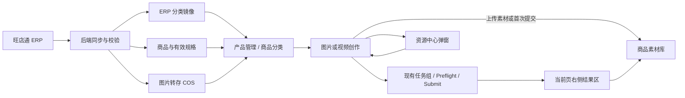

# 达芬奇密码 AI 素材工作台 PRD V2.5：ERP 商品创作闭环

> 版本：V2.5
> 日期：2026-08-10
> 状态：方案评审稿，PRD 与效果图定稿后再进入开发
> 基线：继承 `PRD-V2.3.md` 中的 V2.4 产品能力；冲突处以本文为准
> 原则：ERP 分类唯一、最小改动、优先做减法、避免多头管理

## 1. 摘要

V2.5 将公司 ERP（旺店通）的商品、有效规格、分类和图片接入达芬奇密码 AI 素材工作台，让员工从 ERP 商品目录直接进入图片或视频创作，并将创作素材、任务和结果持续归到同一 SKU 下。

本版本不重做现有工作台。产品管理、商品分类、商品素材库和图片/视频创作页继续保留；图片任务内的资源中心弹窗增加产品维度。生成任务提交后留在当前页查看结果，任务列表继续承担跨商品的执行监控。

## 2. 联系人与文档职责

| 角色 | 负责人 | 职责 |
| --- | --- | --- |
| 产品负责人 | 潘俊杰 | 业务规则、范围和最终验收 |
| ERP 接口方 | 公司 ERP/旺店通负责人 | 接口账号、字段解释、限流和数据正确性 |
| 后端 | 达芬奇密码 AI 后端 | 同步、镜像数据、COS 转存、商品绑定和任务查询 |
| 前端 | EC-AIGCweb | 页面调整、同步状态、规格选择和创作结果留页 |
| 设计/运营 | 内部使用团队 | 字段可理解性、流程效率和生成结果验收 |

本文是 V2.5 产品范围和页面行为依据。正式开发前，前后端还需同步更新 API 契约和实施任务；数据库结构、迁移、生产配置不在本文阶段执行。

## 3. 背景与问题

### 3.1 为什么现在做

当前商品主数据主要由工作台本地维护，ERP 才是公司真实商品和分类来源。继续让员工在两个系统重复建商品、改分类，会产生名称不一致、规格漏选、图片重复上传和责任不清。

生产环境走查还发现：商品、原始素材、生成任务和生成结果分散在多个页面；创作提交后跳到任务列表；图片和视频对商品自动带入的规则不一致；创作页向普通用户暴露 Provider、通道和异步能力等技术概念。

### 3.2 本版本解决的问题

1. ERP 商品、规格、分类和图片进入工作台，商品数据不再重复维护。
2. 同一个 ERP 有效规格成为稳定的创作归属，一条资源只保存一个产品 ID，素材、任务和结果可追溯。
3. 产品管理、商品分类、商品素材库和资源中心各管一件事，不互相替代。
4. 图片和视频创作提交后留在当前页完成等待、查看、失败重试和继续创作。

### 3.3 第一性判断

- 商品分类不是创作系统自建知识，它属于 ERP 主数据，因此 ERP 分类是唯一来源。
- 商品目录不等于创作资产库。全量 ERP 商品应可查，但没有创作活动的商品不应挤进商品素材库。
- 资源中心是创作页内的素材选择器，不是独立管理页面；产品素材只是其中一个选择视图。
- 任务列表是执行监控，不是创作者找结果的第一入口。
- ERP 字段和本地创作字段由不同系统负责，任何同步都不能互相覆盖职责。

## 4. 目标、指标与用户

### 4.1 目标

- 让员工无需重复录入商品和分类，即可从 ERP 商品规格发起创作。
- 让首次创作默认带入可用 ERP 图片，减少重复上传和选错商品。
- 让用户在同一创作页完成“配置 -> 生成 -> 查看结果 -> 继续修改”。
- 在不大改现有页面和底层任务能力的前提下打通数据流。

### 4.2 关键结果

首轮上线后 4 周内观察：

| 指标 | 目标 |
| --- | --- |
| ERP 有效规格同步完整率 | >= 99% |
| 商品/规格增量同步时延 | 95% 在 15 分钟内 |
| 分类每日校准成功率 | >= 99% |
| ERP 图片 COS 转存成功率 | >= 98%，失败可重试 |
| 从产品管理进入创作并成功提交的完成率 | >= 90% |
| 已选商品在图片/视频创作中的上下文一致率 | 100% |
| 提交后被迫跳转任务列表的次数 | 0 |
| ERP 更新覆盖本地创作字段的次数 | 0 |

### 4.3 目标用户

| 用户 | 主要任务 | V2.5 价值 |
| --- | --- | --- |
| 运营/创建人 | 找商品、选素材、生成图片或视频 | 从 ERP 规格直接开始，减少重复录入 |
| 设计/美工 | 补充创作事实、调整 Prompt、选优结果 | 商品上下文稳定，可在当前页连续创作 |
| 审核人 | 按商品查看结果和审核记录 | 结果归属不丢失 |
| 管理员 | 查看同步状态、手动重试和处理映射 | 一处监控 ERP 数据，不维护第二套分类 |

## 5. 价值主张

| 过去 | V2.5 |
| --- | --- |
| ERP 和工作台重复建商品、改分类 | ERP 主数据只读同步，工作台只补创作信息 |
| 商品和素材边界不清 | 产品管理看全量，商品素材库看创作资产，资源中心只负责选择素材 |
| 先找素材再手选商品，容易错配 | 规格和有效图片一起带入，自动建立归属 |
| 提交后离开创作页找结果 | 右侧固定结果区原地刷新 |
| 普通用户理解通道和 Provider | 只选择最终模型和业务参数 |

## 6. 产品方案

### 6.1 范围总览

#### 本版本做

- 接入 ERP 分类、商品、规格和规格图片。
- 产品管理展示全量 ERP 有效规格及同步状态。
- 商品分类展示 ERP 分类树，只读，不支持人工增删改。
- 图片任务资源中心弹窗提供“产品素材、通用素材、模特素材”三个横向入口。
- 图片/视频创作页统一商品带入规则和固定右侧结果区。
- 管理员查看同步状态并手动触发允许的同步或重试。
- 旧本地商品保留“本地来源”，支持后续人工匹配 ERP 规格。

#### 本版本不做

- 不把三个页面合并成新的“商品中心”。
- 不重构模板中心、商品素材库、模特资源库、任务列表或全站导航。
- 不允许工作台人工维护 ERP 分类。
- 不把 ERP 变成创作字段编辑器。
- 不做 ERP 反向写回。
- 不做自动上架、多平台发布和 SKU 智能批量生成。
- 不新增 Provider、工作流编排或第二套任务状态机。
- 不在本阶段修改数据库结构、API、前后端业务代码或生产配置。

### 6.2 权威数据与字段分层

#### ERP 只读字段

| 对象 | 字段示例 | 规则 |
| --- | --- | --- |
| 分类 | `classid`、`fatherid`、`classname`、层级、排序 | ERP 唯一权威，工作台只读 |
| 商品 | `goodsid`、`goodsno`、`goodsname`、品牌、单位、条码 | ERP 更新覆盖 ERP 镜像字段 |
| 规格 | `specid`、`speccode`、`specname`、停用标记 | 一个有效规格对应一个商品项目 |
| 图片 | `goods_id`、`spec_id`、`PicUrl/piclist` | 转存 COS 后供选择，不直接长期依赖源站 URL |

#### 本地创作字段

卖点、材质、颜色、版型结构、创作备注、业务标签、审核信息和生成偏好由工作台维护。ERP 同步不得覆盖这些字段。

页面应明确标记：`ERP 同步，只读` 和 `创作信息，可编辑`。当字段含义相近时，以数据归属而不是页面位置决定能否编辑。

### 6.3 有效规格与商品项目规则

1. 一个有效 ERP 规格对应一个可创作商品项目，稳定键为 ERP 渠道 + `specid`。
2. `specid=0` 的占位规格不进入可创作目录。
3. `bblockup=True` 的停用规格不进入默认可选目录。
4. 无有效规格的商品不创建可创作项目，但管理员可在同步异常中查看原因。
5. 同名规格不合并；不同 `specid` 必须保留独立归属。
6. ERP 商品或规格后续停用时，历史项目标记“ERP 已停用”，仍允许继续创作，历史任务和资产不删除。

### 6.4 ERP 图片规则

1. 同步到的规格图片全部通过后端转存 COS，并保留源 URL、来源规格和同步时间用于追溯。
2. 同一 URL 重复出现时按内容或规范化 URL 去重，但不得跨规格错误合并归属。
3. 图片转存失败不阻断商品目录同步；页面显示“图片同步异常”，管理员可重试。
4. 首次进入图片创作时，第一张有效规格图自动选为主体素材，其余规格图作为可选参考。
5. 用户可以更换主体、上传本地素材或补充参考图。
6. 仅同步 ERP 图片不会让商品进入商品素材库。

### 6.5 三个页面的唯一职责

| 页面 | 展示范围 | 负责 | 不负责 |
| --- | --- | --- | --- |
| 产品管理 | 全量 ERP 有效规格 + 旧本地商品 | 查 ERP 主数据、同步状态、上传素材、发起图片/视频创作 | 人工修改 ERP 字段、维护分类树 |
| 商品分类 | 全量 ERP 分类树 | 浏览分类层级、按分类筛商品、看同步时间和异常 | 新增、改名、移动、删除分类 |
| 商品素材库 | 已发生创作活动的商品规格 | 管本地输入、生成结果、视频、审核和创作记录 | 展示所有未创作 ERP 商品、维护 ERP 主数据 |
| 资源中心弹窗 | 产品素材、通用素材、模特素材 | 在图片任务内选择、上传或转换素材 | 维护商品主数据、ERP 分类和完整模特档案 |

商品素材库准入条件满足任一即可：

- 用户为该规格上传了至少一个本地素材；
- 用户提交了首个图片任务；
- 用户提交了首个视频任务。

创建草稿、浏览详情、仅完成 ERP 图片同步均不计入准入。素材和任务全部归档后，SKU 仍保留在商品素材库并显示历史活动，不自动移除。

### 6.6 产品管理页面

页面沿用现有表格结构，调整为规格级目录：

- 顶部：页面标题、最近同步时间、同步健康状态、管理员“立即同步”。
- 筛选：商品名/货品编号/规格编码、ERP 分类、来源、启停状态、图片状态。
- 表格核心列：规格图、商品/规格、货品编号、规格编码、ERP 分类、品牌、图片数、来源、同步状态、最近同步、操作。
- 默认只显示有效规格；可切换查看 ERP 已停用和本地来源。
- 行操作复用现有能力：查看详情、上传素材、新建图片、新建视频。
- ERP 字段详情只读；本地创作字段在独立区域编辑。

状态说明：

| 状态 | 含义 | 用户操作 |
| --- | --- | --- |
| 已同步 | 主数据和图片均正常 | 可创作 |
| 图片处理中 | 主数据可用，图片仍在转存 | 可上传素材或等待 |
| 部分图片失败 | 至少一张图片转存失败 | 可创作；管理员重试 |
| ERP 已停用 | ERP 商品或规格停用 | 历史可用，默认筛选隐藏 |
| 本地来源 | 尚未匹配 ERP 的旧商品 | 可继续创作；管理员可匹配 |
| 同步异常 | 商品或规格数据无法完成更新 | 查看原因并重试 |

### 6.7 商品分类页面

- 分类树完全来自 ERP，显示层级、商品规格数、最近校准时间。
- 移除人工新增、编辑、拖拽、删除和批量导入入口。
- 支持搜索分类和点击后查看所属规格。
- ERP 删除或停用的分类使用历史标记，不级联删除本地创作数据。
- 本地 `product_category` 仅服务旧数据兼容，不再成为新增商品的分类来源。

### 6.8 商品素材库

商品素材库继续沿用现有页面和名称，本轮不与资源中心合并，也不改造成新的 SKU 素材集合管理页。它仍负责查看已发生创作活动的商品、输入素材、图片结果、视频结果、审核和活动记录。

### 6.8.1 图片任务资源中心弹窗

资源中心是图片任务内打开的宽版选择弹窗，不新增独立导航页面。主体图、参考图和组合素材均复用同一弹窗，通过调用参数保持现有单选或多选行为；组合确认后仍回到现有图片任务流程提交生成。

弹窗一级入口：

- `产品素材`：关联唯一 SKU，始终在团队内共享。
- `通用素材`：未关联 SKU，可见范围由系统配置决定，默认仅本人可见。
- `模特素材`：复用独立模特库的数据、发布状态和权限，只在资源弹窗提供选择入口。

系统配置增加“通用素材可见范围”，枚举为 `个人 / 团队`，默认 `个人`。切换为团队后，工作空间成员可查看团队范围内的通用素材；切回个人后按上传人隔离。产品素材始终团队共享，不受该开关影响。资源中心只读取配置结果，不在弹窗内修改配置。

模特档案仍在独立模特库维护。资源中心只提供已发布模特的查找和选择，不新增性别、年龄、脸部锚点或授权声明编辑表单。

打开规则：

1. 图片任务已有 SKU 上下文时，打开资源中心直接进入当前 SKU 的素材网格，不要求再次选择产品。
2. 主体图入口将 ERP 同步图或用户最近一次更换的图片映射为当前选中项；新增参考图入口没有已有值时保持零选择并正常展示列表，弹窗不额外制造默认选择。
3. 顶部展示当前商品名称、SKU/SPU 编码和 ERP 分类，并提供“切换产品”。
4. 点击“切换产品”，弹窗内部切换为 SKU 产品列表；关闭弹窗前不离开图片任务。
5. 图片任务没有商品上下文时，首次打开直接显示 SKU 产品列表。

SKU 产品列表规则：

1. 一张卡片对应一个 SKU；同一 SPU 下的 SKU 连续排列，多规格 SPU 显示轻量分组标题。
2. 单规格商品直接进入紧凑 SKU 网格，不增加独立 SPU 标题或展开层级。
3. SKU 卡片比例为 `9:16`，封面使用当前白底图；优先使用用户最近一次更换的白底图，否则使用 ERP 同步默认图，两者均不存在时显示空状态。
4. 卡片展示 ERP 商品名称、SKU 编码、规格、素材数量和最近使用时间；宽屏每行 5 个，较窄桌面每行 4 个。
5. 支持按 ERP 商品名称、SPU 编码和 SKU 编码搜索。
6. 产品较多时使用 ERP 分类树筛选，至少覆盖睡衣、围巾、帽子、鞋履等实际分类，并显示分类结果数量。
7. 产品素材一级筛选只保留“全部、最近使用”，图片/视频继续作为独立媒体筛选。
8. SKU 卡片支持多选；选中 1 个时启用本地上传和目录扫描，选中 2 个及以上时启用搭配合成并禁用单 SKU 上传。

进入 SKU 后，弹窗显示该 SKU 的素材网格，默认最新优先。支持按 ERP 同步、用户上传、生成结果和组合结果筛选来源，并按已沉淀的模特、风格、场景、姿势、细节角色以及九大风格和联动场景筛选。上传素材自动绑定当前唯一 `productId`，不增加入库确认、AI 打标或素材分类步骤。

标签不在资源中心维护。用户确认选择并回到图片任务后，在“参考图”区域为图片选择“模特、风格、场景、姿势、细节”角色；角色及用户再生图时选择的标签随素材保存，再次引用时自动带出。通用素材按风格、场景、细节、姿势筛选：风格、场景、姿势支持树形子标签多选并引用现有九大风格及联动字典；细节当前没有子标签，使用扁平多选。同一维度多项按 OR、跨维度按 AND 筛选。某个维度已由参考图承担时，Prompt 底部对应参数保持禁用。

通用素材一级筛选只保留“全部、最近使用”。通用素材执行“设为产品素材”时必须选择一个有效 ERP SKU；确认后写入唯一 `productId`，素材从通用素材移出并进入对应产品素材集合，底层文件不复制。通用图片执行“设为模特”时沿用线上默认名称、标签、适用范围和确认流程，不新增档案字段；成功后从通用素材移出并进入模特素材，后续档案在模特库维护。视频不支持设为模特。

### 6.8.2 商品组合

产品素材提供“单图选择 / 组合素材”模式。组合素材在资源中心完成参与 SKU 与源图选择，确认后带回现有图片任务，不在弹窗内直接提交生成：

1. 搭配由上装、下装和可选鞋履等多个 SKU 组成；组合结果的底层文件只保存一份，每个参与 SKU 建立一条资源引用。
2. 当前主体图来自 ERP 同步图或用户更换结果；进入组合模式后可作为当前 SKU 的默认源图，并允许调整角色。
3. 用户可添加其他参与 SKU，角色为上装、下装和可选鞋履；至少选择两个不同 SKU，同一角色只保留一个有效 SKU。
4. 底部组合栏持续显示三个角色槽位、商品与源图，缺少上装或下装时禁止确认，鞋履保持可选。
5. 点击“带入图片任务”回填组合源图和参与关系，由图片任务现有提交流程生成项目。
6. 组合项目单独记录全部参与 SKU、角色和源图快照。每个参与 SKU 的产品素材集合展示同一组合产物引用，不复制底层文件。
7. 组合素材、任务、结果和成本只产生一份。按任一参与 SKU 搜索均能找到同一组合项目。
8. 关联组合不会自动成为参与 SKU 后续任务的强制参考素材，用户需要时主动选择。
9. ERP 后续改名、换图或停用不改写历史快照；任一参与 SKU 停用后，该组合标记为历史组合，默认不进入新的组合选择器。

### 6.9 图片创作页

图片创作使用独立全屏工作台，不展示应用侧栏；页面只保留返回入口、当前商品上下文和三栏创作区，不因提交切换页面：

| 左栏 `290px` | 中栏 `minmax(540px,1fr)` | 右栏 `330px` |
| --- | --- | --- |
| 主体图、参考图、ERP 标题/分类、SEO 与图片理解参数 | 图片类型、Prompt 与创作标签 | Preflight、排队、生成进度、结果、失败、重试、继续修改 |

左侧商品事实不再重复堆叠 ERP 字段：商品名称直接作为面板标题，ERP 分类作为副标题，二者只读；下方只展示 SEO 名称和图片理解参数。

| 字段 | 来源 | 编辑规则 |
| --- | --- | --- |
| 商品名称 | ERP | 只读，直接作为商品事实面板标题 |
| 商品分类 | ERP | 只读，直接作为标题下的副标题 |
| SEO 优化商品名称 | AI 优化或人工填写 | 本地可编辑，不写回 ERP |
| 颜色 | 图片理解结果 | 本地可编辑 |
| 图案/材质 | 图片理解结果 | 本地可编辑 |
| 版型/结构 | 图片理解结果 | 本地可编辑 |
| 核心卖点 | 图片理解结果 | 本地可编辑 |

关键规则：

1. 从产品管理进入时自动带入规格和第一张有效规格图。
2. 从资源选择主体时，素材根据唯一 `productId` 自动带入商品，不存在多商品归属冲突。
3. 参考图初始化只展示两张已选图片和“添加参考”入口：参考图 1 初始承担“模特”，参考图 2 初始承担“细节”；不再为风格、场景、姿势建立独立图片槽位。
4. 每张参考图均可从固定枚举“模特、风格、场景、姿势、细节”中下拉多选角色。例如同一张模特图可以同时承担模特、风格和场景参考。这里选择的是图片承担的参考类别，不是具体风格名称或场景名称；选择结果保存到素材，再次引用时自动带出。
5. 当任意参考图承担“风格”“场景”或“姿势”时，Prompt 底部对应参数标签立即禁用并显示来源参考图，避免图片参考与枚举值同时生效。Prompt 文本同步写明“风格参考图 1”等引用关系；取消该角色后恢复对应参数标签。
6. ERP 商品名称与分类只读并上移为面板标题与副标题；SEO 优化商品名称及颜色、图案/材质、版型/结构、核心卖点显示在下方，继续允许本地修改。界面不再展示“AI 优化”“图片理解”等来源标签。
7. 风格、场景、姿势、最终模型和图片比例统一显示为 Prompt 编辑器底部标签，不再占用独立参数卡片。未被参考图接管时，风格单选且严格使用九大正式风格；场景和姿势仅显示该风格允许项。
8. 切换风格时保留仍兼容的当前场景和姿势；不兼容时分别回落到该风格的默认场景、默认姿势。场景或姿势变化后重新编译所有已选图片类型的 Prompt。
9. 删除普通用户侧“高级设置与负面约束”入口。数量、分辨率、质量直接汇总显示；商品保真、结构稳定、内容安全等负面约束由模板和系统规则自动编译，不提供第二套人工维护入口。
10. 普通用户不看到 Provider、通道实例、能力编码和 `async`。
11. 提交后保存 `groupId/taskIds`，右栏使用现有任务详情和生成结果接口刷新。
12. 页面刷新后可恢复当前任务组；离开页面不终止后台任务。

#### 6.9.1 图片创作字典基线

字典管理必须为风格、场景和姿势维护稳定编码、正式参数名称和预览图。新建图片任务中的风格字典严格限定为以下九项：

| 编码 | 正式参数名称 | 预览图 | 默认场景 | 默认姿势 |
| --- | --- | --- | --- | --- |
| `SWEET_CREAMY` | 奶油甜妹卧室 | `style-sweet-creamy.png` | 奶油柔光卧室 | 自然站姿 |
| `QUIET_LUXURY` | 静奢深睡品质感 | `style-quiet-luxury.png` | 窗边安静居家 | 窗边缓步 |
| `VINTAGE_HOME` | 复古田园居家 | `style-vintage-home.png` | 旧木田园空间 | 床边自然坐姿 |
| `EASTERN_MATURE` | 东方雅致轻熟 | `style-eastern-mature.png` | 浅色质感家居 | 45 度微侧身 |
| `NEW_CHINESE_MINIMAL` | 新中式雅致 | `style-new-chinese-minimal.png` | 留白新中式 | 轻整理袖口 |
| `DOPAMINE_PLAYFUL` | 多巴胺元气居家 | `style-dopamine-playful.png` | 元气彩色房间 | 轻转身 |
| `DARK_GOTHIC` | 甜酷暗黑辣妹 | `style-dark-gothic.png` | 暗调缎面居家 | 侧身回望 |
| `SWEET_COOL_STREET` | 甜酷美式街头 | `style-sweet-cool-street.png` | 明亮低干扰影棚 | 45 度微侧身 |
| `FRENCH_FEMININE` | 法式轻奢裙装 | `style-french-feminine.png` | 旧木田园空间 | 侧身回望 |

- 场景正式项：奶油柔光卧室、窗边安静居家、旧木田园空间、浅色质感家居、留白新中式、元气彩色房间、暗调缎面居家、明亮低干扰影棚；每项使用同名 `scene-*.png` 预览图。
- 姿势正式项：自然站姿、45 度微侧身、床边自然坐姿、窗边缓步、轻整理袖口、轻转身、侧身回望；每项使用同名 `pose-*.svg` 预览图。
- 每个风格还必须维护 `allowedSceneIds`、`allowedPoseIds`、`defaultSceneId`、`defaultPoseId`。创建页从字典读取，不复制维护第二份名称或图片。
- `SWEET_INFLUENCER`、`PURE_DESIRE`、`MATURE`、`CHINESE_TRADITIONAL` 等旧别名或实验项不进入新建任务选择器；历史任务仅做只读兼容显示。
- 参考图角色使用独立固定枚举 `MODEL`、`STYLE`、`SCENE`、`POSE`、`DETAIL`。它只表达“参考这张图片的什么”，不复制九大风格、场景或姿势字典值。

### 6.10 视频创作页

沿用现有三栏：

| 左栏 `300px` | 中栏 `minmax(0,1fr)` | 右栏 `380px` |
| --- | --- | --- |
| 商品规格、首帧/源视频、参考素材、商品事实 | 模式、Prompt、分镜、最终模型和动态参数 | 视频预览、队列/进度、失败、重试、继续修改 |

视频页与图片页共用素材带商品规则。从图片结果发起视频时，自动带入商品规格、结果图、来源任务和比例。当前右栏参数面板移入中栏，右栏固定为视频结果区。

### 6.11 结果区状态与动作

| 状态 | 展示 | 主要动作 |
| --- | --- | --- |
| 未开始 | 生成准备摘要和空预览 | 检查并生成 |
| Preflight | 校验步骤和费用预估 | 返回修改、确认执行 |
| 排队中 | 队列位置、提交时间、占位卡 | 后台运行 |
| 生成中 | 阶段、进度、已完成结果 | 查看已完成项 |
| 部分成功 | 成功结果 + 失败原因 | 重试失败项 |
| 全部成功 | 大图/视频、缩略图、版本信息 | 继续修改、图片转视频、晋升资产 |
| 失败/超时 | 可理解原因和建议 | 重试、调整参数 |
| 审核拦截/额度不足 | 明确阻断原因 | 修改内容、联系管理员 |

首发的“继续修改”复用现有重试/再次创作和 `ImageRevisionDialog` 能力，不在本轮新建复杂会话版本模型。界面保留版本位置，为后续 V1/V2/V3 关系演进预留，但不扩展后端状态机。

### 6.12 同步策略与管理员操作

| 数据 | 自动同步 | 手动操作 |
| --- | --- | --- |
| 商品/规格 | 增量同步，95% 在 15 分钟内 | 管理员触发增量 |
| 规格图片 | 跟随商品增量发现并异步转存 | 单商品/失败任务重试 |
| 分类 | 每日全量校准 | 管理员触发全量校准 |

所有同步操作异步执行。前端触发后显示任务已创建，不锁住页面等待。重复触发应幂等或明确提示已有任务执行中。失败记录应包含可理解原因、最后成功时间、重试次数和关联商品/规格。

### 6.13 旧数据兼容

- 旧本地商品继续使用并标记“本地来源”。
- 管理员可将一个旧本地商品匹配到一个 ERP 有效规格。
- 匹配前必须预览 ERP 字段、本地创作字段、素材数和历史任务数。
- 匹配后只补充 ERP 归属，不覆盖本地创作字段，不复制历史任务和资产。
- 同一旧商品不能同时匹配多个 ERP 规格；同一 ERP 规格的重复匹配需阻止或进入合并检查。
- 正式匹配可能涉及数据更新，需另行评审并遵守数据库变更红线。

### 6.14 核心数据流



## 7. 技术与约束

### 7.1 复用要求

- 复用现有旺店通 API 客户端、同步任务和图片转存设计，不新增第二套 ERP 接入。
- 复用现有产品管理、商品分类、商品素材库和 `AssetTransitModal` 素材选择能力。
- 复用 `ThreeColumnLayout`、`TaskParamsPanel`、能力 schema 和 `schemaParams` 原样透传。
- 复用现有任务组 `groupId/taskIds`、任务详情和生成结果接口。
- 复用现有 Preflight、费用确认、Submit、队列、审核和资产归档。
- 路由和状态管理保持现状，本轮不为此引入新依赖。

### 7.2 API 契约最低要求

正式开发前补充：

- ERP 分类树、规格分页/详情、同步状态与同步任务接口。
- 规格图片 COS 状态、失败重试接口。
- 产品管理发起创作所需的规格上下文 DTO。
- 商品素材库准入状态和首次活动时间。
- 资源中心按 SKU 查询产品素材、当前白底图和素材数量。
- 资源中心上传资源绑定唯一 `productId`，更新参考图角色标签。
- 通用素材可见范围配置查询与更新接口，默认值为个人。
- 通用素材转产品的 ERP SKU 选择、唯一 `productId` 更新和原子归集语义。
- 通用图片转模特的导入状态与通用素材列表移除语义。
- 组合项目参与 SKU、参与角色、源图快照和共享资源引用查询。
- 创作页按任务组获取进度、图片结果和视频结果的统一刷新规则。
- 旧本地商品与 ERP 规格匹配的校验和确认接口。

接口字段必须区分 ERP 只读字段和本地创作字段。不得由前端根据文案猜测字段所有权。

### 7.3 假设与待验证

- 旺店通 API 能稳定返回商品修改时间，支持增量游标；若不能，需要安全的分页全量兜底。
- `goodsPicList` 在真实数据中可能返回 `PicUrl` 或 `piclist` 两种形态，转换层需兼容。
- 图片源站允许后端拉取；若存在防盗链、过期链接或内网限制，需要 ERP 方提供访问方案。
- ERP 分类可能存在空分类、断裂父节点或循环关系，前端树不能因此整体不可用。
- 一个 ERP 有效规格作为资源的稳定归属；资源不扩展多产品关联。

## 8. 用户故事与验收

### US-25-01：浏览全量 ERP 规格

- GIVEN ERP 已完成同步，WHEN 用户进入产品管理，THEN 默认看到所有有效规格而不是商品聚合行。
- GIVEN 规格 `specid=0` 或 `bblockup=True`，WHEN 默认筛选加载，THEN 该规格不进入可创作列表。
- GIVEN 用户按 ERP 分类筛选，WHEN 选择分类，THEN 结果与商品分类树一致。

### US-25-02：从 ERP 商品开始创作

- GIVEN 规格有多张已转存图片，WHEN 用户点击“新建图片”，THEN 第一张有效图成为主体，其余图可作为参考。
- GIVEN 规格图片仍在处理或全部失败，WHEN 用户进入创作，THEN 可等待或上传本地素材，页面说明原因。
- GIVEN 用户修改卖点或材质，WHEN ERP 再次同步，THEN 本地创作字段保持不变。
- GIVEN 用户进入新建图片任务，WHEN 页面加载完成，THEN 页面使用无应用侧栏的全屏三栏布局，右侧结果区完整可见。
- GIVEN 商品上下文已带入，WHEN 用户查看左侧商品事实，THEN ERP 商品名称直接作为标题、ERP 分类作为副标题且二者只读；下方完整显示可编辑的 SEO 名称和图片理解参数。
- GIVEN 用户尚未添加额外参考图，WHEN 查看参考图区，THEN 显示参考图 1、参考图 2 和添加入口；两张图片分别初始承担模特、细节角色。
- GIVEN 用户打开任意参考图的角色下拉，WHEN 选择角色，THEN 可从模特、风格、场景、姿势、细节五项中多选，并保存到素材及当前任务草稿。
- GIVEN 参考图 1 同时承担风格和场景，WHEN 用户查看 Prompt，THEN 文本写明“风格与场景参考图 1”，底部风格和场景标签禁用并显示“参考图 1”，姿势等未被接管标签仍可操作。
- GIVEN 用户取消某参考图的风格角色，WHEN 页面重新编译 Prompt，THEN 风格标签恢复可选并继续使用九大正式风格字典。
- GIVEN 风格、场景或姿势未被参考图接管，WHEN 用户调整对应标签，THEN 选项参与所有已选图片类型的 Prompt 与执行快照；已被接管的标签保持禁用。
- GIVEN 用户打开风格选择器，WHEN 字典加载成功，THEN 只显示九大正式风格及对应预览图，不显示旧别名和实验项。
- GIVEN 用户切换风格，WHEN 当前场景或姿势仍在新风格允许范围，THEN 保留当前选择；WHEN 不兼容，THEN 自动切换到该风格的默认场景或姿势。
- GIVEN 用户查看 Prompt 底部，WHEN 数量、分辨率和质量已汇总显示，THEN 页面不再出现“高级设置与负面约束”入口，系统约束由模板自动应用。

### US-25-03：图片任务资源中心

- GIVEN 图片任务已有 SKU 上下文，WHEN 用户打开资源中心，THEN 弹窗默认进入当前 SKU 素材网格，并同时保留产品素材、通用素材和模特素材入口。
- GIVEN 主体图已经使用 ERP 同步图或用户更换图，WHEN 用户打开资源中心，THEN 对应素材高亮为当前选中项；从空的参考图入口打开时不预选任何素材。
- GIVEN 用户点击“切换产品”，WHEN 产品列表加载，THEN 每个 SKU 显示为独立卡片且同一 SPU 下连续排列。
- GIVEN 产品数量较多，WHEN 用户选择睡衣、围巾、帽子或鞋履等 ERP 分类，THEN SKU 列表只展示该分类结果并保留搜索条件。
- GIVEN SKU 已有用户更换的白底图，WHEN 卡片加载，THEN 封面显示该白底图；没有更换图时回退 ERP 同步默认图。
- GIVEN 图片任务没有 SKU 上下文，WHEN 用户打开资源中心，THEN 弹窗默认显示 SKU 产品列表。
- GIVEN 用户进入某个 SKU 并上传图片，WHEN 上传完成，THEN 图片直接绑定当前唯一 `productId`，不要求填写分类或标签。
- GIVEN 素材已在创作页保存参考角色或风格参数，WHEN 用户在资源中心筛选，THEN 可以使用来源、角色、九大风格和联动场景定位素材，但不能在弹窗内编辑这些标签。
- GIVEN 通用素材范围保持默认个人，WHEN 用户打开通用素材，THEN 只显示本人未关联产品的素材，不显示团队成员筛选。
- GIVEN 管理员把通用素材范围设为团队，WHEN 工作空间成员打开通用素材，THEN 可查看团队范围素材，产品素材共享规则不变。
- GIVEN 用户展开风格、场景或姿势筛选，WHEN 选择多个子标签，THEN 同维度按 OR、跨维度按 AND 筛选；细节只显示扁平多选项。
- GIVEN 用户对通用素材执行“设为产品素材”，WHEN 选择并确认一个有效 ERP SKU，THEN 素材移出通用素材并进入该 SKU 的产品素材，文件不复制。
- GIVEN 用户对本人通用图片执行“设为模特”，WHEN 确认转换，THEN 不要求补充档案字段，素材移出通用素材并进入模特素材。
- GIVEN 当前素材为视频，WHEN 用户查看可用操作，THEN 不显示或禁用“设为模特”。
- GIVEN 视口为 1440×900，WHEN 产品列表加载，THEN 9:16 SKU 卡片每行显示 5 个；视口为 1280×720 时每行显示 4 个。
- GIVEN 主体图入口以单选模式打开资源中心，WHEN 用户确认，THEN 只返回一张素材；参考图入口按现有多选参数返回允许数量的素材。
- GIVEN 用户在参考图区域为图片选择角色，WHEN 保存任务草稿，THEN 角色同步保存到素材；再次引用时自动带出。
- GIVEN 用户关闭资源中心，WHEN 返回图片任务，THEN 当前任务配置和已选商品上下文不丢失。
- GIVEN 商品后续 ERP 停用，WHEN 用户查看历史素材，THEN 仍可查看和继续创作，并看到“ERP 已停用”。

### US-25-03A：商品组合归集

- GIVEN 用户在产品素材切换到组合素材，WHEN 弹窗打开组合模式，THEN 当前 SKU 的现有主体图自动进入对应角色槽位，并显示上装、下装和可选鞋履。
- GIVEN 用户缺少上装或下装，WHEN 查看底部组合栏，THEN “带入图片任务”保持禁用并明确缺失角色。
- GIVEN 用户完成上装、下装和可选鞋履选择，WHEN 点击“带入图片任务”，THEN 弹窗关闭并把源图、SKU 和角色回填到现有图片任务，不在弹窗内直接生成。
- GIVEN 用户从当前 SKU 开始商品组合，WHEN 选择上装、下装和可选鞋履，THEN 系统记录全部参与 SKU、角色与源图快照。
- GIVEN 组合包含多个参与 SKU，WHEN 组合成功，THEN 结果文件只保存一份，每个参与 SKU 建立资源引用并可查看同一产物。
- GIVEN 用户从任一参与 SKU 搜索组合，WHEN 查看结果，THEN 不产生重复资源、重复成本或重复审核计数。
- GIVEN 用户进入参与 SKU 的后续创作，WHEN 未主动选择关联组合，THEN 系统不强制把组合结果作为参考素材。

### US-25-04：创作结果留在当前页

- GIVEN 用户确认费用并提交，WHEN服务端返回任务 ID，THEN 页面不跳转，右侧进入排队状态。
- GIVEN 多个结果逐个完成，WHEN轮询返回新结果，THEN 右侧逐个展示，无需等待全组结束。
- GIVEN 任务部分失败，WHEN查看右侧，THEN 成功结果可用，失败项有原因和重试入口。
- GIVEN 页面刷新，WHEN任务仍在运行，THEN 根据当前任务组恢复进度和已有结果。

### US-25-05：ERP 停用与同步异常

- GIVEN ERP 商品或规格停用，WHEN同步完成，THEN 新选择器默认隐藏，历史项目不删除。
- GIVEN 图片转存失败，WHEN用户查看产品管理，THEN 显示“部分图片失败”，管理员可重试且不会重复创建已成功资源。
- GIVEN 分类校准失败，WHEN普通用户浏览分类，THEN 保留最后一次成功数据并显示数据更新时间；管理员看到异常详情。

### US-25-06：旧商品匹配 ERP

- GIVEN 商品为“本地来源”，WHEN管理员选择匹配，THEN 系统展示候选 ERP 规格和影响预览。
- GIVEN 管理员确认匹配，WHEN操作成功，THEN 历史素材和任务保持原 ID 与归属，本地创作字段不被覆盖。

## 9. 非功能要求

- 产品管理首屏 2 秒内显示骨架或已有缓存数据；同步不阻塞页面。
- 商品/规格分页由服务端执行，不能一次加载全量到浏览器。
- ERP 源图片必须经过 SSRF、防超大文件、格式和超时校验后再转存。
- ERP 密钥和签名只存在后端安全配置中，绝不返回前端或写入文档。
- 所有管理员手动同步、重试和匹配操作记录操作者、时间、对象和结果。
- 同步失败时保留最后一次成功数据，避免页面因单次失败清空。
- 1440px 桌面端三栏完整可用；低于三栏断点时允许堆叠，但操作和结果不得丢失。

## 10. 发布计划

| 阶段 | 范围 | 完成标准 |
| --- | --- | --- |
| P0 方案定稿 | PRD、4 个主页面效果图、全状态参考 | 产品确认数据权威、页面职责和创作布局 |
| P1 后端数据流 | 分类、商品、规格、图片同步与查询 | 沙箱数据可追溯，失败可重试 |
| P2 商品入口 | 产品管理、商品分类、商品素材库准入、资源中心弹窗 | 页面与弹窗职责符合本文 |
| P3 创作闭环 | 图片/视频带入、固定结果区 | 提交不跳页，状态和结果可恢复 |
| P4 兼容与灰度 | 旧商品匹配、停用、异常、指标 | 小范围真实商品验证后再扩大 |

发布应按“ERP 只读查询 -> 商品入口 -> 创作结果留页 -> 旧数据匹配”逐步开放。任一阶段不得用临时人工维护第二套分类作为兜底。

## 11. 风险与应对

| 风险 | 影响 | 应对 |
| --- | --- | --- |
| ERP 字段质量不稳定 | 分类断裂、图片缺失、规格重复 | 镜像原始 payload、校验、异常队列和最后成功数据 |
| 同步与本地编辑互相覆盖 | 创作信息丢失 | 字段分层、独立 DTO、覆盖测试 |
| 全量商品进入商品素材库 | 页面噪声和性能下降 | 严格按本地上传/首次任务准入 |
| 通用素材配置与后端权限语义不一致 | 用户误判资源范围 | 开发前提供持久化配置接口并验证个人/团队查询边界 |
| 组合结果复制到多个 SKU | 重复资源、成本与审核 | 底层文件只存一份，各参与 SKU 仅建立资源引用 |
| 为了连续创作重做状态机 | 工期和风险失控 | 先复用任务组和现有重试能力 |
| ERP 停用导致历史不可用 | 审核和复盘断链 | 软状态提醒，不删除历史资产与任务 |
| 多页面继续维护相同字段 | 多头管理复发 | 在 PRD 和接口中写死每页唯一职责 |

## 12. 定稿门槛

进入前后端开发前，必须完成：

1. 产品确认 4 个主页面效果图和全状态参考。
2. ERP 方确认分类、商品、规格、图片字段以及停用规则。
3. 前后端确认规格稳定键、字段所有权、商品素材库准入 DTO、资源中心 SKU 查询、资源唯一 `productId` 和组合参与关系。
4. 后端确认现有旺店通同步设计与本 PRD 冲突项。
5. 前端确认图片/视频结果接口足以支撑右侧刷新与页面恢复。
6. 数据库 schema、迁移、生产配置如需调整，另行提交方案并取得明确授权。

## 13. 版本登记

```markdown
| PRD-003 | 达芬奇密码 AI 素材工作台 - V2.5 ERP 商品创作闭环 | ERP 分类为唯一商品分类源，一条普通资源只保存一个产品 ID。商品素材库保持独立；图片任务内的资源中心弹窗提供产品素材、通用素材和模特素材，通用素材默认仅本人可见并支持转产品或模特，产品列表按 9:16 SKU 卡片及 SPU 连续关系展示。搭配产物底层文件只存一份，各参与 SKU 建立资源引用。图片/视频创作保留三栏和固定右侧结果区，提交后不跳任务列表。整体遵循最小改动、字段分层和历史兼容原则。 | docs/product/PRD-V2.5.md |
```
