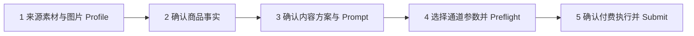
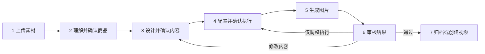
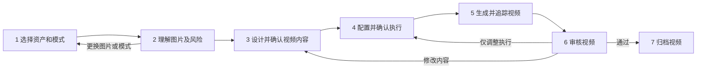
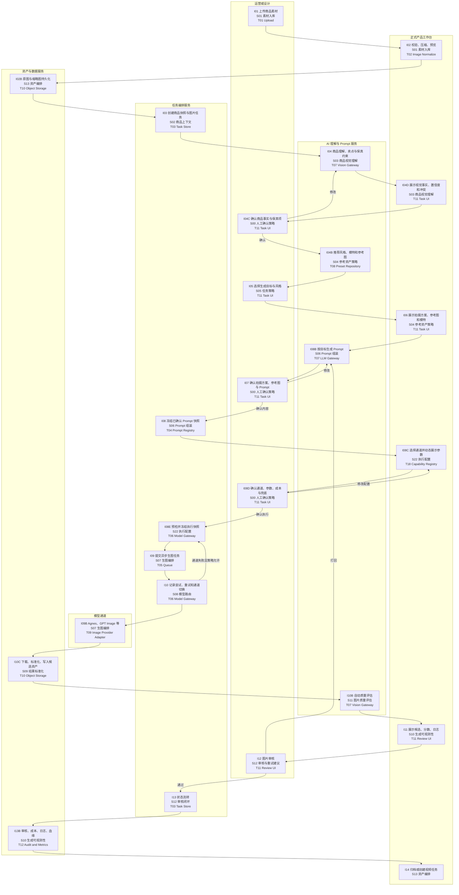
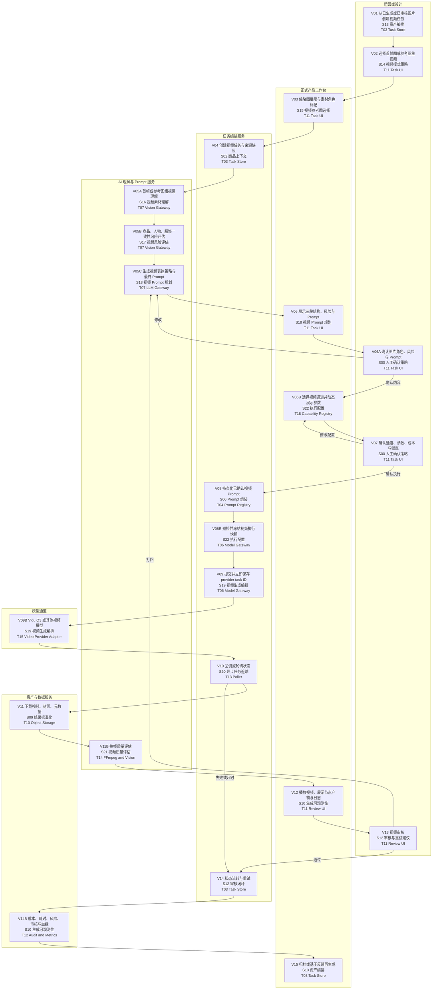

# 达芬奇密码 AI 素材工作台：生图、生视频工作流与 AI Skills/平台能力蓝图

版本：V1.3  
日期：2026-07-14  
用途：将已经在飞书多维表格中验证有效的生图、生视频流程，抽象为正式产品可复用的业务工作流、AI Skills 和平台能力。

## 1. 结论摘要

当前多维表格和工作台实跑已经验证了四个最重要的业务假设：

1. 商品信息、商品参考图、模特参考图、风格和保真约束可以共同驱动较稳定的图片生成。
2. 图片结果可以继续作为首帧图或参考图组，驱动视频提示词和 Vidu 视频生成。
3. 通过生成结果、失败标签、审核结论和模型对比记录，可以形成可复盘的质量闭环。
4. 商品理解、拍摄方案、Prompt 和付费执行必须分阶段确认；模型通道及其参数不能只隐藏在设置页或依赖 Prompt 文本表达。

正式产品不应直接复制当前“一个主表承载全部字段”的实现。建议采用以下架构：

- 工作流层：显式任务状态机，分别控制商品事实确认、Prompt 确认、执行确认、生成、轮询、审核和重试。
- AI Skill 层：只封装需要模型推理、可跨任务复用并可独立评估的业务判断，一期收敛为 5 个 Skills。
- 平台能力层：提供媒体处理、资产、工作流、内容配置、AI 调用、生成通道和审计 7 个稳定能力；队列、轮询和 Provider Adapter 属于内部实现。
- 数据层：商品、任务、生成尝试、素材、Prompt 快照、执行快照和审核记录分别存储，禁止继续用覆盖字段保存历史。
- 飞书定位：保留为 Demo、模板实验、业务导入导出和人工同步入口，不作为正式产品唯一主数据源或运行时编排器。

## 2. 当前多维表格分析

### 2.1 当前结构

当前 Base 包含 12 张数据表和 1 个仪表盘，核心表如下：

| 当前表 | 当前职责 | 正式产品对应对象 |
| --- | --- | --- |
| 新品上市规划 副本 | 商品输入、图片任务、视频任务、Prompt、参数、结果和审核 | 拆分为商品、图片任务、视频任务、任务上下文、审核记录 |
| 01-标准三视图 | 正面、侧面、背面标准参考 | `reference_presets`、`asset_files` |
| 02-风格选项 | 风格名称、风格描述、风格模特图 | `style_presets` |
| 03-模特列表 | 模特参考图、三视图、身份描述、一致性约束 | `model_profiles`、`model_profile_assets` |
| 模型出图对比 | 模型、通道、状态、耗时、结果、错误和人工评价 | `generation_attempts`、`model_call_logs` |
| 提示词库 | 模板、版本、适用目标、输入来源、输出目标和语言 | `prompt_templates`、`prompt_template_versions` |
| 动作姿势表 | 动作/姿势参考 | `pose_presets` |

主表当前有 98 个字段：

- 附件字段 15 个。
- 文本字段 45 个。
- 单选/多选字段 17 个。
- 关联字段 2 个、Lookup 4 个。
- 公式字段 1 个。
- 智能字段或 CLI 暂不支持字段 10 个。
- 至少 25 个字段带有“思考过程、输出结果、新版本、老版、副本”等实验性命名。

### 2.2 当前有效机制

- 商品层：白底图、商品特点、保真检查项和负面约束共同定义“商品不能被改成什么”。
- 风格层：风格类型、风格描述、场景和模特资源定义“画面应该是什么感觉”。
- 人物层：模特参考照片、模特身份描述和人物一致性约束共同锁定人物。
- 图片任务层：上身三视图、风格主图、风格场景图、细节图使用不同 Prompt 字段和结果字段。
- 视频任务层：首帧图生视频与参考图生视频使用不同提示词字段，并配置时长、比例、分辨率和运动幅度。
- 结果层：图片结果写入主表入选字段，完整历史写入模型出图对比表；视频结果写入 `vidu视频`。
- 复盘层：图片失败标签、视频问题标签、审核结论和备注支持人工复盘。

### 2.3 正式产品必须修正的问题

1. 主表职责过重：商品、任务、Prompt、结果、配置和审核混在一条记录中。
2. 字段被用作版本管理：新版本、老版、副本字段会持续膨胀，无法形成可查询的模板版本历史。
3. 字段被用作流程节点：字段是否有值被当作流程是否完成，缺少显式任务状态和节点运行记录。
4. 结果字段会覆盖：主表只适合保存当前入选结果，正式产品必须保存每次生成尝试和全部候选。
5. 类型约束不足：例如 `视频时长` 曾出现 `1080p` 选项，说明字段配置与运行参数缺少服务端校验。
6. 异步任务追踪不足：正式产品必须在提交模型后立即持久化 task ID，不能只保存在页面内存。
7. 当前 Base 没有原生 Workflow 对象，实际编排依赖智能字段和外部工作台代码；正式产品应建设独立编排服务。
8. 通道参数缺少能力约束：Prompt 中写入 `4:5` 不等于 Provider 实际收到比例参数，正式产品必须使用结构化参数并校验返回规格。
9. 失败语义不可靠：队列满时不能复用旧图并标记为本次生成成功；资产复用必须是用户明确选择的独立动作。
10. 通道切换不透明：主通道、重试、兜底通道和切换原因必须生成独立 `generation_attempt`，不能静默完成。
11. Prompt 可能混入未确认的旧字段或被字符串替换破坏语义；正式产品只使用已确认快照，并禁止无语义的字符串级改写。
12. 付费生成前缺少统一预检：应展示实际参考图数量和顺序、通道健康度、预计耗时、成本、参数边界和兜底策略。

## 3. 产品化总体工作流

正式产品同时存在两层流程：

- **新建任务五步流程**：来源素材与任务 Profile -> 商品/来源事实确认 -> Prompt 内容确认 -> 通道参数与 Preflight -> 用户确认付费执行。
- **任务生命周期**：Submit 之后继续经历排队、生成、结果校验、审核、打回、重试和归档。生成和审核不是新建向导中的额外步骤。

任何付费生成都必须严格经过：`确认 Prompt -> 选择通道和参数 -> Preflight -> 用户确认执行 -> Submit`。前端不能绕过阶段直接调用 Provider，后端必须再次校验确认快照、Preflight、幂等键和任务组完整性。

```mermaid
flowchart LR
    A[商品与素材入库] --> B[商品视觉理解]
    B --> C{确认商品事实与保真项}
    C -->|修改| B
    C -->|确认| D[拍摄方案、参考资产与 Prompt]
    D --> E{确认内容方案}
    E -->|修改| D
    E -->|确认| F[选择模型通道并加载能力参数]
    F --> G[预检成本、健康度、规格和兜底策略]
    G --> H{确认付费执行}
    H -->|修改配置| F
    H -->|确认| I[生成图片候选]
    I --> J{图片审核}
    J -->|通过| K[入选图片资产]
    J -->|打回| D
    K --> L[创建视频任务并选择图片角色]
    L --> M[图片理解、风险评估与视频 Prompt]
    M --> N{确认内容方案}
    N -->|修改| M
    N -->|确认| O[选择视频通道、模式与动态参数]
    O --> P{确认付费执行}
    P -->|修改配置| O
    P -->|确认| Q[生成并轮询视频]
    Q --> R{视频审核}
    R -->|通过| S[归档商品图片与视频资产]
    R -->|打回| M
```



图片和视频统一使用 `generation_tasks`，通过 `media_type` 和 `task_profile` 区分，并共享商品、素材、Prompt 模板、模型通道、审核和可观测性能力。一次创建流程对应一个 `generation_task_group`；单视频任务也使用只有一个子任务的任务组。

正式任务 Profile 固定为：图片 `main_image`、`scene_image`、`detail_image`、`tryon_three_view`；视频 `img2video`、`reference2video`。

## 4. 生图主流程

生图新建向导固定为五步：



主图、场景图、细节图和上身/三视图可以在一个向导中多选。系统创建一个任务组和多个子任务，共享商品上下文、主通道、模型、执行参数和兜底策略；每个子任务拥有独立 Prompt、Prompt 快照、执行快照、生成尝试和结果。任一子任务 Preflight 失败时，整组禁止确认和提交。

以下流程描述 Submit 之后的完整生命周期。压缩、存储、队列、Provider Adapter、轮询和日志属于平台能力内部实现，不作为新建向导步骤展示。



### 4.1 阶段产物与能力归属

| 阶段 | 用户确认或查看 | 主要 AI Skill | 主要平台能力 | 阶段产物 |
| --- | --- | --- | --- | --- |
| 1 上传素材 | 商品图、模特图、风格图和参考图 | 无 | Media Processor、Asset Repository | 标准化素材及角色标签 |
| 2 理解并确认商品 | 品类、颜色、图案、面料、版型、卖点和禁止改变项 | `visual-understanding` | AI Gateway、Workflow Engine | 已确认商品事实快照 |
| 3 设计并确认内容 | 拍摄画面、风格、场景、模特、参考图关系和最终 Prompt | `creative-planning`、`prompt-composer` | Content Registry、AI Gateway、Workflow Engine | 内容方案和 Prompt 快照 |
| 4 配置并确认执行 | 通道、比例、尺寸、张数、参考图顺序、成本、健康度和兜底策略 | 无 | Generation Gateway、Workflow Engine | 预检结果和执行快照 |
| 5 生成图片 | 排队、生成进度、重试和通道切换原因 | 无 | Workflow Engine、Generation Gateway、Asset Repository | 生成尝试和候选图片 |
| 6 审核结果 | 候选图、规格、质量分、问题标签和版本差异 | `quality-evaluator`、`retry-advisor` | AI Gateway、Audit & Metrics | 审核结论或重试方案 |
| 7 归档或创建视频 | 入选资产及下一步入口 | 无 | Asset Repository、Workflow Engine | 归档图片或预填视频任务 |

### 4.2 生图关键规则

- 商品事实确认、内容确认和付费执行确认是三个不同节点。
- 商品参考图、模特参考图、风格图和姿势图必须有角色和顺序，不能仅传无序图片。
- 主图、场景图、细节图和上身/三视图通过 `task_profile` 复用同一组 Skills，不建立独立 Skill。
- Prompt 只读取已确认商品快照和内容方案；比例、分辨率、张数等执行参数必须结构化提交。
- 所有模型调用都建立独立 `generation_attempt`；重试或切换通道不能覆盖历史记录。
- 队列满、限流和超时只能保持排队、等待重试或失败，不能复用旧资产伪装成功。
- 旧资产复用必须由用户显式选择，并标记 `source_type = reused`。
- 三视图主要用于结构审核；进入视频时默认不拆图、不直接作为首帧。
- 结果必须校验数量、尺寸、比例、格式和重复资产，规格不符标记 `spec_mismatch`。
- `spec_mismatch` 是结果校验状态，不是任务状态；结果必须进入人工审核且不得自动归档。
- 复用历史资产时创建 `source_type = reused` 的结果记录，不创建 Provider 成功尝试，也不产生生成成本。

## 5. 生视频主流程

视频新建向导同样使用五步：来源资产与视频 Profile、确认来源事实、确认视频 Prompt、通道参数与 Preflight、确认付费执行。视频模式分别使用 `img2video` 和 `reference2video` Profile，单个视频任务仍由一个单子任务任务组承载。



### 5.1 阶段产物与能力归属

| 阶段 | 用户确认或查看 | 主要 AI Skill | 主要平台能力 | 阶段产物 |
| --- | --- | --- | --- | --- |
| 1 选择资产和模式 | 首帧图或参考图组、图片角色和顺序 | `creative-planning` | Asset Repository、Content Registry | 视频来源快照 |
| 2 理解图片及风险 | 主体、人物、服装、场景、细节和冲突 | `visual-understanding`、`creative-planning` | AI Gateway | 视觉摘要和风险提示 |
| 3 设计并确认视频内容 | 主叙事、节奏、图片绑定和最终视频 Prompt | `creative-planning`、`prompt-composer` | Content Registry、AI Gateway、Workflow Engine | 视频内容方案和 Prompt 快照 |
| 4 配置并确认执行 | 视频通道、模式参数、时长、比例、分辨率、成本和兜底策略 | 无 | Generation Gateway、Workflow Engine | 预检结果和执行快照 |
| 5 生成并追踪视频 | Provider task ID、进度、耗时和失败原因 | 无 | Workflow Engine、Generation Gateway、Media Processor、Asset Repository | 视频、封面和生成尝试 |
| 6 审核视频 | 播放器、抽帧评分、漂移时间点和问题标签 | `quality-evaluator`、`retry-advisor` | Media Processor、AI Gateway、Audit & Metrics | 审核结论或重试方案 |
| 7 归档视频 | 入选视频和商品资产关系 | 无 | Asset Repository、Workflow Engine | 归档视频资产 |

### 5.2 两种视频模式的输入规则

| 模式 | 默认输入 | Prompt 重点 | 主要风险 |
| --- | --- | --- | --- |
| 首帧图生视频 | 1 张审核通过的风格主图或上身图 | 基于首帧已有构图描述小幅动作和运镜 | 大动作造成服装、人物和背景漂移 |
| 参考图生视频 | 1 张风格主图 + 最多 3 张场景图 + 1 张细节图 | 明确每张图角色，综合锁定人物、服装、场景和细节 | 多图角色冲突、不同服装被错误融合 |

三视图继续作为审核和结构校验资产，不默认加入参考图组。用户需要强制加入时，系统必须提示其可能被模型理解为拼图或多人物画面。

### 5.3 视频 Prompt 生成顺序

1. 理解信息密度：识别必须突出、辅助表达和不可改变的信息。
2. 设计视频表达策略：输出一句主叙事逻辑、三段视觉节奏和每段视觉重点。
3. 定义图片绑定关系：明确哪些图片用于吸引、说服和建立信任。
4. 生成最终 Prompt：只输出可直接提交模型的 Prompt，不重复前面的分析结构。

首帧图与参考图组使用不同 `task_profile`，但共享商品保真、人物一致性、运动风险和执行确认机制。

### 5.4 通道与执行确认规则

1. 普通用户只能选择管理员已启用且支持当前任务的通道，密钥和协议细节不向普通用户展示。
2. 页面根据通道能力动态显示参数，不使用所有通道共用的固定表单。
3. `preflight` 校验参考图、结构化参数、请求大小、预算、健康度和限流状态。
4. 页面展示脱敏请求摘要、预计成本、预计耗时和兜底策略，用户确认后才提交付费任务。
5. 修改 Prompt、参考图、通道或参数后，原执行确认失效。
6. 自动切换只允许发生在用户已确认的兜底策略内，并创建新的生成尝试。

## 6. 五个 AI Skills

Skill 只承担需要模型推理、可跨任务复用、具备稳定输入输出并能够独立评估的业务判断。人工确认、状态流转、快照、存储、队列和 Provider 调用都不属于 Skill。

| Skill | 职责 | 核心输入 | 核心输出 | 任务 Profile |
| --- | --- | --- | --- | --- |
| `visual-understanding` | 理解商品图、首帧图、参考图组和视频抽帧中的视觉事实 | 图片/帧、图片角色、已确认商品上下文 | 商品、人、服装、场景、细节、置信度和冲突 | `product`、`reference_set`、`video_frames` |
| `creative-planning` | 设计拍摄画面、参考图角色、视频模式、视觉节奏和风险控制 | 视觉理解、任务目标、可用资产、时长 | 拍摄方案、参考关系、叙事节奏、风险和降风险建议 | 图片和视频任务 Profile |
| `prompt-composer` | 将已确认内容和模板转成可直接提交模型的最终 Prompt | 内容方案、商品快照、模板版本、参考关系 | Prompt、负面约束、变量来源和版本 | 图片和视频任务 Profile |
| `quality-evaluator` | 评估图片或视频结果的保真度、审美、规格和稳定性 | 原商品、参考资产、生成结果、执行快照 | 维度评分、问题标签、漂移时间点和审核建议 | `image_result`、`video_result` |
| `retry-advisor` | 根据失败、评分和人工反馈生成可控的下一轮建议 | 原 Prompt、执行快照、尝试记录、审核意见 | Prompt/参考图/参数/通道差异建议和风险 | `image_retry`、`video_retry` |

### 6.1 Skill 边界

- 同一 Skill 通过 Profile 适配任务差异，不因主图、场景图、三视图或视频模式重复建 Skill。
- `prompt-composer` 不选择模型通道，也不负责付费提交。
- `retry-advisor` 只输出建议，不能自动重试、切换通道或复用旧资产。
- AI 质量判断与确定性的尺寸、格式、Checksum 校验分开；后者由平台能力完成。
- 每个 Skill 必须有版本、评估集、质量指标和模型配置记录。

## 7. 七个平台能力

平台能力是正式产品稳定的技术边界。内部可以使用多个模块、库和 Provider Adapter，但不要求把每个内部模块包装成独立 Tool。

| 平台能力 | 对外职责 | 主要内部实现 |
| --- | --- | --- |
| `Media Processor` | 上传校验、压缩、转码、缩略图、视频探测和抽帧 | Sharp、FFmpeg、文件大小和格式规则 |
| `Asset Repository` | 保存素材、元数据、Checksum、角色、顺序和资产血缘 | 对象存储、素材表、签名 URL、去重 |
| `Workflow Engine` | 管理任务状态、人工确认、快照、队列、轮询、重试和通知 | 状态机、Job Queue、Scheduler、Callback、Notification |
| `Content Registry` | 管理 Prompt 模板、风格、模特、姿势和平台规格 | 模板版本、预置项、变量定义和任务 Profile |
| `AI Gateway` | 统一调用视觉理解和结构化文本模型 | 多模态模型、LLM、模型配置和调用记录 |
| `Generation Gateway` | 管理通道能力、动态参数、Preflight、序列化、提交、查询和取消 | Capability Schema、图片/视频 Provider Adapter、健康度和成本规则 |
| `Audit & Metrics` | 记录节点日志、成本、耗时、错误、操作和质量指标 | Trace、事件、成本记录、统计聚合 |

### 7.1 非核心 Connector

`Feishu Connector` 用于 Demo 数据导入导出、模板实验和人工同步，不参与正式产品核心状态机。即使飞书不可用，正式任务也应能独立完成。

### 7.2 不再单独定义的 Tool

- Task/Review UI 属于展示与交互层，不是 Tool。
- Queue、Poller、Notification 是 `Workflow Engine` 的内部实现。
- Prompt Registry 和 Preset Repository 合并为 `Content Registry`。
- Capability Registry、图片 Provider Adapter 和视频 Provider Adapter 归入 `Generation Gateway`。
- Upload、Image Normalize 和 Media Tool 归入 `Media Processor`。
- Object Storage 和结果标准化归入 `Asset Repository` 与 `Media Processor`。

## 8. 工程迁移附录

旧 S00-S22、T01-T18 仅用于追溯 V1.1，不再代表需要独立建设、部署或维护的 41 个能力。

| V1.1 Skills | V1.2 归属 |
| --- | --- |
| S03、S16 | `visual-understanding` |
| S04、S14、S15、S17、S18 的策略部分 | `creative-planning` |
| S06、S18 的最终 Prompt 部分 | `prompt-composer` |
| S11、S21 | `quality-evaluator` |
| S12 | `retry-advisor` |
| S00-S02、S05、S07-S10、S13、S19、S20、S22 | 归入对应平台能力，不再定义为 Skill |

| V1.1 Tools | V1.2 归属 |
| --- | --- |
| T01、T02、T14 | Media Processor |
| T10 | Asset Repository |
| T03、T05、T13、T17 | Workflow Engine |
| T04、T08 | Content Registry |
| T07 | AI Gateway |
| T06、T09、T15、T18 | Generation Gateway |
| T12 | Audit & Metrics |
| T16 | 可选 Feishu Connector |
| T11 | 移出 Tool 清单，归入前端交互层 |

<details>
<summary>展开查看 V1.1 详细节点、Skills 和 Tools</summary>

### 8.1 V1.1 生图详细泳道

以下内容是 V1.1 的历史映射，仅用于理解来源，不作为 V1.2 建设清单。



#### 8.1.1 生图关键业务规则

- 商品理解只提取商品事实，不混入风格和场景要求。
- 商品视觉理解必须输出置信度、不可确认项和与历史字段的冲突，用户确认后形成不可变商品快照。
- 三视图、风格主图、风格场景图、细节图必须使用不同任务模板，但共享商品保真约束。
- 内容确认与执行确认必须分开：先确认拍摄方案、参考图和 Prompt，再选择模型通道并确认动态参数、成本和兜底策略。
- Prompt 提交前冻结模板版本、变量值、参考图 IDs 和模特快照；付费执行前另行冻结通道、结构化参数、成本估算和实际请求摘要。
- 比例、分辨率、张数、参考图数量等必须作为结构化参数提交；写在 Prompt 中不能视为已配置。
- 所有模型调用都是 `generation_attempt`，重试或切换通道必须新增尝试记录，不能覆盖原记录。
- 队列满、限流和超时必须保持排队、等待重试或失败状态；禁止复用旧资产并标记为本次生成成功。
- 资产复用是用户显式动作，结果来源标记为 `reused`，不产生虚假的 Provider 成功记录。
- 最终 Prompt 只允许基于用户确认快照生成；禁止静默拼入实时飞书字段或使用简单字符串替换改写用户语义。
- 三视图定位为服装结构审核资产；进入视频时默认不拆图、不直接作为首帧，除非用户明确选择。
- 图片生成完成后校验实际尺寸、比例、数量、格式和重复资产；规格不符标记 `spec_mismatch`，再进入候选区和人工审核。

### 8.2 V1.1 生视频详细泳道



#### 8.2.1 两种视频模式的输入规则

| 模式 | 默认输入 | Prompt 重点 | 主要风险 |
| --- | --- | --- | --- |
| 首帧图生视频 | 1 张审核通过的风格主图或上身图 | 基于首帧已有构图描述小幅动作和运镜 | 大动作造成服装、人物和背景漂移 |
| 参考图生视频 | 1 张风格主图 + 最多 3 张场景图 + 1 张细节图 | 明确每张图角色，综合锁定人物、服装、场景和细节 | 多图角色冲突、不同服装被错误融合 |

三视图继续作为审核和结构校验资产，不默认加入参考图组。用户需要强制加入时，系统必须提示其可能被模型理解为拼图或多人物画面。

#### 8.2.2 视频 Prompt 生成顺序

正式产品不应直接把商品字段堆叠成 Vidu Prompt。建议固定为四步：

1. 理解信息密度：识别必须突出、辅助表达和不可改变的信息。
2. 设计视频表达策略：输出一句主叙事逻辑、三段视觉节奏和每段视觉重点。
3. 定义图片绑定关系：明确哪些图片用于吸引、说服和建立信任。
4. 生成最终 Prompt：只输出可直接提交模型的 Prompt，不重复前面的分析结构。

首帧图与参考图组使用两套模板，但共享商品保真、人物一致性、运动风险和模型参数上下文。

#### 8.2.3 通道与执行确认规则

图片和视频共用同一套执行确认机制：

1. 普通用户只能选择管理员已启用、且支持当前任务类型的模型通道；密钥、Base URL 和协议细节不向普通用户展示。
2. 用户选择通道后，页面根据通道能力动态展示参数，不使用所有通道共用的固定表单。
3. 参数 Schema 至少描述类型、默认值、可选项、范围、依赖条件和是否影响成本；例如 Vidu 参考图模式与首帧模式显示不同参数。
4. 提交前执行 `preflight`，校验参考图数量和顺序、比例、分辨率、张数、请求大小、预算、通道健康度及限流状态。
5. 页面必须展示不含密钥的请求摘要、预计成本、预计耗时、兜底通道和是否允许自动重试，用户确认后才创建执行快照并提交付费任务。
6. 用户修改 Prompt、参考图、通道或任一参数后，原执行确认失效，必须重新预检和确认。
7. 自动切换通道仅在用户已确认的兜底策略范围内执行；每次切换创建新的生成尝试并保留原因。

### 8.3 V1.1 节点级映射

#### 8.3.1 生图节点

| 节点 | 节点产物 | Skill | Tool |
| --- | --- | --- | --- |
| I01 | 待处理上传文件 | S01 `asset-ingestion` | T01 Upload Tool |
| I02 | 校验结果、压缩图和预览图 | S01 `asset-ingestion` | T02 Image Normalize Tool |
| I02B | 原始素材记录和对象存储地址 | S13 `asset-orchestration` | T10 Object Storage |
| I03 | 商品快照、图片任务 ID | S02 `product-context-snapshot` | T03 Task Store |
| I04 | 商品事实、卖点、保真项 | S03 `product-vision-understanding` | T07 AI Gateway |
| I04D | 商品事实、置信度、不可确认项和历史冲突 | S03 `product-vision-understanding` | T11 Task and Review UI |
| I04C | 用户确认后的商品事实快照 | S00 `human-approval-policy`、S02 `product-context-snapshot` | T03 Task Store、T11 Task and Review UI |
| I04B | 风格、模特、姿势和参考图推荐 | S04 `reference-asset-policy` | T08 Preset Repository |
| I05 | 任务类型、规格和审核策略 | S05 `generation-task-policy` | T11 Task and Review UI |
| I06 | 用户选定的拍摄方案、参考图和模特 | S04 `reference-asset-policy` | T11 Task and Review UI |
| I08B | Prompt 草稿和负面约束 | S06 `prompt-composer` | T04 Prompt Registry、T07 AI Gateway |
| I07 | 拍摄方案、参考图和 Prompt 内容确认记录 | S00 `human-approval-policy` | T11 Task and Review UI |
| I08 | 不可变 Prompt 快照 | S06 `prompt-composer` | T03 Task Store、T04 Prompt Registry |
| I08C | 候选通道、动态参数表单和请求预览 | S22 `generation-execution-configurator` | T18 Model Capability Registry、T11 Task and Review UI |
| I08D | 付费执行确认记录 | S00 `human-approval-policy` | T11 Task and Review UI |
| I08E | 预检结果和不可变执行快照 | S22 `generation-execution-configurator` | T03 Task Store、T06 Model Gateway、T18 Model Capability Registry |
| I09 | 已入队图片任务 | S07 `image-generation-orchestrator` | T05 Queue |
| I10 | 通道路由和生成尝试记录 | S08 `model-routing` | T06 Model Gateway、T12 Audit and Metrics |
| I09B | Provider 原始生图结果 | S07 `image-generation-orchestrator` | T09 Image Provider Adapter |
| I10C | 标准候选图片资产 | S09 `generation-result-normalizer` | T10 Object Storage |
| I10B | 图片质量评分和问题标签 | S11 `image-quality-evaluation` | T07 AI Gateway |
| I11 | 候选图、评分、日志和版本差异 | S10 `generation-observability` | T11 Task and Review UI |
| I12 | 人工审核结论和反馈 | S00 `human-approval-policy`、S12 `review-and-retry-advisor` | T11 Task and Review UI |
| I13 | 新任务状态和重试策略 | S12 `review-and-retry-advisor` | T03 Task Store |
| I13B | 审核、成本、事件和血缘记录 | S10 `generation-observability` | T12 Audit and Metrics |
| I14 | 入选资产或预填的视频任务 | S13 `asset-orchestration` | T03 Task Store、T11 Task and Review UI |

#### 8.3.2 生视频节点

| 节点 | 节点产物 | Skill | Tool |
| --- | --- | --- | --- |
| V01 | 图片任务到视频任务的来源关系 | S13 `asset-orchestration` | T03 Task Store、T11 Task and Review UI |
| V02 | 视频模式和 Provider 参数边界 | S14 `video-mode-policy` | T11 Task and Review UI |
| V03 | 有顺序和角色的首帧/参考图组 | S15 `video-reference-selector` | T08 Preset Repository、T11 Task and Review UI |
| V04 | 视频任务 ID 和来源快照 | S02 `product-context-snapshot` | T03 Task Store |
| V05A | 图片组视觉事实摘要 | S16 `video-asset-understanding` | T07 AI Gateway |
| V05B | 漂移、冲突和动作风险报告 | S17 `video-risk-evaluation` | T07 AI Gateway |
| V05C | 叙事、节奏、绑定关系和 Prompt 草稿 | S18 `video-prompt-planner` | T04 Prompt Registry、T07 AI Gateway |
| V06 | 可编辑的图片角色、风险和视频 Prompt | S18 `video-prompt-planner` | T11 Task and Review UI |
| V06A | 图片角色、风险和 Prompt 内容确认记录 | S00 `human-approval-policy` | T11 Task and Review UI |
| V06B | 视频通道、模式驱动的动态参数和请求预览 | S22 `generation-execution-configurator` | T18 Model Capability Registry、T11 Task and Review UI |
| V07 | 视频付费执行确认记录 | S00 `human-approval-policy` | T11 Task and Review UI |
| V08 | 不可变视频 Prompt 快照 | S06 `prompt-composer` | T03 Task Store、T04 Prompt Registry |
| V08E | 视频预检结果和不可变执行快照 | S22 `generation-execution-configurator` | T03 Task Store、T06 Model Gateway、T18 Model Capability Registry |
| V09 | Provider task ID 和提交诊断 | S19 `video-generation-orchestrator` | T06 Model Gateway、T12 Audit and Metrics |
| V09B | Provider 异步视频任务 | S19 `video-generation-orchestrator` | T15 Video Provider Adapter |
| V10 | 可恢复的异步状态和进度 | S20 `async-generation-tracker` | T13 Async Poller |
| V11 | 视频、封面、元数据和标准资产 | S09 `generation-result-normalizer` | T10 Object Storage、T14 Media Tool |
| V11B | 抽帧评分、问题时间点和标签 | S21 `video-quality-evaluation` | T14 Media Tool、T07 AI Gateway |
| V12 | 视频播放器、节点产物和日志 | S10 `generation-observability` | T11 Task and Review UI |
| V13 | 人工视频审核结论 | S00 `human-approval-policy`、S12 `review-and-retry-advisor` | T11 Task and Review UI |
| V14 | 新状态、重试或终止策略 | S12 `review-and-retry-advisor` | T03 Task Store |
| V14B | 成本、耗时、风险、审核和血缘 | S10 `generation-observability` | T12 Audit and Metrics |
| V15 | 归档视频或新一轮视频任务 | S13 `asset-orchestration` | T03 Task Store、T10 Object Storage |

### 8.4 V1.1 Skills 清单

Skill 是可复用的业务判断单元。每个 Skill 应有稳定输入输出、版本号、质量指标和可独立测试能力，不直接依赖具体页面。

| Skill | 职责 | 核心输入 | 核心输出 |
| --- | --- | --- | --- |
| S00 `human-approval-policy` | 管理商品事实、内容方案、付费执行和结果审核四类人工确认；不替代人的业务决策 | 待确认产物、确认类型、权限、确认规则 | 是否可进入下一阶段、确认记录、失效条件、缺失项 |
| S01 `asset-ingestion` | 识别素材类型、校验、压缩和去重策略 | 上传文件、来源、商品 ID | 标准素材元数据、校验结果、压缩建议 |
| S02 `product-context-snapshot` | 聚合并冻结本次任务的商品上下文 | 商品、任务类型、来源素材 | 不可变任务上下文快照 |
| S03 `product-vision-understanding` | 提取品类、颜色、图案、面料、版型和关键细节 | 商品原图/白底图/细节图 | 商品事实、置信度、待确认项 |
| S04 `reference-asset-policy` | 推荐风格、模特、姿势和参考图组合 | 商品事实、任务目标、风格 | 有角色标记的参考资产列表、推荐理由 |
| S05 `generation-task-policy` | 决定任务目标、默认张数、比例和审核规则 | 用户目标、平台规格 | 任务策略和参数预设 |
| S06 `prompt-composer` | 解析模板、注入已确认变量、合并结构化约束并冻结版本；禁止静默拼入实时字段或字符串级语义改写 | 模板版本、确认后的商品上下文、参考资产 | Prompt 快照、结构化负面约束、来源血缘 |
| S07 `image-generation-orchestrator` | 根据已确认执行快照提交图片任务并协调排队和重试 | Prompt 快照、执行快照、幂等键 | 生成尝试列表、排队状态和候选结果 |
| S08 `model-routing` | 按能力、稳定性、成本和健康度推荐通道，并仅在已确认策略内切换 | 任务类型、SLA、通道健康度、用户选择 | 推荐通道、已确认兜底通道和路由原因 |
| S09 `generation-result-normalizer` | 统一 URL、Base64、文件、封面和元数据，并校验实际规格和重复资产 | Provider 原始结果、执行快照、历史资产 | 标准资产记录、规格校验、来源类型和存储地址 |
| S10 `generation-observability` | 记录节点日志、耗时、成本和错误 | 工作流事件、Provider 响应 | Trace、成本记录、诊断摘要 |
| S11 `image-quality-evaluation` | 评估商品、人物、构图、画质和输出规格 | 原商品、参考图、候选图、执行快照 | 维度评分、`spec_mismatch` 等问题标签、审核建议 |
| S12 `review-and-retry-advisor` | 将审核反馈转换为可控重试策略，禁止把旧资产复用视为新生成成功 | 审核结论、标签、原 Prompt、执行快照 | 重试建议、Prompt/参数差异、是否换通道或显式复用资产 |
| S13 `asset-orchestration` | 管理候选、入选、归档和跨任务引用 | 任务结果、审核结论 | 资产状态、来源关系、后续任务入口 |
| S14 `video-mode-policy` | 决定首帧图或参考图生视频 | 已选资产、用户目标、模型能力 | 视频模式、最大图片数和参数范围 |
| S15 `video-reference-selector` | 按角色筛选和排序视频参考图 | 商品素材包、审核状态、视频模式 | 首帧或参考图组、角色和冲突提示 |
| S16 `video-asset-understanding` | 理解首帧/图组已有视觉事实 | 已选图片、角色标签 | 主体、人物、服装、场景和细节摘要 |
| S17 `video-risk-evaluation` | 识别服装重绘、人物漂移和动作风险 | 视觉理解、动作计划、模型参数 | 风险分、风险项、降风险建议 |
| S18 `video-prompt-planner` | 生成叙事、节奏、图片绑定和最终 Prompt | 图片理解、商品上下文、模式、时长 | 视频策略、三段建议、最终 Prompt |
| S19 `video-generation-orchestrator` | 创建视频任务并协调模型调用 | Prompt 快照、参考图、Vidu 参数 | Provider task ID 和提交诊断 |
| S20 `async-generation-tracker` | 回调优先、轮询兜底地追踪异步任务 | Provider task ID、超时策略 | 状态、进度、结果或明确失败原因 |
| S21 `video-quality-evaluation` | 抽帧评估人物、服装、动作和镜头稳定性 | 视频、首帧、参考图、商品事实 | 质量分、漂移时间点、问题标签 |
| S22 `generation-execution-configurator` | 根据通道能力生成动态参数、执行预检、成本/耗时估算和请求预览 | 任务类型、Prompt 快照、参考图、候选通道、预算 | 推荐通道、参数 Schema、预检结果、执行快照和确认摘要 |

### 8.5 V1.1 Tools 清单

Tool 是确定性基础能力或外部 API 适配器。Skill 可以调用 Tool，但 Tool 不承担业务策略。

| Tool | 建议接口 | 用途 |
| --- | --- | --- |
| T01 Upload Tool | `upload(file, constraints)` | 分片上传、大小和格式校验 |
| T02 Image Normalize Tool | `normalize(file, maxBytes, format)` | 使用 Sharp 压缩、转码、尺寸和 EXIF 处理 |
| T03 Task Store | `createTask`、`transition`、`appendNodeRun` | PostgreSQL 保存任务状态机和节点运行记录 |
| T04 Prompt Registry | `resolveTemplate`、`createSnapshot` | 管理模板版本、变量定义和任务级副本 |
| T05 Queue | `enqueue`、`retry`、`cancel` | Redis/BullMQ、SQS 或同类队列处理异步任务 |
| T06 Model Gateway | `preflight`、`serializeRequest`、`submit`、`query`、`cancel`、`health` | 统一模型通道协议、鉴权、请求序列化、超时、重试和熔断 |
| T07 AI Gateway | `vision`、`generateStructuredText` | 统一视觉理解和结构化文本模型调用 |
| T08 Preset Repository | `searchStyle`、`recommendModels`、`getReferences` | 查询风格、模特、姿势和平台规格预设 |
| T09 Image Provider Adapter | `generateImages(request)` | Agnes、GPT Image、ShowMe 等生图适配器 |
| T10 Object Storage | `put`、`getSignedUrl`、`copy`、`checksum` | OSS/COS/S3 保存所有输入和输出资产 |
| T11 Task and Review UI | 任务编辑、候选对比、评分、标签、打回、版本差异 | 支持创建、确认和审核统一体验 |
| T12 Audit and Metrics | `emitEvent`、`recordCost`、`trace` | OpenTelemetry、日志、成本和审计 |
| T13 Async Poller | `register`、`poll`、`timeout` | 保存 task ID，回调优先、轮询兜底 |
| T14 Media Tool | `probe`、`thumbnail`、`extractFrames` | 使用 FFmpeg 获取视频元数据、封面和抽帧 |
| T15 Video Provider Adapter | `createVideo`、`getCreations` | Vidu Q3、Agnes Video 等视频适配器 |
| T16 Feishu Connector | `readRecord`、`writeRecord`、`uploadAttachment` | Demo 数据导入导出、模板实验和同步，不参与核心状态机 |
| T17 Notification Tool | `notifyTaskState` | 站内信、飞书消息或邮件通知生成完成、失败、待审核 |
| T18 Model Capability Registry | `describeCapabilities`、`getParameterSchema`、`validateRequest`、`estimateCost` | 管理任务类型、参考图数量、比例、分辨率、时长、张数、参数依赖和成本规则 |

</details>

## 9. Skill 通用契约

所有 Skill 建议统一使用以下执行包络：

```json
{
  "skill": "prompt-composer",
  "version": "1.0.0",
  "task_id": "task_xxx",
  "input": {},
  "context": {
    "product_snapshot_id": "snapshot_xxx",
    "prompt_template_version_id": "ptv_xxx",
    "reference_assets": [
      {"asset_id": "asset_xxx", "role": "product", "position": 1}
    ],
    "task_profile": "reference2video"
  },
  "options": {
    "locale": "zh-CN",
    "idempotency_key": "task_xxx:node_xxx:attempt_1"
  }
}
```

统一输出：

```json
{
  "status": "succeeded",
  "output": {},
  "warnings": [],
  "diagnostics": {},
  "metrics": {
    "duration_ms": 1200,
    "input_tokens": 0,
    "output_tokens": 0,
    "estimated_cost": 0
  },
  "trace_id": "trace_xxx"
}
```

约束：

- Skill 输出尽量结构化，最终提交给模型的 Prompt 才使用长文本。
- 每次执行必须有 `task_id`、版本、幂等键和 Trace。
- Warning 不等于失败；例如参考图不足可以返回降级建议，但是否继续由工作流策略决定。
- Skill 不直接覆盖业务数据，通过编排服务确认后写入新的快照或运行记录。
- `reference_assets.position` 从 1 开始且在同一请求内唯一；所有 Skill 和 Provider 序列化都按 `position` 升序处理。
- 前端不直接调用通用 Skill API。Workflow Engine 按业务阶段调用 Skill，并将版本、Profile、输入输出摘要、告警、指标和 Trace 写入 `workflow_node_runs`。

## 10. 正式产品状态机

### 10.1 图片任务

```text
draft
-> pending_product_confirmation
-> pending_prompt_confirmation
-> pending_execution_confirmation
-> queued
-> generating
-> pending_aesthetic_review
-> pending_listing_review
-> archived

异常分支：
queued -> retry_waiting -> queued
generating -> generation_failed
generation_failed -> pending_prompt_confirmation
generation_failed -> pending_execution_confirmation
pending_aesthetic_review -> returned -> pending_prompt_confirmation
pending_listing_review -> returned -> pending_prompt_confirmation
```

### 10.2 视频任务

```text
draft
-> assets_ready
-> pending_prompt_confirmation
-> pending_execution_confirmation
-> queued
-> generating
-> pending_aesthetic_review
-> pending_listing_review
-> archived

异常分支：
assets_ready -> asset_conflict
queued -> retry_waiting -> queued
generating -> generation_failed
generation_failed -> pending_prompt_confirmation
generation_failed -> pending_execution_confirmation
pending_aesthetic_review -> returned -> pending_prompt_confirmation
pending_listing_review -> returned -> pending_prompt_confirmation
```

图片和视频都必须保留 `pending_prompt_confirmation` 与 `pending_execution_confirmation`。生成 Prompt 不能自动触发付费生成；用户确认 Prompt、参考图、模型通道、动态参数、成本和兜底策略后才允许提交。

`unusable` 只作为结果审核结论。结果被判定不可用不会把任务改为取消；当全部结果已完成审核且用户未选择打回重试时，任务进入 `archived`，并通过结果汇总体现 `approved`、`unusable` 或混合结论。`spec_mismatch` 只作为结果 `validation_status`，任务仍进入相应人工审核状态。

正式 `TaskStatus` 全集固定为：`draft`、`assets_ready`、`asset_conflict`、`pending_product_confirmation`、`pending_prompt_confirmation`、`pending_execution_confirmation`、`queued`、`retry_waiting`、`generating`、`generation_failed`、`pending_aesthetic_review`、`pending_listing_review`、`returned`、`archived`、`cancelled`。

## 11. 核心数据对象

正式产品至少需要以下对象：

| 对象 | 说明 |
| --- | --- |
| `product_assets` | 商品事实、卖点、禁止改变项和 AI 理解结果 |
| `asset_files` | 原图、白底图、参考图、候选图、通过图和视频文件 |
| `generation_task_groups` | 一次五步创建流程；聚合状态由子任务派生，不复制子任务状态 SSOT |
| `generation_tasks` | 图片和视频子任务，通过 `media_type`、`task_profile` 区分 |
| `task_context_snapshots` | 任务组冻结的商品、模特、风格和有序参考资产上下文 |
| `prompt_templates` / `prompt_template_versions` | 全局模板和不可变版本 |
| `task_prompt_snapshots` | 任务实际使用的 Prompt、变量值和来源 |
| `generation_execution_snapshots` | 用户确认的通道、结构化参数、参考图顺序、成本估算、健康度和兜底策略 |
| `generation_preflights` | 无付费预检、请求指纹、有效期、健康快照和逐子任务校验结果 |
| `generation_attempts` | 每次模型提交、重试、切换通道和原始响应 |
| `generation_results` | 图片/视频统一结果、规格校验、审核状态和 `generated/reused` 血缘 |
| `workflow_node_runs` | 每个节点的输入摘要、输出摘要、状态、耗时和错误 |
| `review_records` | 审核人、评分、标签、结论、意见和时间 |
| `model_channels` / `model_channel_capabilities` / `model_channel_health_snapshots` | 模型协议、动态参数能力、健康度、成本和限流状态 |
| `cost_records` | 每次调用及任务汇总成本 |

## 12. 产品验收指标

### 12.1 链路正确性

- 100% 模型任务在提交成功后持久化 provider task ID。
- 100% 生成结果可追溯到商品快照、Prompt 版本、参考图、模型通道和生成尝试。
- 100% 付费提交可追溯到用户确认的执行快照；修改 Prompt、参考图、通道或参数后旧确认自动失效。
- 页面刷新、服务重启后可以继续查询异步任务。
- 同一幂等键不会重复创建付费模型任务。
- 队列满、限流和超时不会复用旧资产伪装为生成成功；旧资产复用必须显示 `reused` 来源。
- 提交前页面展示实际参考图数量和顺序、参数、预计成本、预计耗时、健康度和兜底策略，不展示密钥。
- 多子任务任务组中任一 Preflight 无效时，整组无法确认执行或 Submit；Submit 必须全量入队或全部失败。

### 12.2 图片质量

- 商品颜色、图案、版型、面料和关键细节有独立质量评分。
- 人物身份和服装一致性有独立评分，不与审美分混为一个指标。
- 审核打回后能明确展示本次与上次 Prompt、参考图和模型参数差异。
- 比例、分辨率、张数和格式以结构化参数提交；实际返回不符合执行快照时自动标记 `spec_mismatch`。
- 最终 Prompt 只读取已确认商品快照，不受后续飞书字段或预置资料变更影响。

### 12.3 视频质量

- 首帧模式只能提交 1 张首帧，参考图模式按 Provider 限制提交有角色的图组。
- 任务提交前展示实际将提交的图片数量和顺序。
- 首帧和参考图模式切换后动态参数表单、默认值、参考图限制和成本估算同步刷新，原执行确认失效。
- 视频抽帧能够定位人物漂移、服装变形、颜色偏差和图案丢失发生的时间点。
- 5s、8s、15s 使用同一节奏框架，但每段时长根据总时长动态计算。

### 12.4 运营效率

- 统计平均商品理解耗时、Prompt 准备耗时、生成耗时、审核耗时和总交付时长。
- 统计模型通道成功率、超时率、平均成本、审核通过率和人工重试率。
- 支持按商品、任务类型、模板版本、模型通道和问题标签复盘。

## 13. 建议实施顺序

1. 先建设正式任务状态机、素材存储、生成尝试、执行快照和节点日志，解决可追溯性。
2. 建设 Generation Gateway，将通道能力、动态参数、Preflight、Provider Adapter 和成本估算收敛为统一付费执行入口。
3. 优先实现 `visual-understanding`、`creative-planning` 和 `prompt-composer` 三个生产前 Skills。
4. 接入 Workflow Engine、图片生成、候选结果、规格校验和统一审核页。
5. 建设图片到视频的资产选择和同一组 Skills 的视频任务 Profile。
6. 接入 Vidu 任务持久化、回调/轮询、视频下载、抽帧评估和审核闭环。
7. 最后实现 `quality-evaluator`、`retry-advisor`，迁移提示词库、风格库、模特库和历史对比数据；飞书转为可选 Connector。

## 14. 本次分析依据

- 主表：`新品上市规划 副本`，字段总数 98。
- 视图：`产品主图提示词及样图`、`04-视频生成流程` 等 7 个视图。
- 支撑表：`01-标准三视图`、`02-风格选项`、`03-模特列表`、`模型出图对比`、`提示词库`。
- 样例记录确认存在完整三视图、风格主图、场景图、细节图结果；视频视图中存在已回写的 Vidu 视频附件。
- 当前 Base 未发现原生 Workflow 对象，运行链路主要由智能字段和 AIGC 工作台 API 完成。
- 正式产品数据模型和 API 原则参考项目现有 V2 PRD、数据模型与 API 契约。
- 2026-07-13 使用第一行商品完成“商品理解确认 -> 拍摄方案确认 -> Prompt 确认 -> Agnes 生图 -> 结果审核”实跑；验证了主流程，同时发现队列满、旧图错误复用、结构化比例未传递、Prompt 字符串改写和结果规格不符问题。
- 2026-07-14 按第一性原理重新划分边界：主蓝图收敛为 5 个 AI Skills 和 7 个平台能力，V1.1 细粒度编号仅保留在工程迁移附录。
