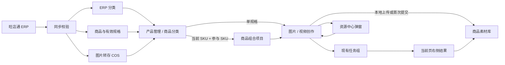

# ERP 商品创作闭环 — 需求总结

> 版本：v2.5
> 日期：2026-08-10
> 状态：方案评审稿，已补充资源中心弹窗与多 SKU 组合归集规则，定稿后再开发

---

## 背景

公司将通过旺店通 ERP API 提供商品、规格、分类和图片。当前工作台仍存在本地商品与分类维护、素材和任务分散、图片与视频商品带入不一致、提交后跳任务列表等问题。V2.5 要在不重做现有系统的前提下，将 ERP 主数据接入现有创作闭环。

## 目标

本版本要解决的核心问题：

1. ERP 分类成为唯一商品分类来源，停止维护第二套新分类。
2. 一个有效 ERP 规格是稳定的素材归属；一条资源只归属一个产品 ID，组合项目通过参与 SKU 关系追溯。
3. 全量主数据与创作资产分开呈现，避免产品管理和素材库重复管理。
4. 图片和视频任务提交后留在创作页，右侧持续展示状态与结果。
5. ERP 更新不覆盖卖点、材质、版型、备注等本地创作字段。

## 功能范围

### 做什么

- 同步 ERP 分类、商品、有效规格和规格图片。
- 排除 `specid=0` 和 `bblockup=True` 的无效规格。
- ERP 图片转存 COS，首张有效图默认作为首次图片创作主体。
- 支持从当前 SKU 创建商品组合，可添加上装、下装和可选鞋履；结果资源归属当前 SKU，组合项目记录所有参与 SKU。
- 产品管理展示全量 ERP 规格目录和同步状态。
- 商品分类展示只读 ERP 分类树。
- 图片任务资源中心弹窗保留产品素材、公共素材和我的素材；已有 SKU 上下文时直接展示当前 SKU 素材。
- 图片、视频创作页保留三栏，右栏固定展示结果。
- 普通用户只看到最终模型和业务参数，不看到 Provider、通道实例、能力编码与 `async`。
- 旧本地商品继续使用，可由管理员后续匹配 ERP 规格。

### 不做什么

- 不合并为新的“商品中心”（原因：现有三个页面职责可通过减法划清）。
- 不重构模板中心、模特资源库和任务列表（原因：超出 ERP 闭环的最小范围）。
- 不允许人工新增、编辑、移动或删除 ERP 分类（原因：避免多源权威）。
- 不做 ERP 反向写回（原因：本版本只建立只读主数据链路）。
- 不新建任务状态机或复杂多轮会话模型（原因：优先复用任务组、重试和再次创作）。
- 不在方案阶段修改数据库、API、前后端业务代码、环境变量或生产配置。

## 载体

这是现有“达芬奇密码 AI 素材生产工作台”的功能调整，不新增独立应用。入口沿用现有侧栏和“新建创作”按钮：

- `产品管理`：全量 ERP 商品规格目录。
- `商品分类`：ERP 分类树，只读。
- `商品素材库`：保持现有独立页面，查看已发生创作活动的商品资产。
- `资源中心`：图片任务内的素材选择弹窗，保留产品素材、公共素材和我的素材。
- `新建图片任务`、`新建视频任务`：沿用现有入口和三栏工作台。

## 页面职责

| 页面 | 唯一职责 | 数据范围 | 关键操作 |
| --- | --- | --- | --- |
| 产品管理 | ERP 商品规格主目录 | 全量有效规格、停用历史、本地旧商品 | 搜索、筛选、看同步、上传素材、发起创作 |
| 商品分类 | ERP 分类浏览 | ERP 分类树及规格数量 | 搜索分类、筛选规格 |
| 商品素材库 | 创作资产域 | 已上传本地素材或提交过任务的规格 | 看输入/图片/视频/审核/活动、继续创作 |
| 资源中心弹窗 | 创作素材选择 | 产品素材、公共素材、我的素材 | 在图片任务内选图、上传、切换 SKU |
| 任务列表 | 跨商品执行监控 | 所有任务组和子任务 | 筛选、异常处理、审核 |

## 核心数据流



## 关键决策

探索过程中确认的产品和设计决策，PRD 和开发阶段必须遵守：

| # | 决策 | 原因 |
| --- | --- | --- |
| 1 | ERP 分类是唯一商品分类源 | 避免 ERP 和工作台同时维护造成冲突 |
| 2 | 本地 `product_category` 只兼容旧数据 | 保留历史可用性，不继续扩大双写 |
| 3 | 一条资源只归属一个产品 ID | 普通素材不建立多产品关系；组合项目另行记录参与 SKU |
| 4 | 排除 `specid=0` 和 `bblockup=True` | 过滤占位与停用规格 |
| 5 | ERP 字段只读，本地创作字段可编辑 | 不同系统各自负责擅长的数据 |
| 6 | ERP 更新不能覆盖本地创作字段 | 防止卖点、材质、版型和备注丢失 |
| 7 | ERP 图片全部转存 COS | 避免长期依赖外部源站和失效 URL |
| 8 | 产品管理保留并展示全量 ERP 规格 | 它是主数据目录，不是创作资产库 |
| 9 | 商品分类保留但只读 | 用户仍需按分类浏览，无需第二套维护入口 |
| 10 | 商品素材库只收录已发生创作活动的 SKU | 防止全量 ERP 商品淹没实际工作内容；按任一参与 SKU 可检索同一组合项目 |
| 11 | 仅同步 ERP 图片不触发素材库准入 | 同步数据不是人的创作活动 |
| 12 | 图片/视频创作保留固定右侧结果区 | 支持原地等待、查看、失败重试和继续创作 |
| 13 | 模型和动态参数移到中栏 | 右栏只负责任务状态和结果 |
| 14 | 普通用户不见 Provider 等技术路由 | 降低创作判断成本，管理员继续在后台配置 |
| 15 | 旧本地商品标记来源后继续使用 | 不因 ERP 接入破坏历史任务和资产 |
| 16 | ERP 停用只提示，不删除历史 | 审核、复盘和继续创作需要历史连续性 |
| 17 | 商品/规格 15 分钟增量，分类每日校准 | 平衡时效、稳定性和接口负载 |
| 18 | 本轮不大改模板、模特资源库、导航和任务状态机 | 遵循最小改动与优先做减法 |
| 19 | 新建图片任务使用独立全屏页面，不显示应用侧栏 | 最大化素材、Prompt 和结果的可用空间 |
| 20 | 图片页以 ERP 商品名称为商品事实标题、ERP 分类为副标题，下方保留图片理解参数并新增 SEO 优化商品名称 | 避免重复字段，同时不减少创作上下文 |
| 21 | 参考区初始化只保留两张已选图片和添加入口，初始角色为模特、细节 | 减少固定图片槽位，具体用途改由图片角色表达 |
| 22 | 每张参考图从模特、风格、场景、姿势、细节五类角色中下拉多选 | 同一图片可以同时承担模特、风格和场景等多个参考作用 |
| 23 | 风格、场景、姿势、模型、比例都作为 Prompt 底部标签 | 将创作控制收进内容输入上下文，接近对话式操作 |
| 24 | 风格字典严格限定九大正式风格，名称与预览图复用现有字典资产 | 剔除旧别名和实验项，避免同义风格多头维护 |
| 25 | 风格联动过滤场景和姿势，兼容则保留、不兼容则回落默认组合 | 恢复现有业务规则，避免产生无效参数组合 |
| 26 | 删除“高级设置与负面约束”入口 | 数量、分辨率、质量已有摘要；约束由模板和系统自动应用 |
| 27 | 参考图已承担风格、场景或姿势时，禁用 Prompt 底部对应标签并在文本中声明图片来源 | 防止图片参考与枚举参数重复生效或互相冲突 |
| 28 | 商品事实区去掉“AI 优化”“图片理解”等来源标签 | 标题层级已说明 ERP 上下文，不再增加视觉噪音 |
| 29 | 商品组合不是把资源复制到多个 SKU | 结果资源归属当前 SKU，其他参与 SKU 只通过组合关系查看同一结果 |
| 30 | 组合项目保存参与 SKU、角色和源图快照 | 角色支持 `TOP`、`BOTTOM` 和可选 `SHOES`；ERP 后续变化不改写历史事实 |
| 31 | 关联组合不成为强制参考素材 | 参与 SKU 后续创作需要用户主动选择组合结果，避免隐性输入 |
| 32 | 任一参与 SKU 停用后，组合项目进入历史状态 | 历史素材、任务和结果保留；默认不进入新的组合选择器 |
| 33 | 资源中心是图片任务内弹窗，不与商品素材库合并 | 延续现有管理页面和选择弹窗的职责边界 |
| 34 | 模特资源库继续独立 | 创建任务可以引用模特，但资源中心不复制和管理模特档案 |
| 35 | 资源中心产品素材一张卡片对应一个 SKU，同一 SPU 下连续排列 | 保留 SKU 颗粒度，同时方便扫描同一商品的不同规格 |
| 36 | SKU 卡片封面使用最近素材图 | 直接反映当前最新创作状态；无素材时回退 ERP 商品图 |
| 37 | 资源中心上传只选择一个 SKU，不要求分类和标签 | 上传后自动绑定唯一 `productId`；参考角色只在创作页参考图区域维护并自动带出 |
| 38 | 已有 SKU 上下文时直接打开当前 SKU 素材 | 减少重复选商品；“切换产品”才进入 SPU 分组的 SKU 列表 |
| 39 | 主体图沿用 ERP 同步图或用户最近一次更换结果 | 打开资源中心时映射现有选择；从空参考图入口打开时不制造默认选择 |
| 40 | 产品素材使用 ERP 分类，素材列表使用已沉淀标签筛选 | 分类覆盖睡衣、围巾、帽子、鞋履等；标签来自参考角色、九大风格和联动场景，不在弹窗维护 |
| 41 | 公共素材和我的素材必须有完整独立状态 | 两者都展示分类、标签、搜索和素材网格，权限与数据范围不混用 |
| 42 | 产品素材内提供单图选择和组合素材模式 | 组合选择上装、下装和可选鞋履，确认后带回图片任务复用现有生成流程 |
| 43 | 视频创作只保留首帧图生、智能多帧、爆款复刻、电商复刻四种模式 | 不增加“参考图生视频”；首帧与关键帧、源视频已分别承担画面参考职责 |
| 44 | 视频模式分为“图生视频”和“视频复刻”两组横向 Tab | 图生视频包含首帧图生、智能多帧；视频复刻包含爆款复刻、电商复刻；切换时保留已选产品 |
| 45 | 视频 Prompt 不展示风格、场景、姿势等画面标签 | 首帧/关键帧负责图生视频的画面，源视频负责复刻的镜头与节奏；Prompt 仅补充运动、变化、镜头、品牌调性或禁忌 |
| 46 | 智能多帧以“全局 Prompt + 关键帧时间轴”呈现 | 全局 Prompt 定义整体目标；每段按时间顺序选择关键帧，并只描述从上一帧到当前帧的变化和时长 |
| 47 | 每个视频 Prompt 输入框下方展示模型能力参数标签 | 参数包含模型、时长、分辨率、比例和音频等，随当前模式和模型能力变化；不与画面标签混用 |
| 48 | 智能多帧默认不展示全局 Prompt 输入框 | 用户只维护关键帧和段 Prompt；仅在需要时展开“补充全局要求”填写额外节奏或禁忌 |
| 49 | 智能多帧的默认全局规则由服务端组装并快照 | 服务端以商品事实、首帧、关键帧、连续性与安全约束为单一权威生成有效 Prompt；前端只提交可选的补充全局要求 |

## 页面结构

### 产品管理

```text
+-----------------------------------------------------------------------------------+
| 产品管理                         ERP 正常 · 8 分钟前              [立即同步]       |
+-----------------------------------------------------------------------------------+
| 搜索商品/编码 | ERP 分类 | 来源 | 状态 | 图片状态                  [清除筛选]      |
+-----------------------------------------------------------------------------------+
| 图 | 商品/规格 | 货品编号 | 规格编码 | ERP 分类 | 图片 | 同步状态 | 操作          |
| 图 | 测试一11 / 蓝色 | TEST1 | 123 | 夏季水果类 | 3 | 已同步 | 图片创作 / 合成套装 |
+-----------------------------------------------------------------------------------+
```

### 商品素材库

```text
+-----------------------------------------------------------------------------------+
| 商品素材库    活跃商品 33 · 输入图片 188 · 生成视频 18 · 待审核 183              |
+-----------------------------------------------------------------------------------+
| 搜索商品/规格 | ERP 分类 | 素材类型 | 审核状态 | 最近活动                       |
+-----------------------------------------------------------------------------------+
| [单规格卡] [组合套装卡] [单规格卡]  仅显示已经上传素材或提交任务的创作项目         |
+-----------------------------------------------------------------------------------+
```

### 图片任务资源中心弹窗

```text
+-----------------------------------------------------------------------------------+
| 资源中心                                      [产品素材] [公共素材] [我的素材] [×] |
+-----------------------------------------------------------------------------------+
| [单图选择][组合素材]  当前 SKU / TEST1-GRN-M       [切换产品] [上传素材]          |
+-----------------------------------------------------------------------------------+
| ERP 分类       | 来源 / 角色 / 九大风格 / 联动场景 / 搜索                        |
| 睡衣  围巾     | [素材图] [素材图] [素材图] [素材图]                             |
| 帽子  鞋履     | 当前主体图高亮；空参考图入口保持零选择                           |
+-----------------------------------------------------------------------------------+
| 当前主体图 / 已选择 0 项                               [取消] [确认使用]          |
+-----------------------------------------------------------------------------------+
| 组合模式：上装 + 下装 + 可选鞋履 → 带入图片任务，复用现有生成流程                |
| 公共素材 / 我的素材：各自展示分类、标签、搜索和真实素材网格                       |
+-----------------------------------------------------------------------------------+
```

### 图片创作

```text
+-----------------------------------------------------------------------------------+
| ← 新建图片任务                            当前 ERP 商品 / 规格或上下装组合     |
+--------------------------+-----------------------------------+----------------------+
| 主体素材                 | 图片类型                          | 任务状态 / 图片结果  |
| 参考图 1 / 参考图 2 / +  | Prompt：写明各角色参考哪张图      | 排队 / 生成 / 失败   |
| 五类参考角色可多选       | [风格/参考图][场景/参考图][姿势]  | 重试 / 继续修改      |
| ERP 名称 + 分类副标题    | [模型][比例] + 输出摘要            |                      |
| SEO 名称 + 图片理解参数  | 系统自动应用商品与安全约束         |                      |
+--------------------------+-----------------------------------+----------------------+
```

### 视频创作

```text
+-----------------------------------------------------------------------------------+
| 商品选择 / 商品事实      [图生视频：首帧图生 | 智能多帧] [视频复刻：爆款 | 电商] |
+--------------------------+-----------------------------------+----------------------+
| 首帧 / 关键帧 / 源视频   | Prompt：运动、变化、镜头、调性     | 视频规格 / 结果      |
| 当前模式的必要素材       | 下方展示模型、时长、分辨率等参数   | 进度 / 失败 / 重试   |
+--------------------------+-----------------------------------+----------------------+
| 智能多帧：首帧 + 关键帧  | 全局 Prompt + 分段时间轴 Prompt    | 每段时长 / 顺序可调  |
+--------------------------+-----------------------------------+----------------------+
```

## 技术约束

- 现有旺店通接入设计已包含 API 客户端、同步任务、商品/分类镜像和图片转存思路，应在其上调整，不新增第二套接入。
- 规格必须作为独立镜像实体同步，规格图片必须按规格归属；不能仅以 `spec_json` 和货品级主图支撑规格级创作。
- 普通素材、任务和结果只保存一个归属 `productId`。组合项目额外保存参与 SKU 关系、`TOP` / `BOTTOM` / 可选 `SHOES` 角色及源图快照；其他参与 SKU 通过关系回查，不复制资源。
- `goodsPicList` 样例存在 `PicUrl` 和 `piclist` 两种返回形态，后端转换层需兼容。
- 创作页继续复用 `ThreeColumnLayout`、`TaskParamsPanel`、能力 schema、`schemaParams`、Preflight 和 Submit。
- 提交后继续使用现有 `groupId/taskIds`、任务详情和生成结果接口刷新右侧。
- 智能多帧提交时，服务端必须基于商品事实、首帧、按序关键帧和系统约束组装最终全局 Prompt；前端不可自行固化默认 Prompt。用户填写的“补充全局要求”作为附加输入，最终组装结果必须随任务快照保存，以支持复现与审计。
- 图片页为无侧栏全屏工作台，布局基线为 `290px / minmax(540px,1fr) / 330px`；视频当前仍按 `300px / minmax(0,1fr) / 380px`，待逐页确认。
- 正式商品/规格映射涉及数据更新时，必须单独评审并取得数据库变更授权。

## 全状态清单

- ERP 正常、同步中、部分图片失败、同步失败、长期未同步。
- 有效规格、ERP 已停用、本地来源、待匹配。
- 组合项目可创作、缺少有效来源图、历史组合、组合素材带入单规格上下文。
- 商品目录加载、空数据、搜索无结果、局部图片加载失败。
- 商品素材库未准入、已准入、仅输入素材、已有结果、审核积压。
- 资源中心当前 SKU 有素材、无素材、切换产品、搜索无结果、单选和多选。
- 公共素材、我的素材、模特资源库独立入口、公共/个人权限语义一致。
- 创作未开始、Preflight、排队、生成中、部分成功、全部成功、失败、超时、审核拦截、额度不足。
- 页面刷新恢复任务、离开后后台继续、ERP 停用后历史继续可用。

## 资源中心与组合创作验收准则

1. 图片任务已有 SKU 时，资源中心打开后直接显示当前 SKU 素材；主体图映射 ERP 同步图或用户更换图，从空参考图入口打开时不预选素材。
2. SKU 列表中一张卡片对应一个 SKU，同一 SPU 下连续排列；卡片封面优先使用最近素材图，无素材时回退 ERP 商品图。
3. SKU 产品列表可按 ERP 分类、名称、SPU 和 SKU 筛选；素材列表可按来源、参考角色、九大风格和联动场景筛选。
4. 用户在资源中心上传图片时，只需确认一个 SKU；上传后资源绑定当前唯一 `productId`，不出现分类、AI 打标或入库确认步骤。
5. 主体图入口维持单选，参考图入口按当前调用参数支持多选；确认后返回图片任务且上下文不丢失。
6. 公共素材和我的素材都有独立列表、分类、标签、搜索和权限状态，不是空标签页。
7. 参考图片的“模特、风格、场景、姿势、细节”角色只在创作页参考图区域维护，保存后再次引用自动带出。
8. 用户在产品素材切换到组合模式时，至少选择两个不同 SKU 并明确上装、下装角色，可额外选择鞋履；确认后带回图片任务复用现有生成流程。
9. 创建成功后，组合项目、合成素材、任务组、图片结果和视频结果各只产生一份；结果资源归属当前 SKU，其他参与 SKU 通过“关联组合”检索，不产生重复资源、成本或审核计数。
10. 任一参与 SKU 停用、ERP 图片被替换或同步异常时，不修改历史快照、不删除历史结果；关联组合不自动进入参与 SKU 的后续任务。

## 设计参考

本目录下的设计文件：

- `ERP商品创作闭环-设计稿.html` — 产品管理、商品素材库、图片创作、资源中心弹窗和视频创作页面。
- `ERP商品创作闭环-全状态设计参考.html` — 页面状态、Toast、边界情况和交互规则。
- `03-图片创作-资源中心-产品素材.png` — 当前 SKU、ERP 分类、来源和标签筛选。
- `03-图片创作-资源中心-未选素材.png` — 从空参考图入口打开时的零选择状态。
- `03-图片创作-资源中心-切换产品.png` — ERP 分类下的 SPU 分组与 SKU 列表。
- `03-图片创作-资源中心-组合素材.png` — 上装、下装和可选鞋履组合后带入图片任务。
- `03-图片创作-资源中心-公共素材.png`、`03-图片创作-资源中心-我的素材.png` — 两个独立素材范围的完整筛选与列表状态。

样式继承实际前端：`/Users/jay/Documents/GitHub/dafenqi/EC-AIGCweb/src/index.css`，使用深色侧栏、暖白主区、橙红主操作色与紧凑 B 端密度。
